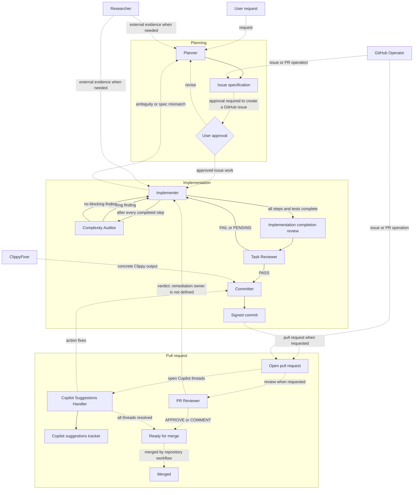
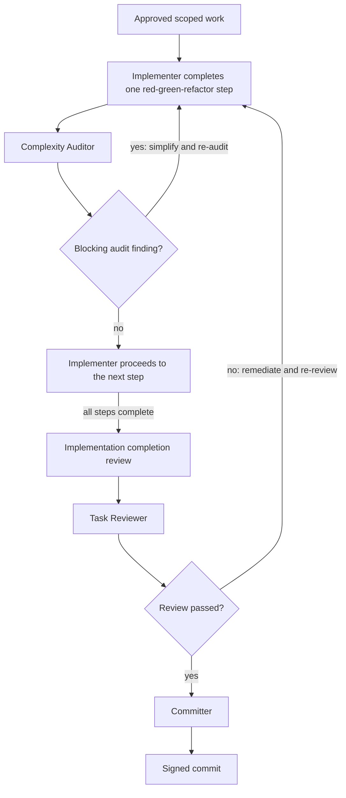
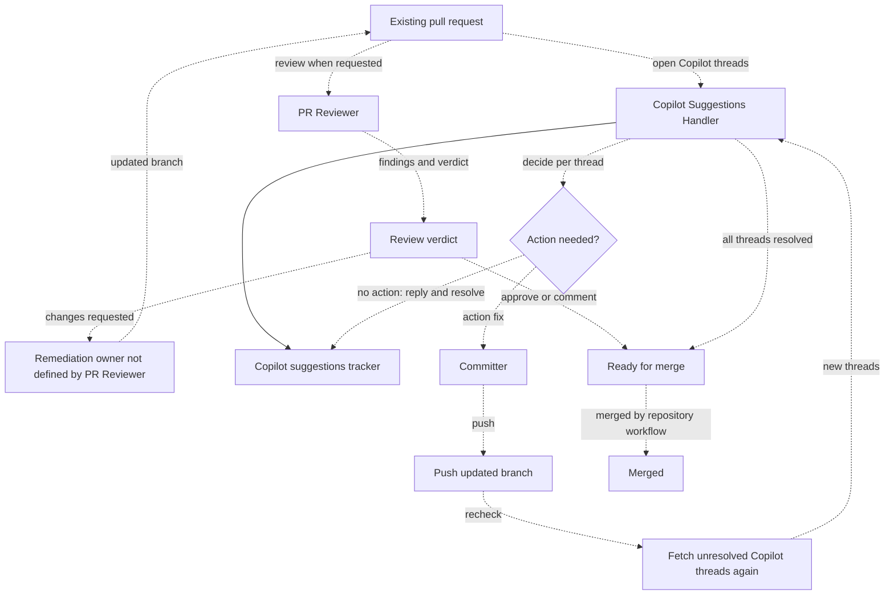

---
semantic-links:
  related-artifacts:
    - AGENTS.md
    - .github/agents/
    - .github/agents/README.md
    - .github/skills/
    - docs/agents/README.md
    - issue #2155
    - issue #2160
    - docs/adrs/20260821172000_establish_ai_agent_context_capability_and_portability_governance.md
---

# AI Agent Orchestration

## Purpose

This guide makes the currently declared relationships between repository custom agents explicit.
It is a portable process model derived from `.github/agents/*.agent.md`, not a runtime controller.
The profile definitions, `AGENTS.md`, skills, scripts, tests, and GitHub interfaces remain the
authoritative sources for a particular task.

Solid arrows in the flowchart are mandatory handoffs declared by an agent workflow. Dashed arrows
are optional, event-driven, or incomplete paths. An arrow documents intent; it does not prevent an
agent from acting when preceding work is absent.

## Workflow Overview

## Implementation and Pre-Commit Workflow

This detailed view expands the mandatory path declared by the Implementer profile. Solid arrows
are mandatory handoffs. The feedback arrows return a blocking finding to the Implementer; the
Implementer repeats the relevant work and review before proceeding.

## Pull-Request Feedback Workflow

This view shows conditional paths after a pull request exists. No profile defines a universal PR
entry, merge transition, remediation owner for a PR Reviewer finding, or mandatory re-review after
a fix; those paths are therefore dashed. Solid arrows apply only to the Copilot Suggestions
Handler's required per-thread tracker update.

## Required Delivery Path

The Implementer profile declares the repository's complete mandatory delivery path. A direct user
request can invoke an Implementer without a Planner-created specification, but this does not remove
the Implementer's own required review and commit handoffs.

| From          | To                 | Required condition                                                                                                                                                                          | Evidence or output                                                                                                                        | Failure route                                                                                     |
| ------------- | ------------------ | ------------------------------------------------------------------------------------------------------------------------------------------------------------------------------------------- | ----------------------------------------------------------------------------------------------------------------------------------------- | ------------------------------------------------------------------------------------------------- |
| Planner       | Implementer        | Planner completes its planning workflow.                                                                                                                                                    | Classified issue specification, acceptance criteria, and scoped tasks.                                                                    | Implementation ambiguity or a spec/code mismatch returns to Planner or the user.                  |
| Implementer   | Complexity Auditor | Each red-green-refactor step is complete and focused tests pass.                                                                                                                            | Per-function assessment and `AUDIT PASSED`, `AUDIT WARNED`, or `AUDIT FAILED`.                                                            | A blocking audit finding returns to Implementer for simplification and re-audit.                  |
| Implementer   | Task Reviewer      | All implementation steps and tests are complete; completion-review evidence exists.                                                                                                         | Acceptance-criteria matrix, convention findings, checklist updates, and `REVIEW PASSED` or `REVIEW FAILED`.                               | A failure or pending evidence returns to Implementer for remediation and another review.          |
| Task Reviewer | Committer          | Task Reviewer reports `REVIEW PASSED` for an implementation commit. A caller may also request a focused documentation commit for a persisted failed review when durable evidence is needed. | Verified scope and acceptance-criteria evidence, including an issue-local report when the reviewer received a folder-style specification. | Committer returns stale-spec, policy, implementation, or test blockers to the code-focused owner. |
| Committer     | Signed commit      | The commit workflow has a coherent scope and passing mandatory validation.                                                                                                                  | GPG-signed Conventional Commit with verification result.                                                                                  | Committer returns stale-spec, policy, implementation, or test blockers to the code-focused owner. |

## Optional and Event-Driven Paths

These paths support the delivery path but are not universal prerequisites.

| Agent                       | Trigger                                                             | Output and handoff                                                              | Boundary                                                                                                                                                              |
| --------------------------- | ------------------------------------------------------------------- | ------------------------------------------------------------------------------- | --------------------------------------------------------------------------------------------------------------------------------------------------------------------- |
| Researcher                  | A focused external-evidence question.                               | Structured findings to Planner or Implementer.                                  | Research is read-only and does not choose a design. Materially invalidating findings require replanning.                                                              |
| GitHub Operator             | A requested GitHub-side operation with the required local context.  | Verified issue, subissue, metadata, or PR operation result.                     | Creating an issue requires an approved local spec. Code-changing review feedback returns to a code-focused agent.                                                     |
| User                        | A task, problem statement, or decision requiring an agent workflow. | A request to the appropriate agent or an approval/revision decision.            | Profiles do not define a universal entry agent; Planning and pull-request creation are conditional workflows.                                                         |
| ClippyFixer                 | Concrete Clippy warnings from the user or `linter clippy`.          | Focused remediation and documented exceptions; Committer creates commits.       | The profile currently declares no `edit` tool although it describes source modifications. Issue #2158 tracks this capability mismatch.                                |
| PR Reviewer                 | An existing PR and its actual diff/check context.                   | Findings and `APPROVE`, `REQUEST_CHANGES`, or `COMMENT`.                        | The profile does not define a remediation owner, thread-publication step, or required re-review after fixes.                                                          |
| Copilot Suggestions Handler | Unresolved Copilot review threads on an existing PR.                | Per-thread decision, reply, resolution, and `docs/copilot-pr-reviews/` tracker. | It handles Copilot threads only, replies before resolving, and fetches the threads again after each push. An action fix is validated and committed through Committer. |

## Artifact Ownership

| Artifact                         | Current owner                                                      | Location                                                                                       | Use                                                                                                     |
| -------------------------------- | ------------------------------------------------------------------ | ---------------------------------------------------------------------------------------------- | ------------------------------------------------------------------------------------------------------- |
| Issue or EPIC specification      | Planner or the user; Task Reviewer may update verified checkboxes. | `docs/issues/drafts/`, then `docs/issues/open/` or `docs/issues/closed/`.                      | Scope, acceptance criteria, verification, and progress record.                                          |
| Implementation completion review | Implementer.                                                       | Issue specification folder when a retrospective is required; otherwise the issue progress log. | Records material discoveries and lessons before independent verification.                               |
| Signed commit                    | Committer.                                                         | Git history.                                                                                   | Records a validated, GPG-signed change.                                                                 |
| Copilot suggestions tracker      | Copilot Suggestions Handler.                                       | `docs/copilot-pr-reviews/pr-<number>-copilot-suggestions.md`.                                  | Records per-thread decisions, replies, and resolution state.                                            |
| Independent review report        | Complexity Auditor, Task Reviewer, or PR Reviewer.                 | `agent-review-reports.md` in a folder-style issue specification.                               | Chronological evidence, findings, verdict, and follow-up actions; Issue #2160 establishes the workflow. |

## Known Gaps and Future Enforcement

The repository does not currently define a universal entry point, state store, automatic agent
selection mechanism, or machine-enforced transition graph. This guide must not be used to claim
those capabilities exist.

Future work may model approved workflow transitions as a state machine, graph, or external tool.
It must first collect evidence from real workflow use, define state ownership, recovery, and
failure paths, compare alternatives, and record a dedicated ADR before selecting an enforcement
mechanism. Issue #2155 deliberately does not make that selection.

## References

- [Repository agent profiles](../../.github/agents/README.md)
- [AI agent documentation index](README.md)
- [Issue #2155 specification](../issues/open/2155-2003-document-ai-agent-orchestration/ISSUE.md)
- [Issue #2160 specification](../issues/open/2160-2003-persist-independent-agent-review-reports/ISSUE.md)
- [AI agent context, capability, and portability governance ADR](../adrs/20260821172000_establish_ai_agent_context_capability_and_portability_governance.md)
