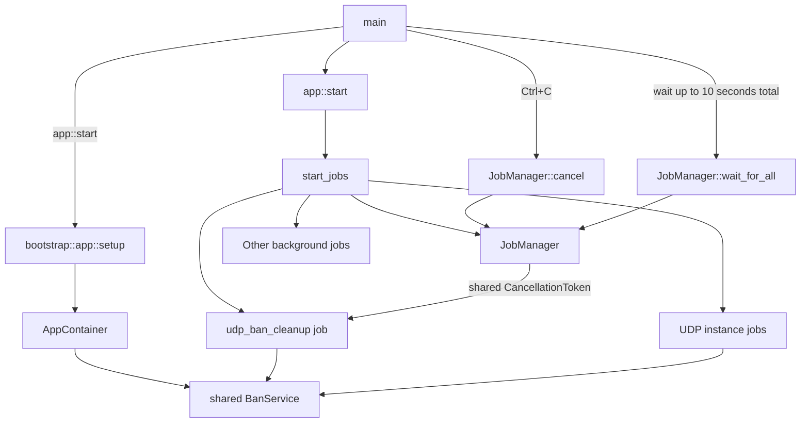

---
semantic-links:
  skill-links:
    - write-markdown-docs
  related-artifacts:
    - issue #1453
    - issue #1488
    - src/main.rs
    - src/app.rs
    - src/bootstrap/app.rs
    - src/bootstrap/jobs/
    - src/bootstrap/jobs/manager.rs
    - src/bootstrap/jobs/udp_tracker_server.rs
    - src/container.rs
    - packages/udp-core/src/container.rs
    - packages/udp-core/src/services/banning.rs
    - packages/udp-server/src/server/launcher.rs
---

# Application Jobs and Task Ownership

This document describes the tracker application's **current implementation** of
background jobs and task ownership. It is not the final shutdown architecture.
The target design is being developed in [shutdown-overhaul EPIC #1488](https://github.com/torrust/torrust-tracker/issues/1488)
and its [draft PR #1993](https://github.com/torrust/torrust-tracker/pull/1993).

## Terms

- **Direct component**: a named component future spawned directly by
  `JobManager` into its `JoinSet`.
- **Legacy job**: one of the three pre-spawned periodic-job handles retained by
  `JobManager` outside the `JoinSet` until SI-4/SI-5 migrate their APIs.
- **Owner**: `JobManager` owns direct component tasks and the retained legacy
  handles; a direct component owns any nested server task it starts.
- **Service**: a runtime capability stored in an application or instance
  container. Services may be shared between instances or owned by one instance.
- **Instance**: a configured UDP or HTTP listener, such as one element of
  `[[udp_trackers]]`.

Tokio jobs are not operating-system processes. An unmanaged job can nevertheless
outlive the component that logically owns it, retain resources, and make
shutdown unreliable. This document calls such a task **unmanaged** or
**orphaned**, not a zombie process.

## Current Bootstrap Flow

1. `main` calls `app::start`.
2. `bootstrap::app::setup` loads configuration, initializes shared services,
   and constructs `AppContainer`.
3. `app::start` loads required persisted data, then `start_jobs` creates a
   `JobManager` and starts application jobs and service instances.
4. On `Ctrl+C`, `main` calls `JobManager::cancel`, then waits for registered
   direct components and transitional legacy jobs through
   `JobManager::wait_for_all` under one ten-second process-wide grace period.

## Current Ownership Rule

Every spawned task has an explicit owner. `JobManager::spawn` directly creates
and owns direct component tasks in its `JoinSet`; it does not receive their
`JoinHandle`s. Components retain ownership of their nested server handles and
must signal, join, or deliberately abort them before completion. The narrow
legacy registry retains only the pre-spawned periodic handles that cannot be
adopted by a `JoinSet` without a wrapper task.

`JobManager::cancel` supplies one shared `CancellationToken` for cooperative
shutdown. `wait_for_all` applies one common deadline concurrently to direct
components and retained legacy handles. On expiry it aborts and joins all
remaining work; direct components use drop-safe cleanup to prevent a nested
server from becoming detached when the outer component is aborted.

The job's ownership follows the lifetime of the **service or data it operates
on**, not merely the listener that happened to start it. A shared service has
one application-owned job; an instance-owned service can have one instance-owned
job.

## IP-Ban Cleanup Example

Issue #1453 applies this ownership rule to the UDP IP-ban cleanup task.

`UdpTrackerCoreServices` owns one `BanService` shared by every configured UDP
tracker instance. Previously, each UDP listener launcher spawned a cleanup task
for that same shared service. With multiple UDP listeners, the application
therefore ran multiple cleanup tasks that reset the same ban data.

The UDP listener instances, their event-listener jobs, and the cleanup task now
start as one configuration-gated UDP service group. The cleanup task is one
application-owned `udp_ban_cleanup` job:

- `app::start_jobs` starts the group only when UDP listeners are requested and
  allowed: at least one is configured and the tracker is not in private mode.
- It registers the cleanup job with `JobManager` before starting UDP listener
  instances.
- It receives the manager's shared `CancellationToken` and exits cooperatively
  when cancellation is requested.
- The listener launcher no longer spawns cleanup tasks.

This is a concrete improvement in lifecycle control, but it does not imply that
all jobs already follow the desired ownership model.

## Current Limitations and Future Work

The current `JobManager` directly owns named component futures in a `JoinSet`
and keeps a narrow compatibility registry for the pre-spawned torrent-cleanup,
activity-metrics, and UDP ban-cleanup periodic jobs. All of those tasks share
one shutdown deadline, but the legacy jobs are not direct `JoinSet` components.
They are transitional until SI-4/SI-5 migrate their periodic-job APIs.

It is not yet a complete task-supervision system.

In particular, the current architecture does not yet define a complete hierarchy
of parent and child jobs, uniform cancellation support for every job, state
reporting, restart policy, or richer parent-child communication. Those concerns
belong to shutdown-overhaul EPIC #1488 and draft PR #1993. Changes to this
document should describe verified current behavior until that design is accepted.
