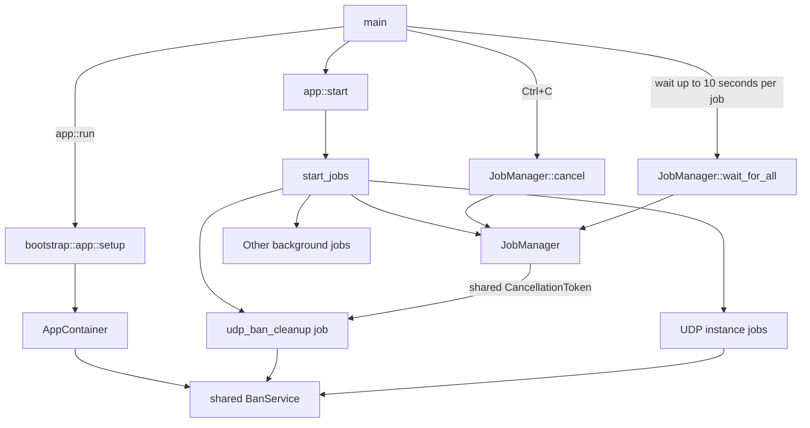

---
semantic-links:
  skill-links:
    - write-markdown-docs
  related-artifacts:
    - issue #1453
    - issue #1488
    - src/main.rs
    - src/app.rs
    - src/bootstrap/app.rs
    - src/bootstrap/jobs/
    - src/bootstrap/jobs/manager.rs
    - src/bootstrap/jobs/udp_tracker_server.rs
    - src/container.rs
    - packages/udp-core/src/container.rs
    - packages/udp-core/src/services/banning.rs
    - packages/udp-server/src/server/launcher.rs
---

# Application Jobs and Task Ownership

This document describes the tracker application's **current implementation** of
background jobs and task ownership. It is not the final shutdown architecture.
The target design is being developed in [shutdown-overhaul EPIC #1488](https://github.com/torrust/torrust-tracker/issues/1488)
and its [draft PR #1993](https://github.com/torrust/torrust-tracker/pull/1993).

## Terms

- **Job**: a named asynchronous task spawned with `tokio::spawn` and registered
  with `JobManager`.
- **Owner**: the component that spawns a job, retains its `JoinHandle` through
  `JobManager`, and provides its cancellation capability.
- **Service**: a runtime capability stored in an application or instance
  container. Services may be shared between instances or owned by one instance.
- **Instance**: a configured UDP or HTTP listener, such as one element of
  `[[udp_trackers]]`.

Tokio jobs are not operating-system processes. An unmanaged job can nevertheless
outlive the component that logically owns it, retain resources, and make
shutdown unreliable. This document calls such a task **unmanaged** or
**orphaned**, not a zombie process.

## Current Bootstrap Flow

1. `main` calls `app::run`.
2. `bootstrap::app::setup` loads configuration, initializes shared services,
   and constructs `AppContainer`.
3. `app::start` loads required persisted data, then `start_jobs` creates a
   `JobManager` and starts application jobs and service instances.
4. On `Ctrl+C`, `main` calls `JobManager::cancel`, then waits for registered
   jobs through `JobManager::wait_for_all` with a ten-second grace period per
   job.

## Current Ownership Rule

The desired current rule is that every spawned job has an explicit owner. At a
minimum, that owner must:

1. Spawn the job.
2. Register and retain its `JoinHandle` in `JobManager`.
3. Give the job a cancellation token when the job supports cooperative shutdown.
4. Wait for the registered job during application shutdown.

The job's ownership follows the lifetime of the **service or data it operates
on**, not merely the listener that happened to start it. A shared service has
one application-owned job; an instance-owned service can have one instance-owned
job.

## IP-Ban Cleanup Example

Issue #1453 applies this ownership rule to the UDP IP-ban cleanup task.

`UdpTrackerCoreServices` owns one `BanService` shared by every configured UDP
tracker instance. Previously, each UDP listener launcher spawned a cleanup task
for that same shared service. With multiple UDP listeners, the application
therefore ran multiple cleanup tasks that reset the same ban data.

The cleanup task is now one application-owned `udp_ban_cleanup` job:

- `app::start_jobs` registers it with `JobManager` before starting UDP listener
  instances.
- It starts only when UDP listeners can run: at least one is configured and the
  tracker is not in private mode.
- It receives the manager's shared `CancellationToken` and exits cooperatively
  when cancellation is requested.
- The listener launcher no longer spawns cleanup tasks.

This is a concrete improvement in lifecycle control, but it does not imply that
all jobs already follow the desired ownership model.

## Current Limitations and Future Work

The current `JobManager` is an application-level registry with one shared
cancellation token. It records registered `JoinHandle`s and waits for them, but
it is not yet a complete task-supervision system.

In particular, the current architecture does not yet define a complete hierarchy
of parent and child jobs, uniform cancellation support for every job, state
reporting, restart policy, or richer parent-child communication. Those concerns
belong to shutdown-overhaul EPIC #1488 and draft PR #1993. Changes to this
document should describe verified current behavior until that design is accepted.
