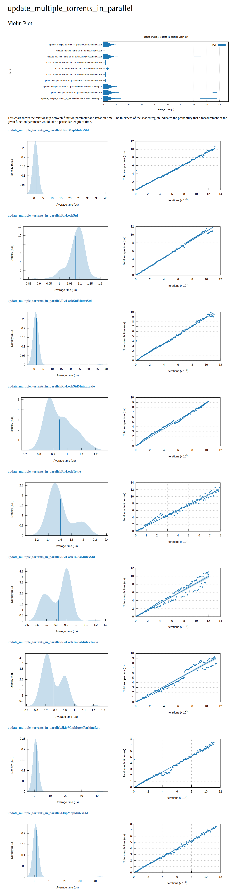

# Benchmarking

We have two types of benchmarking:

- E2E benchmarking running the UDP tracker.
- Internal torrents repository benchmarking.

## E2E benchmarking

We are using the scripts provided by [aquatic](https://github.com/greatest-ape/aquatic).

How to install both commands:

```console
cargo install aquatic_udp_load_test && cargo install aquatic_http_load_test
```

You can also clone and build the repos. It's the way used for the results shown
in this documentation.

```console
git clone git@github.com:greatest-ape/aquatic.git
cd aquatic
cargo build --release -p aquatic_udp_load_test
```

### Run UDP load test

Run the tracker with UDP service enabled and other services disabled and set log level to `error`.

```toml
log_level = "error"

[[udp_trackers]]
enabled = true
```

Build and run the tracker:

```console
cargo build --release
TORRUST_TRACKER_CONFIG_TOML_PATH="./share/default/config/tracker.udp.benchmarking.toml" ./target/release/torrust-tracker
```

Run the load test with:

```console
./target/release/aquatic_udp_load_test
```

> NOTICE: You need to modify the port in the `udp_load_test` crate to use `6969` and rebuild.

Output:

```output
Starting client with config: Config {
    server_address: 127.0.0.1:6969,
    log_level: Error,
    workers: 1,
    duration: 0,
    summarize_last: 0,
    extra_statistics: true,
    network: NetworkConfig {
        multiple_client_ipv4s: true,
        sockets_per_worker: 4,
        recv_buffer: 8000000,
    },
    requests: RequestConfig {
        number_of_torrents: 1000000,
        number_of_peers: 2000000,
        scrape_max_torrents: 10,
        announce_peers_wanted: 30,
        weight_connect: 50,
        weight_announce: 50,
        weight_scrape: 1,
        peer_seeder_probability: 0.75,
    },
}

Requests out: 398367.11/second
Responses in: 358530.40/second
  - Connect responses:  177567.60
  - Announce responses: 177508.08
  - Scrape responses:   3454.72
  - Error responses:    0.00
Peers per announce response: 0.00
Announce responses per info hash:
  - p10: 1
  - p25: 1
  - p50: 1
  - p75: 1
  - p90: 2
  - p95: 3
  - p99: 105
  - p99.9: 289
  - p100: 361
```

> IMPORTANT: The performance of the Torrust UDP Tracker is drastically decreased with these log levels: `info`, `debug`, `trace`.

```output
Requests out: 40719.21/second
Responses in: 33762.72/second
  - Connect responses:  16732.76
  - Announce responses: 16692.98
  - Scrape responses:   336.98
  - Error responses:    0.00
Peers per announce response: 0.00
Announce responses per info hash:
  - p10: 1
  - p25: 1
  - p50: 1
  - p75: 1
  - p90: 7
  - p95: 14
  - p99: 27
  - p99.9: 35
  - p100: 45
```

### Comparing UDP tracker with other Rust implementations

#### Aquatic UDP Tracker

Running the tracker:

```console
git clone git@github.com:greatest-ape/aquatic.git
cd aquatic
cargo build --release -p aquatic_udp
./target/release/aquatic_udp -p > "aquatic-udp-config.toml"
./target/release/aquatic_udp -c "aquatic-udp-config.toml"
```

Run the load test with:

```console
./target/release/aquatic_udp_load_test
```

```output
Requests out: 432896.42/second
Responses in: 389577.70/second
  - Connect responses:  192864.02
  - Announce responses: 192817.55
  - Scrape responses:   3896.13
  - Error responses:    0.00
Peers per announce response: 21.55
Announce responses per info hash:
  - p10: 1
  - p25: 1
  - p50: 1
  - p75: 1
  - p90: 2
  - p95: 3
  - p99: 105
  - p99.9: 311
  - p100: 395
```

#### Torrust-Actix UDP Tracker

Run the tracker with UDP service enabled and other services disabled and set log level to `error`.

```toml
log_level = "error"

[[udp_trackers]]
enabled = true
```

```console
git clone https://github.com/Power2All/torrust-actix.git
cd torrust-actix
cargo build --release
./target/release/torrust-actix --create-config
./target/release/torrust-actix
```

Run the load test with:

```console
./target/release/aquatic_udp_load_test
```

> NOTICE: You need to modify the port in the `udp_load_test` crate to use `6969` and rebuild.

```output
Requests out: 200953.97/second
Responses in: 180858.14/second
  - Connect responses:  89517.13
  - Announce responses: 89539.67
  - Scrape responses:   1801.34
  - Error responses:    0.00
Peers per announce response: 1.00
Announce responses per info hash:
  - p10: 1
  - p25: 1
  - p50: 1
  - p75: 1
  - p90: 2
  - p95: 7
  - p99: 87
  - p99.9: 155
  - p100: 188
```

### Results

Announce request per second:

| Tracker       |  Announce |
|---------------|-----------|
| Aquatic       |   192,817 |
| Torrust       |   177,508 |
| Torrust-Actix |    89,539 |

Using a PC with:

- RAM: 64GiB
- Processor: AMD Ryzen 9 7950X x 32
- Graphics: AMD Radeon Graphics / Intel Arc A770 Graphics (DG2)
- OS: Ubuntu 23.04
- OS Type: 64-bit
- Kernel Version: Linux 6.2.0-20-generic

## Repository benchmarking

### Requirements

You need to install the `gnuplot` package.

```console
sudo apt install gnuplot
```

### Run

You can run it with:

```console
cargo bench -p torrust-tracker-torrent-repository
```

It tests the different implementations for the internal torrent storage.  The output should be something like this:

```output
     Running benches/repository_benchmark.rs (target/release/deps/repository_benchmark-2f7830898bbdfba4)
add_one_torrent/RwLockStd
                        time:   [60.936 ns 61.383 ns 61.764 ns]
Found 24 outliers among 100 measurements (24.00%)
  15 (15.00%) high mild
  9 (9.00%) high severe
add_one_torrent/RwLockStdMutexStd
                        time:   [60.829 ns 60.937 ns 61.053 ns]
Found 1 outliers among 100 measurements (1.00%)
  1 (1.00%) high severe
add_one_torrent/RwLockStdMutexTokio
                        time:   [96.034 ns 96.243 ns 96.545 ns]
Found 6 outliers among 100 measurements (6.00%)
  4 (4.00%) high mild
  2 (2.00%) high severe
add_one_torrent/RwLockTokio
                        time:   [108.25 ns 108.66 ns 109.06 ns]
Found 2 outliers among 100 measurements (2.00%)
  2 (2.00%) low mild
add_one_torrent/RwLockTokioMutexStd
                        time:   [109.03 ns 109.11 ns 109.19 ns]
Found 4 outliers among 100 measurements (4.00%)
  1 (1.00%) low mild
  1 (1.00%) high mild
  2 (2.00%) high severe
Benchmarking add_one_torrent/RwLockTokioMutexTokio: Collecting 100 samples in estimated 1.0003 s (7.1M iterationsadd_one_torrent/RwLockTokioMutexTokio
                        time:   [139.64 ns 140.11 ns 140.62 ns]
```

After running it you should have a new directory containing the criterion reports:

```console
target/criterion/
├── add_multiple_torrents_in_parallel
├── add_one_torrent
├── report
├── update_multiple_torrents_in_parallel
└── update_one_torrent_in_parallel
```

You can see one report for each of the operations we are considering for benchmarking:

- Add multiple torrents in parallel.
- Add one torrent.
- Update multiple torrents in parallel.
- Update one torrent in parallel.

Each report look like the following:



## Other considerations

If you are interested in knowing more about the tracker performance or contribute to improve its performance you ca join the [performance optimizations discussion](https://github.com/torrust/torrust-tracker/discussions/774).
