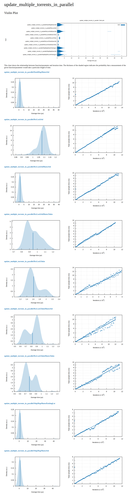

---
semantic-links:
  skill-links:
    - write-markdown-docs
  related-artifacts:
    - docs/index.md
    - docs/profiling.md
    - docs/issues/open/1505-optimize-peer-ip-list-from-swarm/aquatic-benchmarking-guide.md
    - packages/torrent-repository-benchmarking/
    - packages/swarm-coordination-registry/examples/bench_peers.rs
    - share/default/config/tracker.udp.benchmarking.toml
---

# Benchmarking

We have several types of benchmarking:

- **E2E UDP load testing** — using `aquatic_udp_load_test` against the running tracker.
- **Comparative UDP benchmarking** — using `aquatic_bencher` to compare multiple trackers on the same machine.
- **Repository microbenchmarks** — using `cargo bench` for internal data structure performance.
- **Peer retrieval microbenchmarks** — measuring the `peers_excluding` path directly.

> For a detailed step-by-step guide with full command output and troubleshooting, see the
> [Aquatic Benchmarking Guide](docs/issues/open/1505-optimize-peer-ip-list-from-swarm/aquatic-benchmarking-guide.md)
> (created during issue #1505).

## Prerequisites

- Linux 6.0+ (for `io_uring` support)
- Rust toolchain
- System packages for `aquatic_bencher`: `cmake`, `build-essential`, `pkg-config`, `git`, `screen`, `cvs`, `zlib1g-dev`, `golang`
- For `io_uring` feature: `libhwloc-dev`

## E2E UDP load testing

### 1. Build the Torrust tracker

```console
cargo build --release
```

### 2. Start the tracker with benchmarking config

The project provides a benchmarking configuration at `share/default/config/tracker.udp.benchmarking.toml`
that disables logging, tracking usage stats, persistent metrics, and peerless torrent removal.
It binds the UDP tracker to `0.0.0.0:3000`:

```toml
[logging]
threshold = "error"

[[udp_trackers]]
bind_address = "0.0.0.0:3000"
```

Start the tracker:

```console
TORRUST_TRACKER_CONFIG_TOML_PATH="./share/default/config/tracker.udp.benchmarking.toml" \
  ./target/release/torrust-tracker
```

### 3. Build the aquatic UDP load test

```console
git clone git@github.com:greatest-ape/aquatic.git
cd aquatic
cargo build --release -p aquatic_udp_load_test
```

> **Note**: Prefer building from source over `cargo install` to ensure the tool can be rebuilt
> later if dependencies change.

### 4. Generate the load test config

```console
./target/release/aquatic_udp_load_test -p > load-test-config.toml
```

Edit `load-test-config.toml` to adjust parameters like `announce_peers_wanted` (number of
peers requested per announce), `duration` (run time in seconds), or `summarize_last`
(window for the summary report). The default config already points to `127.0.0.1:3000`
matching the benchmarking config — no port change needed.

Example config for 10-second run with 74 peers wanted:

```toml
server_address = "127.0.0.1:3000"
log_level = "error"
workers = 1
duration = 10
summarize_last = 5
extra_statistics = true

[network]
multiple_client_ipv4s = true
sockets_per_worker = 4
recv_buffer = 8000000

[requests]
number_of_torrents = 1000000
number_of_peers = 2000000
scrape_max_torrents = 10
announce_peers_wanted = 74
weight_connect = 50
weight_announce = 50
weight_scrape = 1
peer_seeder_probability = 0.75
```

### 5. Run the load test

```console
cd /path/to/aquatic
./target/release/aquatic_udp_load_test -c load-test-config.toml
```

Example output:

```text
Requests out: 172510.83/second
Responses in: 172383.48/second
  - Connect responses:  85442.62
  - Announce responses: 85242.81
  - Scrape responses:   1698.05
  - Error responses:    0.00
Peers per announce response: 47.58

# aquatic load test report
Test ran for 10 seconds (only last 5 included in summary)
Average responses per second: 171718.89
  - Connect responses:  85084.98
  - Announce responses: 84945.36
  - Scrape responses:   1688.55
  - Error responses:    0.00
```

> **Important**: The performance of the Torrust UDP tracker is **drastically decreased**
> with verbose logging. Always use `threshold = "error"` for benchmarking.

```text
# With log threshold "info":
Requests out: 40719.21/second
Responses in: 33762.72/second
```

### Troubleshooting

#### Cookie errors during load test

```text
ERROR UDP TRACKER: response error error=tracker announce error:
  Connection cookie error: cookie value is expired: ...
```

This is **normal**. The load test sends a burst of requests at the start, and some
arrive before the tracker's cookie system expects them. These errors account for
a tiny fraction of requests (typically `< 0.001%` of error responses) and do not
affect the overall throughput measurement.

#### Result variance

Benchmark results vary between runs due to system load, CPU frequency scaling,
and background processes. Typical variance for the UDP load test is **±5–10%**
on a non-dedicated machine. For before/after comparison, run multiple iterations
and use the median.

## Comparative UDP benchmarking with `aquatic_bencher`

The Aquatic repository's `aquatic_bencher` can compare multiple trackers
(`aquatic_udp`, `opentracker`, `chihaya`, `torrust-tracker`) on the same machine.

### 1. Build the bencher

```console
cd /path/to/aquatic
cargo build --profile release-debug -p aquatic_bencher
```

> **Note**: This uses `release-debug` profile (not `--release`) — the bencher needs
> debug symbols for CPU utilization measurements.

### 2. Install other trackers

Each tracker must be built and available in `PATH` or specified via CLI args:

- **Opentracker**: Build from source at https://erdgeist.org/arts/software/opentracker/
- **Chihaya**: Install with `go install` from https://github.com/chihaya/chihaya
- **Aquatic UDP**: `cargo build --profile release-debug -p aquatic_udp` (in the aquatic repo)

### 3. Run the bencher

```console
cd /path/to/aquatic
./target/release-debug/aquatic_bencher \
  --min-priority medium --cpu-mode subsequent-one-per-pair
```

The bencher supports the `--torrust-tracker` argument to specify the path to the
torrust-tracker binary (default: looks for `torrust-tracker` in `PATH`).

### Previous results (2024)

Using a PC with:

- RAM: 64 GiB
- Processor: AMD Ryzen 9 7950X x 32
- OS: Ubuntu 23.04
- Kernel: Linux 6.2.0-20-generic

| Tracker                 | Announce req/s (1 core, 8 workers) |
| ----------------------- | ---------------------------------- |
| Aquatic (io_uring)      | 389,576                            |
| Aquatic                 | 351,834                            |
| Opentracker (workers 1) | 343,570                            |
| Opentracker (workers 0) | 297,698                            |
| **Torrust**             | **222,330**                        |
| Chihaya                 | 115,159                            |

See the [latest official results](https://github.com/greatest-ape/aquatic/blob/master/documents/aquatic-udp-load-test-2024-02-10.md)
for more data.

## Microbenchmarks

### Repository benchmarking

Tests the different implementations for the internal torrent storage.

```console
cargo bench -p torrust-tracker-torrent-repository
```

Example output:

```output
     Running benches/repository_benchmark.rs (target/release/deps/repository_benchmark-2f7830898bbdfba4)
add_one_torrent/RwLockStd
                        time:   [60.936 ns 61.383 ns 61.764 ns]
add_one_torrent/RwLockStdMutexStd
                        time:   [60.829 ns 60.937 ns 61.053 ns]
add_one_torrent/RwLockStdMutexTokio
                        time:   [96.034 ns 96.243 ns 96.545 ns]
add_one_torrent/RwLockTokio
                        time:   [108.25 ns 108.66 ns 109.06 ns]
```

After running, HTML reports are generated in `target/criterion/`:

```console
target/criterion/
├── add_multiple_torrents_in_parallel
├── add_one_torrent
├── report
├── update_multiple_torrents_in_parallel
└── update_one_torrent_in_parallel
```

### Peer retrieval microbenchmark

Measures the `Coordinator::peers_excluding` path directly — the core operation that
extracts peer lists from a swarm for announce responses.

```console
cargo run --package torrust-tracker-swarm-coordination-registry \
  --example bench_peers --release
```

Example output:

```text
=== Baseline: Coordinator::peers_excluding ===
iterations=100000
  10 peers:      96.85 ns/iter  (9.68 ns/peer)
  74 peers:     402.05 ns/iter  (5.43 ns/peer)
 100 peers:     439.80 ns/iter  (4.40 ns/peer)
 500 peers:     404.60 ns/iter  (0.81 ns/peer)
1000 peers:     419.53 ns/iter  (0.42 ns/peer)
```

Source: `packages/swarm-coordination-registry/examples/bench_peers.rs`.

## Notes

- **Port convention**: The benchmarking config (`tracker.udp.benchmarking.toml`) binds to
  port **3000**, which matches the `aquatic_udp_load_test` default. No port change needed.
- **Log level**: Always use `threshold = "error"` for benchmarking. Verbose logging
  (`info`, `debug`, `trace`) reduces throughput by ~10×.
- **Workers**: The default UDP load test uses 1 worker. Increase for higher load:
  increase both `workers` in the config and add more CPU cores to the tracker.
- **Multiple `announce_peers_wanted` values**: Adding 74 peers (BEP 23 max) vs 10 peers
  typically does **not** significantly change UDP throughput — the bottleneck is at the
  connection/socket layer, not peer-list serialization.
- **Result variance**: Expect ±5–10% variance between runs on a non-dedicated machine.
  Run multiple iterations and use the median.

You can see one report for each of the operations we are considering for benchmarking:

- Add multiple torrents in parallel.
- Add one torrent.
- Update multiple torrents in parallel.
- Update one torrent in parallel.

Each report look like the following:



## Other considerations

If you are interested in knowing more about the tracker performance or contribute to improve its performance you ca join the [performance optimizations discussion](https://github.com/torrust/torrust-tracker/discussions/774).
