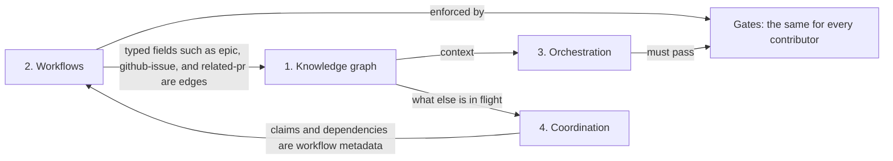

---
semantic-links:
  related-artifacts:
    - "issue #2003"
    - "issue #2264"
    - "issue #2278"
    - docs/agents/orchestration.md
    - docs/templates/ISSUE.md
    - docs/skills/semantic-skill-link-convention.md
    - docs/issues/closed/README.md
    - docs/adrs/20260821172000_establish_ai_agent_context_capability_and_portability_governance.md
    - contrib/dev-tools/checks/frontmatter-validator/
---

# Goals and Boundaries: Knowledge, Workflows, and Agents

| Field        | Value                                                                                                                  |
| ------------ | ---------------------------------------------------------------------------------------------------------------------- |
| Status       | Draft for review in the pull request that adds it                                                                      |
| Started      | 2026-10-03                                                                                                             |
| Participants | Jose Celano (the four aspects); GitHub Copilot (analysis and draft)                                                    |
| Reviewer     | Cameron (`da2ce7`), assignee of EPIC #2003 and its child EPICs #2264 and #2278                                         |
| Informs      | EPIC #2003 and its child EPICs #2264 and #2278                                                                         |
| Deep dive    | [Semantic linking and a repository knowledge graph](../20261003-semantic-linking-knowledge-graph/README.md) (aspect 1) |

## Why This Discussion

The [semantic-linking discussion](../20261003-semantic-linking-knowledge-graph/README.md) started
from a proposal for a repository knowledge graph and drifted into workflow state, link validation,
and agent behavior. Those are different goals, with different owners and different rules. This
discussion names the goals first, so that each proposal can be judged against the goal it serves.

Nothing here changes a specification. A conclusion takes effect only when the owner of the affected
EPIC records it.

## The Four Aspects

Jose Celano's framing, summarized:

1. **Knowledge graph.** A knowledge base that AI agents use to build their context, and whose links
   they follow while working to find more relevant context. It must link artifacts at different
   levels of abstraction: ADRs, types, modules, commits, specifications, and document sections.
2. **Deterministic workflows.** The workflows every contributor follows, such as processing a pull
   request or creating, implementing, and merging an issue. They need metadata and state machines,
   which today are split between the Rust harness code and Markdown frontmatter. Frontmatter is the
   YAML serialization of instances of the Rust types; YAML is preferred because people read it more
   easily than JSON.
3. **Agent orchestration.** How several agents work together on one task, for example pair review,
   as the custom agents under `.github/agents/` define it. This should be a proposal, not a
   requirement: contributors may use other tools or strategies. The standards, linters, guardrails,
   and sensors (the gates) are the same for every contributor, and any orchestration must produce
   work that passes them.
4. **Agent coordination.** Agents working in parallel on different tasks. Today planning handles
   it: work is decomposed into small tasks that do not conflict, and a conflict surfaces at
   pull-request or merge time, at most about an hour after the work starts. Agents could also talk
   to each other while working; if they do, the maintainer should be able to observe what they
   exchange.

## Contract and Technique

What the framing says about orchestration applies to every aspect. Each has a **contract** that
binds every contributor and is deterministic, independent of any tool, and enforced by gates, and a
**technique** that each contributor may choose and that can be replaced. The
[AI-agent portability ADR](../../../adrs/20260821172000_establish_ai_agent_context_capability_and_portability_governance.md)
already treats agent profiles, tools, and indexes this way: they are optional adapters and must not
be the only record of a workflow.

| Aspect | Question it answers | Contract | Technique | Today |
| ------ | ------------------- | -------- | --------- | ----- |
| 1. Knowledge graph | What should I read to understand this? | Reference syntax and resolution rules | Graph database, index, query tool | Links exist; no graph or query tool |
| 2. Workflows | What state is this work in, what may happen next, and what evidence is required? | States, transitions, roles, and evidence, in Rust types, frontmatter, and gates | The scripts and editors that produce the evidence | v1 frontmatter model and validator; PR-review audit and its validator |
| 3. Orchestration | How do my agents work together on one task? | The gates and evidence of aspect 2 | Agent profiles, pair review, model routing | `.github/agents/` and [`docs/agents/orchestration.md`](../../../agents/orchestration.md) |
| 4. Coordination | How do parallel tasks avoid colliding? | Claiming a task before starting it; dependencies recorded in the plan | Messaging between agents, schedulers | Plan decomposition only |

## How the Aspects Depend on Each Other

Aspect 2 is the foundation. Part of the knowledge graph is built from its metadata, and its gates
and claims bound aspects 3 and 4. #2264 and #2278 already cover much of it.

## Findings

### Aspect 1: Knowledge Graph

- The goal is context; a database is one way to serve it. Under the portability ADR it must be
  possible to rebuild an index from tracked files, so the links live in the files. Standard
  Markdown links also stay usable by an agent that has no graph tool.
- Link types should follow from the questions agents need answered, for example "which ADRs
  constrain this module?", "which tests cover this behavior?", or "where else is this rule
  restated?". The draft `docs/issues/drafts/2003-mine-ai-agent-memories/ISSUE.md` is a source for
  those questions: what agents had to remember is what they could not find.
- The [semantic-linking discussion](../20261003-semantic-linking-knowledge-graph/README.md) covers
  this aspect in depth.

### Aspect 2: Deterministic Workflows

- Frontmatter is the right home for workflow state. Knowledge links also live in document bodies
  and code comments, so aspect 1 should not depend on frontmatter alone.
- YAML needs a strict subset enforced by the validator: 48 issue references in frontmatter have
  already lost their number because an unquoted `#` starts a comment
  (`link-convention-unquoted-issue-marker` in the #2003 friction register).
- `frontmatter-validator` checks states against locations (a specification in `closed/` must be
  `done`) but checks no transitions.
- Some state belongs to GitHub: an issue is closed, a pull request is merged. A copy of that state
  in the repository drifts unless a check compares it with GitHub. The register overhaul of
  2026-09-26 found a subissue still `IN_PROGRESS` in the #2278 table after its issue had closed.
- Issue specifications are provisional. Closed specifications are a temporary buffer before
  permanent removal ([`docs/issues/closed/README.md`](../../../issues/closed/README.md)), so
  knowledge that must outlive a specification has to move into a durable artifact (ADR, guide,
  test, or code documentation) before the specification is deleted. No workflow states that step
  today.

### Aspect 3: Agent Orchestration

The repository currently treats one orchestration as mandatory:

- [`docs/agents/orchestration.md`](../../../agents/orchestration.md) calls the Implementer path "the
  repository's complete mandatory delivery path", and its artifact table names the Committer agent
  as the owner of signed commits.
- The Workflow Checkpoints in [`docs/templates/ISSUE.md`](../../../templates/ISSUE.md) name the
  Committer and the `agent-review-reports.md` artifact.

If orchestration is a proposal, these become requirements on roles and evidence, for example "an
independent review of the acceptance criteria is recorded", and the agent workflow becomes one way
to meet them. A step with an objective result, such as a complexity limit, becomes a gate instead
of an agent step.

### Aspect 4: Agent Coordination

- Small pull requests merged optimistically surface textual conflicts quickly. They do not surface
  conflicts of direction between changes to different files: those never conflict at merge and
  appear later as inconsistency. A recurring defect class in the friction register, two copies of
  one rule drifting apart, is that outcome.
- Collisions have already happened: #2367 and #2368 were opened within two minutes of each other
  for the same close-out, and two branches bumped the same skill to version 1.3 and merged without
  a conflict (`add-new-skill-version-collision-undetected`).
- GitHub is already an observable coordination channel that works with any tool: claim a task
  through the issue assignee or a draft pull request before starting, and discuss in the issue.
  Messages exchanged inside one agent runtime are invisible to other runtimes and to reviewers
  unless they are logged somewhere shared.
- A deterministic check could flag open pull requests that reference the same issue or change the
  same files.

## Link Purposes

The repository's existing semantic links already mix the aspects. The
[convention](../../../skills/semantic-skill-link-convention.md) defines `skill-link` and
`related-artifacts` as change-impact links: "linked files should be reviewed when this one
changes". That is a guardrail, part of aspect 2. Yet 2,002 of the 3,286 path links are in closed
specifications, which do not change
([link corpus](../20261003-semantic-linking-knowledge-graph/README.md#existing-link-corpus)), so
authors use the field for context and provenance, which is aspect 1.

| Purpose | Aspect | Example | Validation |
| ------- | ------ | ------- | ---------- |
| Context | 1 | A specification points at the ADR that explains one of its constraints | Lenient: the target may go stale in historical records |
| Change impact | 2 | A workflow file names the skill that must be reviewed when it changes | Strict: the target must exist, and a change must trigger the review |
| Workflow relation | 2 | `epic`, `github-issue`, and `related-pr` in a specification | Strict and tied to state: checked against GitHub where GitHub owns the state |

## Draft Conclusions

1. **Frame #2003 by the four aspects.** Record each proposal under the aspect it serves and judge
   it against that aspect's goal.
2. **Every aspect separates contract from technique.** The contract binds every contributor and is
   enforced by gates; the technique is optional and replaceable.
3. **Workflow state lives in typed frontmatter.** It is the YAML serialization of the Rust types,
   restricted to a strict subset. State that GitHub owns is referenced, not copied, unless a check
   compares the copy with GitHub.
4. **Workflows name roles and evidence, never agents.** The agent workflow in
   `docs/agents/orchestration.md` is one reference orchestration. Rewording that guide and the
   issue template's checkpoints is follow-up work for their owner.
5. **Name the three link purposes** and validate each according to its purpose.
6. **Promote knowledge before deleting a specification.** The archive and cleanup workflow should
   state the step.
7. **Coordination starts on GitHub.** A claim rule and a check for overlapping open pull requests
   come first. Messaging between agents is a later, optional technique and must log to a place the
   maintainers can read.
8. **Sequence.** Aspect 2 first, then aspect 1. The claim rule and the rewording of the
   orchestration guide are small documentation changes that can happen at any time.

## Open Questions for the Reviewer

1. Is the four-aspect frame right for #2003? Is anything missing, for example the gates as an
   aspect of their own?
2. Which current agent-workflow requirements are standards for every contributor, such as a
   recorded independent review, and which are techniques, such as a complexity audit after every
   step?
3. 5 of 167 ADR path links no longer resolve, and nothing checks them. Should ADR links be
   change-impact links validated strictly, or context links treated as historical because an ADR
   records a decision at a point in time? The register asks the same question for audit
   frontmatter (`cleanup-completed-issues-audit-links-class-unstated`) and for links between
   specifications (`link-convention-stability-warning-scope`).
4. Where should a coordination claim live: the issue assignee, a draft pull request, or a comment
   convention?
5. Which repository records copy state that GitHub owns (specification status, EPIC subissue
   tables, `related-pr`), and should each copy be checked or removed?
6. Does the [`docs/discussions/`](../../AGENTS.md) convention work, and should the outcome of this
   discussion be recorded in #2003?

## Outcome

Pending review.
