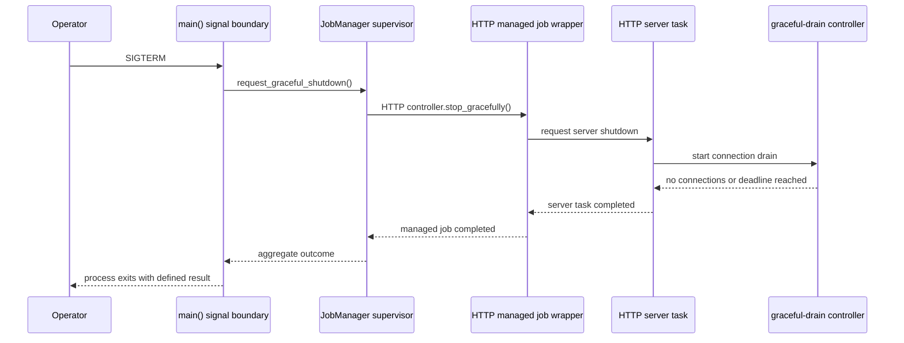
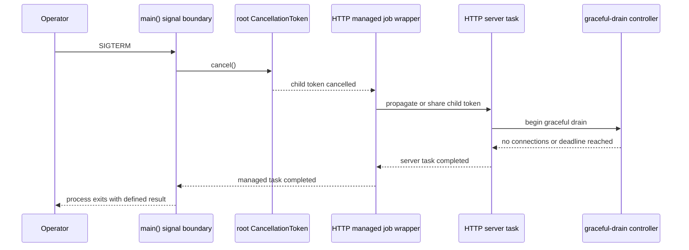
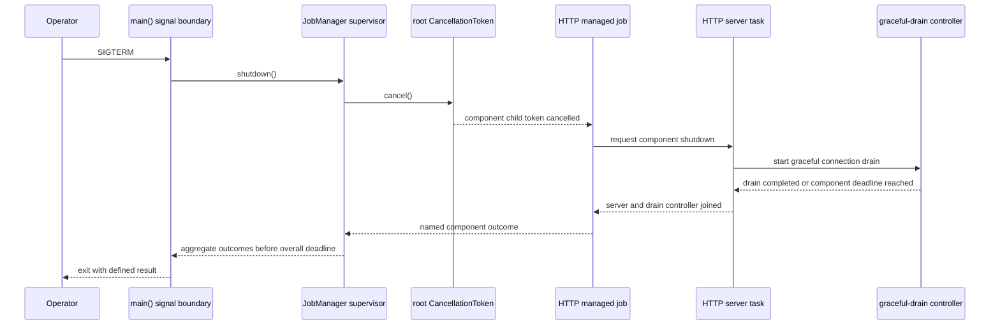
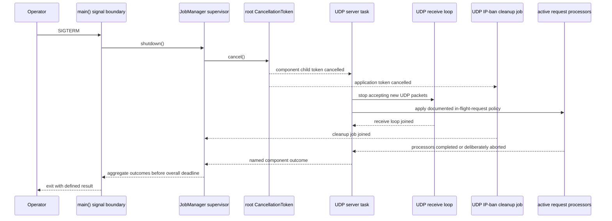

# Shutdown Architecture Examples

## Purpose

This document makes three Q2 candidate architectures concrete. Each example
shows one shutdown request from the tracker binary through at least two nested
task levels. Q2 selected the supervised cancellation tree as the target; the
other examples are retained to document the alternatives that were evaluated.

The examples use an HTTP tracker because its current lifecycle has a managed
job wrapper, a server task, and a graceful-drain controller. The same ownership
principles must also work for UDP, REST API, health-check API, periodic jobs,
and standalone package consumers.

## Shared Boundary Rule

In both alternatives, the tracker binary is the only production component that
subscribes to `SIGINT` and `SIGTERM`. It translates either OS signal into a
normal, in-process shutdown request. Server libraries do not subscribe to OS
signals; a standalone binary using a server package performs that translation
at its own binary boundary.

## Alternative A: Supervisor Owns Explicit Component Controllers

### Model

`JobManager` becomes an application supervisor. Each long-running component
returns a managed task together with a typed controller or shutdown handle. The
supervisor retains both. On shutdown it requests stop through every controller,
then concurrently awaits the managed tasks and reports their individual
outcomes.

A controller is a public lifecycle API, not an incidental sender leaked from a
task closure. An HTTP controller would request graceful draining through the
server's dedicated mechanism; a UDP controller could first stop accepting new
UDP packets and then apply its documented in-flight-work policy.

### Example Flow



### Ownership Tree

```text
main() [OS-signal boundary]
└─ JobManager supervisor [owns task handles and component controllers]
   └─ HTTP component [managed]
      ├─ HTTP managed job wrapper [joined by supervisor]
      │  └─ HTTP server task [joined by wrapper]
      │     └─ graceful-drain controller [joined by server task]
      └─ HTTP shutdown controller [retained by supervisor]
```

### Consequences to Evaluate

- Makes shutdown ownership explicit and lets the supervisor observe the exact
  state of every component.
- Fits components whose stop operation has meaningful semantics beyond generic
  cancellation, such as HTTP draining and UDP admission control.
- Requires a lifecycle/controller API and may require changes to existing
  server start functions and standalone environments.
- Does not by itself normalize background-loop cancellation; those components
  still need a defined stop contract, potentially backed by a token.

## Alternative B: Shared Cancellation Tree with Component-Owned Graceful Stop

### Model

The application creates one root `CancellationToken`. Every long-running task
receives a child token. Cancelling the root cascades cancellation to all child
tokens. Component tasks own their graceful-stop sequence: an HTTP server task
observes its token, invokes the Axum handle's graceful-drain API, and joins its
own controller before reporting completion to the parent.

The supervisor retains top-level task handles for outcome reporting, but it does
not retain a separate sender per component. A standalone caller creates and
cancels the root or component token at its application boundary.

### Example Flow



### Ownership Tree

```text
main() [OS-signal boundary]
└─ root CancellationToken [owned by application]
   └─ HTTP component child token
      └─ HTTP managed job wrapper [joined by supervisor]
         └─ HTTP server task [joined by wrapper]
            └─ graceful-drain controller [joined by server task]
```

### Consequences to Evaluate

- Provides one cancellation vocabulary for event listeners, periodic jobs, and
  server components.
- Enables deterministic tests: cancel an injected token instead of delivering
  an OS signal.
- Requires an explicit policy for token ownership, child-token boundaries, and
  what component shutdown means when a token is dropped.
- A token communicates _when_ to stop, but the component must still own and
  expose enough lifecycle state to report draining, completion, timeout, or
  failure accurately.

## Recommended Target: JobManager Supervision with a Cancellation Tree

### Model

This combines the strengths of the preceding alternatives. `JobManager` remains
the application's top-level supervisor: it owns named top-level task handles,
initiates shutdown, awaits outcomes concurrently under one overall deadline,
and reports completion, failure, and timeout by component name.

Its root `CancellationToken` is the normal shutdown-request mechanism. Each
long-running component receives a child token. Cancellation requests that a
component stop; it does not itself prove the component stopped. Every component
is responsible for propagating cancellation to its children, applying its own
graceful-stop policy, and joining or deliberately aborting every child it
spawns before its managed top-level task completes.

This model does not make a generic token responsible for transport-specific
behavior. HTTP components still drain connections through their Axum handle;
UDP components still define their admission and in-flight-request behavior.
The common contract is ownership and completion reporting, not an identical
shutdown algorithm for every protocol.

### HTTP Shutdown Flow



### UDP Shutdown Flow



### Ownership Tree

```text
main() [only OS-signal boundary]
└─ JobManager supervisor [root token; named top-level task handles]
   ├─ HTTP component child token
   │  └─ HTTP managed job [joined by JobManager]
   │     └─ HTTP server task [joined by HTTP job]
   │        └─ graceful-drain controller [joined by HTTP server]
   └─ UDP component child token
      └─ UDP managed job [joined by JobManager]
         └─ UDP server task [joined by UDP job]
            ├─ receive loop [joined by UDP server]
            └─ active request processors [joined or deliberately aborted]
    └─ UDP IP-ban cleanup job [cancelled and joined by JobManager]
```

### Contract for Standalone Consumers

Standalone server environments must provide the same deterministic, in-process
lifecycle behavior without depending on `JobManager`. Their `stop()` API
requests cancellation through their component root token and awaits their owned
tasks. A standalone binary, rather than the library, maps OS signals to that
method. Tests call `stop()` or cancel an injected token directly.

### Why This Is the Recommended Target

- It gives the application a single shutdown authority without making server
  libraries dependent on operating-system signals.
- It makes `CancellationToken` the single normal cancellation vocabulary while
  preserving component-specific graceful behavior.
- It eliminates detached long-running child tasks as an accepted lifecycle
  state: every child has a documented owner and completion policy.
- It allows `JobManager` to provide the observability and aggregate outcomes
  expected from an application supervisor.
- It supports deterministic tests and standalone library consumers.

The implementation may use temporary token-to-oneshot forwarding while
migrating legacy servers, but that forwarding is not part of the target public
lifecycle contract.

### Propagation Rule

Cancellation flows top-down, from an owner to the child tasks it directly owns.
Completion and failure outcomes flow bottom-up through awaited handles. The
supervisor therefore owns only named top-level component tasks, while each
component owns and joins its nested tasks. This applies equally to the HTTP
drain controller, UDP receive loop, and active request work. The application-
level UDP IP-ban cleanup job is separately owned and joined by `JobManager`.

## Relationship to the Existing Options

| Current Q2 option                                                             | Relationship to these examples                                                                                                            |
| ----------------------------------------------------------------------------- | ----------------------------------------------------------------------------------------------------------------------------------------- |
| Option 1: `JobManager` stores halt senders                                    | A narrow predecessor of Alternative A. It exposes transport-specific oneshot senders rather than component lifecycle controllers.         |
| Option 2: servers watch `CancellationToken`                                   | The core of Alternative B. It must additionally define task ownership, join behavior, and component status reporting.                     |
| Option 3: each wrapper forwards token cancellation to an internal halt sender | A compatibility bridge toward Alternative B, but preserves duplicated signaling and a hidden per-component protocol.                      |
| Recommended target: supervised cancellation tree                              | Combines Alternative A's explicit top-level supervision with Alternative B's normalized cancellation and component-owned child lifecycle. |

## Evaluation Results Recorded by Q2

Q2 compared all alternatives, including the recommended target, against the
[Architecture Decision Criteria](README.md#architecture-decision-criteria). The
following questions were used to validate the selected architecture:

1. Does every long-running and detached task have an owner that can request
   shutdown and await or deliberately abort it?
2. Can the tracker and standalone consumers stop an HTTP, REST, health-check,
   or UDP component without subscribing to OS signals in library code?
3. Are timeout, task failure, and forced termination outcomes visible to the
   top-level supervisor?
4. Which behavior is intentionally common through cancellation, and which is
   component-specific through a lifecycle API?
5. Is there a migration path that prevents mixed old/new signal authority from
   creating races while packages are updated?
