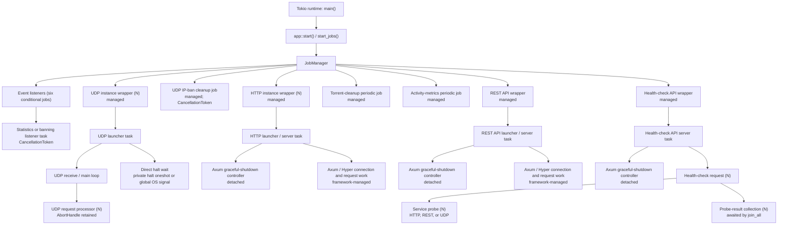

# Preliminary Task Inventory

## Purpose and Scope

This is a planning-time map of tasks spawned by the production tracker and the
ownership relationships between them. It supports the shutdown architecture
decision in [Q2](questions.md#q2); it is **not** the implementation-time,
complete inventory required to close [issue #1588][issue-1588].

The map starts at the tracker binary's Tokio runtime and follows the normal
`app::start()` startup path. It excludes tests, benchmarks, the tracker-client
console application, and Tokio work whose exact task structure is owned by
third-party HTTP framework internals.

## How to Read This Map

- An arrow means the parent creates, owns, or supervises the child task.
- `JobManager` retains only the top-level handles explicitly registered through
  `push`; it does not recursively own child tasks.
- **Managed** means the `JobManager` holds the handle and will await it.
- **Detached** means the handle is discarded after spawning.
- `N` means one task per configured binding, service, request, or datagram.
- Shutdown behavior describes the current implementation, not the desired
  feature design.

## Spawn Hierarchy

### `ps --forest`-Style View

This is a conceptual task tree, styled after `ps --forest`. Tokio tasks are
not operating-system threads or child processes: they are scheduled across the
runtime worker threads and do not have stable PIDs. The indentation represents
spawn or supervision ownership, not an operating-system parent-child relation.

```text
torrust-tracker process (Tokio runtime; main)
└─ app::start() / start_jobs()
   └─ JobManager
      ├─ swarm-registry statistics listener [managed; conditional]
      ├─ tracker-core event listener [managed; conditional]
      ├─ HTTP-core statistics listener [managed; conditional]
      ├─ UDP-core statistics listener [managed; conditional]
      ├─ UDP-server statistics listener [managed; conditional]
      ├─ UDP-server banning listener [managed]
      ├─ UDP IP-ban cleanup job [managed; conditional]
      ├─ UDP instance wrapper [managed; N bindings]
      │  └─ UDP launcher task
      │     ├─ UDP receive / main loop
      │     │  └─ request processor [one per datagram; AbortHandle retained]
      │     └─ direct halt wait [private halt oneshot or global OS signal]
      ├─ HTTP instance wrapper [managed; N bindings]
      │  └─ HTTP launcher / server task
      │     ├─ graceful-shutdown controller [detached]
      │     └─ Axum / Hyper connection and request work [framework-managed]
      ├─ torrent-cleanup periodic job [managed; conditional]
      ├─ activity-metrics periodic job [managed; conditional]
      ├─ REST API wrapper [managed; conditional]
      │  └─ REST API launcher / server task
      │     ├─ graceful-shutdown controller [detached]
      │     └─ Axum / Hyper connection and request work [framework-managed]
      └─ health-check API wrapper [managed]
         └─ health-check API server task
            ├─ graceful-shutdown controller [detached]
            └─ health-check request [N requests]
               ├─ service probe [N registered services]
               └─ probe-result collection [N probes; awaited by join_all]
```

`[managed]` means that the `JobManager` retains and awaits the **wrapper**
handle. It does not mean every indented descendant is joined by the manager.
`[detached]` identifies tasks whose `JoinHandle` is discarded in the current
implementation.



## Inventory

| Task / cardinality                                        | Immediate owner                      | Handle ownership                         | Current shutdown trigger                                               | Responds to `jobs.cancel()`? | Planning concern                                                                   |
| --------------------------------------------------------- | ------------------------------------ | ---------------------------------------- | ---------------------------------------------------------------------- | ---------------------------- | ---------------------------------------------------------------------------------- |
| Swarm-registry statistics listener, conditional           | `JobManager`                         | Managed                                  | `CancellationToken` or event receiver closure                          | Yes                          | None identified in this preliminary review.                                        |
| Tracker-core event listener, conditional                  | `JobManager`                         | Managed                                  | `CancellationToken` or event receiver closure                          | Yes                          | None identified in this preliminary review.                                        |
| HTTP-core statistics listener, conditional                | `JobManager`                         | Managed                                  | `CancellationToken` or event receiver closure                          | Yes                          | None identified in this preliminary review.                                        |
| UDP-core statistics listener, conditional                 | `JobManager`                         | Managed                                  | `CancellationToken` or event receiver closure                          | Yes                          | None identified in this preliminary review.                                        |
| UDP-server statistics listener, conditional               | `JobManager`                         | Managed                                  | `CancellationToken` or event receiver closure                          | Yes                          | None identified in this preliminary review.                                        |
| UDP-server banning listener                               | `JobManager`                         | Managed                                  | `CancellationToken` or event receiver closure                          | Yes                          | None identified in this preliminary review.                                        |
| UDP IP-ban cleanup, conditional                           | `JobManager`                         | Managed                                  | `CancellationToken`                                                    | Yes                          | Application-wide cleanup is already owned; it is not a per-listener child task.    |
| UDP instance wrapper, one per public UDP binding          | `JobManager`                         | Managed wrapper awaits launcher          | Manager token → private `Halted::Normal`; legacy global signal remains | Yes, through forwarding      | Cancellation reaches the wrapper, but launcher child ownership remains incomplete. |
| UDP launcher                                              | UDP wrapper / `Server<Running>`      | Retained by wrapper                      | Private halt oneshot or `global_shutdown_signal()`                     | Indirectly                   | Global signal bypasses the application supervisor.                                 |
| UDP receive/main loop                                     | UDP launcher                         | Local join handle; aborted on halt       | Aborted by launcher after halt signal                                  | No                           | Forced cancellation can interrupt in-flight work.                                  |
| UDP direct halt wait                                      | UDP launcher                         | Awaited directly in launcher `select!`   | Private halt oneshot or global SIGINT/SIGTERM                          | Indirectly                   | Each server independently observes OS signals.                                     |
| HTTP instance wrapper, one per HTTP binding               | `JobManager`                         | Managed wrapper awaits server            | Manager token → private `Halted::Normal`; legacy global signal remains | Yes, through forwarding      | Cancellation reaches the wrapper, but server drain ownership and budgets conflict. |
| HTTP launcher / server                                    | HTTP wrapper / `HttpServer<Running>` | Retained by wrapper                      | Detached controller receives private halt oneshot or global signal     | Indirectly                   | 90-second Axum drain conflicts with the manager's 10-second per-job wait.          |
| HTTP graceful-shutdown controller                         | HTTP server                          | Detached                                 | Halt oneshot or global SIGINT/SIGTERM                                  | No                           | May outlive a manager wrapper that has timed out.                                  |
| HTTP connection and request work                          | Axum / Hyper                         | Framework-managed                        | `Handle::graceful_shutdown`                                            | Indirectly                   | Exact task topology is an external implementation detail.                          |
| Torrent-cleanup periodic job, conditional                 | `JobManager`                         | Managed                                  | Direct Ctrl+C or weak-manager expiry                                   | No                           | Does not have a manager-token or SIGTERM path.                                     |
| REST API wrapper and launcher                             | `JobManager`                         | Managed wrapper awaits server            | Manager token → private `Halted::Normal`; legacy global signal remains | Yes, through forwarding      | Same lifecycle split and timeout conflict as HTTP tracker.                         |
| REST API graceful-shutdown controller                     | REST API server                      | Detached                                 | Halt oneshot or global SIGINT/SIGTERM                                  | No                           | Same detached-controller concern as HTTP tracker.                                  |
| Health-check API wrapper and server                       | `JobManager`                         | Managed wrapper awaits server            | Manager token → private `Halted::Normal`; legacy global signal remains | Yes, through forwarding      | Same lifecycle split and timeout conflict as HTTP tracker.                         |
| Health-check graceful-shutdown controller                 | Health-check server                  | Detached                                 | Halt oneshot or global SIGINT/SIGTERM                                  | No                           | Same detached-controller concern as other Axum servers.                            |
| Health-check service probe, one per service per request   | Health-check request handler         | Retained indirectly by result collection | Normal response/error or runtime teardown                              | No                           | Timeout behavior depends on the protocol client.                                   |
| Health-check result collection, one per probe per request | Health-check request handler         | Awaited by `join_all`                    | Normal completion or request-future cancellation                       | No                           | A failed task join currently panics.                                               |

## Preliminary Findings Relevant to Q2

1. `JobManager` provides a cancellation path to the event listeners, UDP-ban
   cleanup, and server wrappers. Torrent cleanup and activity metrics remain
   outside that path; server wrappers use token-to-halt forwarding rather than
   the target direct lifecycle API.
2. Server instances have multiple lifecycle layers: a managed wrapper, a retained
   server/launcher task, and a detached shutdown controller. This means the
   top-level handle does not alone represent the full shutdown lifecycle.
3. The HTTP, REST, health-check, and UDP server paths each accept direct OS
   signals inside library-level code. This conflicts with a single application
   shutdown authority.
4. The periodic torrent-cleanup and activity-metrics jobs do not participate in
   manager cancellation. The application-level UDP IP-ban cleanup job is already
   token-cancellable and manager-owned.
5. Request-level work needs separate treatment from long-running components:
   HTTP is drained through the server handle, whereas UDP processing is
   explicitly abortable.

## Follow-up for Issue #1588

Before closing #1588, re-validate every row against the then-current code and
expand the inventory as needed. In particular, it must establish the actual
behavior of detached tasks when their parent future ends, framework-owned HTTP
request work, error and panic paths, and all configuration-dependent task
cardinalities. Record that evidence in #1588's `verification.md`.

[issue-1588]: ../../issues/open/1588-review-shutdown-process-for-all-tasks-jobs/ISSUE.md
