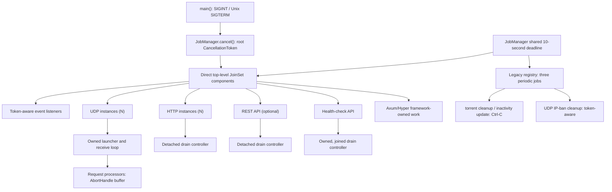

# Task Inventory

## Purpose and Scope

This is the implementation-time task-ownership evidence for the production
tracker, revalidated for [issue #1588][issue-1588] after [issue #1586][issue-1586]
adopted direct `JoinSet` supervision. It follows the normal `app::start()`
startup path and excludes tests, benchmarks, the tracker-client application,
and third-party framework internals whose exact task topology is not exposed.

`main()` is the executable signal boundary: it accepts `SIGINT` and, on Unix,
`SIGTERM`; it then calls `JobManager::cancel()` and awaits all manager-owned
work under one shared ten-second deadline. The supervisor owns direct
top-level component futures only. Components own nested tasks and must join or
deliberately abort them before returning; `JobManager` never collects nested
handles.

## Conceptual Ownership Tree

Tokio tasks have no process IDs. This conceptual tree represents task creation
and supervision ownership, not operating-system parent-child relationships.
`N` means one task per matching configured item.

```text
torrust-tracker process (Tokio runtime; main)
└─ app::start() / start_jobs()
   └─ JobManager
      ├─ Direct JoinSet components
      │  ├─ seven token-aware event-listener categories [conditional as listed below]
      │  ├─ UDP instance [N configured public bindings]
      │  │  └─ launcher task [component-owned NestedServerTask]
      │  │     ├─ receive loop [launcher-owned; abort and join on halt]
      │  │     └─ request processors [N datagrams; bounded AbortHandle buffer]
      │  ├─ HTTP instance [N configured bindings]
      │  │  └─ server task [component-owned NestedServerTask]
      │  │     └─ drain controller [currently detached]
      │  ├─ REST API [conditional]
      │  │  └─ server task [component-owned NestedServerTask]
      │  │     └─ drain controller [currently detached]
      │  └─ health-check API [always]
      │     ├─ server task [component-owned NestedServerTask]
      │     └─ drain controller [component-owned and joined]
      ├─ Legacy registry (pre-spawned periodic jobs, not JoinSet members)
      │  ├─ torrent cleanup [conditional; direct Ctrl-C]
      │  ├─ peers inactivity update [conditional; direct Ctrl-C]
      │  └─ UDP IP-ban cleanup [conditional; CancellationToken]
      └─ Axum/Hyper connection and request work [framework-owned]
```



## Current Inventory

| Task / cardinality                                                                                                                                  | Immediate owner and retained work                                                     | Cancellation and completion policy                                                                                              | Current state / roadmap owner                                                                      |
| --------------------------------------------------------------------------------------------------------------------------------------------------- | ------------------------------------------------------------------------------------- | ------------------------------------------------------------------------------------------------------------------------------- | -------------------------------------------------------------------------------------------------- |
| Swarm-registry statistics listener, 0–1 when `tracker_usage_statistics`                                                                             | Direct `JoinSet` component                                                            | Root token; runner reports cooperative cancellation or completion.                                                              | Current token-native path.                                                                         |
| Tracker-core in-memory listener, 0–1 when `tracker_usage_statistics`                                                                                | Direct `JoinSet` component                                                            | Root token; runner reports cooperative cancellation or completion.                                                              | Current token-native path.                                                                         |
| Tracker-core persistent completed-statistics listener, 0–1 when persistent completed statistics are enabled; startup fails if persistence is absent | Direct `JoinSet` component                                                            | Root token; runner reports cooperative cancellation or completion.                                                              | Current token-native path; this listener was absent from the preliminary inventory.                |
| HTTP-core listener, exactly 1                                                                                                                       | Direct `JoinSet` component                                                            | Root token; runner reports cooperative cancellation or completion.                                                              | Current token-native path, including without HTTP bindings.                                        |
| UDP-core listener, exactly 1                                                                                                                        | Direct `JoinSet` component                                                            | Root token; runner reports cooperative cancellation or completion.                                                              | Current token-native path, including without UDP services.                                         |
| UDP-server statistics and banning listeners, each 0–1 when UDP services are enabled (public tracker and non-empty UDP configuration)                | Direct `JoinSet` components                                                           | Root token; runners report cooperative cancellation or completion.                                                              | Current token-native path.                                                                         |
| UDP instance, N per configured UDP binding when UDP services are enabled                                                                            | Direct `JoinSet` component owns launcher in `NestedServerTask`                        | Token cancellation sends private `Halted::Normal`, then joins launcher. Drop sends halt, aborts, and prevents child detachment. | Legacy `Halted` bridge and server-library signal fallback: SI-2, then SI-14/SI-15 and SI-18/SI-19. |
| UDP receive loop, 1 per UDP instance                                                                                                                | Launcher owns its `JoinHandle`                                                        | Launcher awaits it normally; on halt it aborts and awaits it.                                                                   | Receive cancellation is not token-native: SI-14.                                                   |
| UDP request processor, N per received datagram                                                                                                      | Receive loop retains a bounded buffer of `AbortHandle`s, not joins                    | Eviction and buffer drop abort unfinished processors; no terminal result is collected.                                          | Active-request deadline, abort, and outcome policy: SI-15.                                         |
| HTTP instance, N per configured HTTP binding                                                                                                        | Direct `JoinSet` component owns server task in `NestedServerTask`                     | Token cancellation sends private `Halted::Normal`, then joins server.                                                           | Token-native server lifecycle and joined drain controller: SI-2, SI-10, SI-11.                     |
| HTTP drain controller, 1 per HTTP instance                                                                                                          | Spawned by server library; handle is discarded                                        | Waits for private halt or legacy global signal; performs 90-second Axum drain with 95-second maximum wait.                      | Detached lifecycle and deadline mismatch: SI-10/SI-11.                                             |
| REST API, 0–1 when `http_api` is configured                                                                                                         | Direct `JoinSet` component owns server task in `NestedServerTask`                     | Token cancellation sends private `Halted::Normal`, then joins server.                                                           | Token-native server lifecycle and joined drain controller: SI-2, SI-10, SI-12.                     |
| REST API drain controller, 0–1                                                                                                                      | Spawned by server library; handle is discarded                                        | Same private-halt/global-signal and 90/95-second drain behavior as HTTP.                                                        | Detached lifecycle and deadline mismatch: SI-10/SI-12.                                             |
| Health-check API, exactly 1                                                                                                                         | Direct `JoinSet` component owns both server and controller through `NestedServerTask` | Token cancellation sends private `Halted::Normal`; component joins both handles, while drop aborts remaining children.          | Uses legacy bridge; token-native lifecycle and readiness-first shutdown remain: SI-13/SI-21.       |
| Health-check probes and aggregation, N per request and registered service                                                                           | Request handler / protocol client; request-scoped                                     | Aggregation is awaited with `join_all`; protocol probes are spawned inside service checks.                                      | Framework/request-scoped work, not manager-owned.                                                  |
| Torrent cleanup, 0–1 when `inactive_peer_cleanup_interval > 0`                                                                                      | Pre-spawned `JoinHandle` in `legacy_jobs`, not `JoinSet`                              | Direct `ctrl_c` or weak-manager expiry. It ignores `jobs.cancel()` and is aborted then joined at deadline.                      | Migrate to token-aware starter: SI-4.                                                              |
| Peers inactivity update, 0–1 when `tracker_usage_statistics`                                                                                        | Pre-spawned `JoinHandle` in `legacy_jobs`, not `JoinSet`                              | Direct `ctrl_c` or weak-dependency expiry. It ignores `jobs.cancel()` and is aborted then joined at deadline.                   | Migrate to token-aware starter: SI-5.                                                              |
| UDP IP-ban cleanup, 0–1 when UDP services are enabled                                                                                               | Pre-spawned `JoinHandle` in `legacy_jobs`, not `JoinSet`                              | Root token; manager waits or aborts and joins it at deadline.                                                                   | Token-cancellable, but its pre-spawned lifecycle remains a periodic-job migration concern.         |

The direct-component count is configuration dependent:

$$
3 + 2I_{usage} + I_{persistent} + I_{udp}(2 + N_{udp}) + N_{http} + I_{api}
$$

The constant three represents the HTTP-core listener, UDP-core listener, and
health-check API. The three legacy jobs are separate and individually
conditional as shown above.

## Findings and Roadmap Mapping

1. The #1586 supervisor boundary is present: direct top-level component
   futures enter `JoinSet`; component child handles do not. The three
   pre-spawned periodic jobs are a deliberately narrow compatibility registry
   under the same process-wide deadline.
2. `main.rs` now handles Unix `SIGTERM` at the executable boundary. SI-1 is
   complete, so this is not an open gap.
3. `torrent_cleanup` and `peers_inactivity_update` still subscribe to Ctrl-C
   directly and therefore require the deadline-abort fallback after
   `jobs.cancel()`. Their migrations are SI-4 and SI-5.
4. Server libraries still combine private `Halted` channels with
   `global_shutdown_signal` behavior. The additive lifecycle API belongs to
   SI-2; supported-consumer deprecation/removal follows in SI-18 and SI-19.
5. HTTP and REST drain controllers remain detached, while the health-check
   component now owns its controller. HTTP/REST drain completion and timeout
   alignment remain SI-10 through SI-12.
6. Health-check lifecycle remains on the bridge and does not yet mark readiness
   unhealthy before draining: SI-13 and SI-21.
7. UDP still aborts its receive loop and retains only request abort handles;
   SI-14 and SI-15 own those lifecycle and outcome policies.
8. Standalone HTTP and UDP examples retain Ctrl-C-based shutdown: SI-16 and
   SI-17. Final process outcome-to-exit-code and configured-deadline policy is
   SI-20.

No implementation evidence identified a missing independently releasable
shutdown slice. The [EPIC #1488 roadmap][issue-1488] remains unchanged.

[issue-1488]: ../../issues/open/1488-overhaul-tracker-shutdown/ISSUE.md
[issue-1586]: ../../issues/open/1586-evaluate-job-manager-join-set/ISSUE.md
[issue-1588]: ../../issues/open/1588-review-shutdown-process-for-all-tasks-jobs/ISSUE.md
