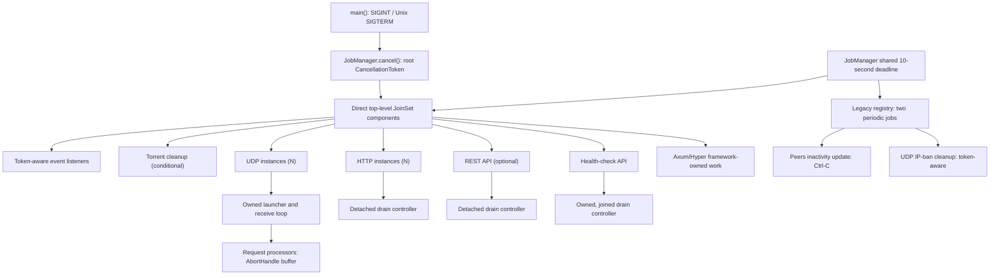

# Task Inventory

## Purpose and Scope

This is the implementation-time task-ownership evidence for the production
tracker, revalidated for [issue #1588][issue-1588] after [issue #1586][issue-1586]
adopted direct `JoinSet` supervision. It follows the normal `app::start()`
startup path and excludes tests, benchmarks, the tracker-client application,
and third-party framework internals whose exact task topology is not exposed.

`main()` is the executable signal boundary: it accepts `SIGINT` and, on Unix,
`SIGTERM`; it then calls `JobManager::cancel()` and awaits all manager-owned
work under one shared ten-second deadline. The supervisor owns direct
top-level component futures only. Components own nested tasks and must join or
deliberately abort them before returning; `JobManager` never collects nested
handles.

## Conceptual Ownership Tree

Tokio tasks have no process IDs. This conceptual tree represents task creation
and supervision ownership, not operating-system parent-child relationships.
`N` means one task per matching configured item.

```text
torrust-tracker process (Tokio runtime; main)
└─ app::start() / start_jobs()
   └─ JobManager
      ├─ Direct JoinSet components
      │  ├─ seven token-aware event-listener categories [conditional as listed below]
      │  ├─ torrent cleanup [conditional]
      │  ├─ UDP instance [N configured public bindings]
      │  │  └─ launcher task [component-owned NestedServerTask]
      │  │     ├─ receive loop [launcher-owned; abort and join on halt]
      │  │     └─ request processors [N datagrams; bounded AbortHandle buffer]
      │  ├─ HTTP instance [N configured bindings]
      │  │  └─ server task [component-owned NestedServerTask]
      │  │     └─ drain controller [currently detached]
      │  ├─ REST API [conditional]
      │  │  └─ server task [component-owned NestedServerTask]
      │  │     └─ drain controller [currently detached]
      │  └─ health-check API [always]
      │     ├─ server task [component-owned NestedServerTask]
      │     └─ drain controller [component-owned and joined]
      ├─ Legacy registry (pre-spawned periodic jobs, not JoinSet members)
      │  ├─ peers inactivity update [conditional; direct Ctrl-C]
      │  └─ UDP IP-ban cleanup [conditional; CancellationToken]
      └─ Axum/Hyper connection and request work [framework-owned]
```



## Current Inventory

The table is a compact overview. The [detailed inventory](#detailed-inventory)
below records the exact ownership, cancellation, and completion evidence for
each row.

| Work                          | Cardinality | Ownership        | Current shutdown         | Roadmap                |
| ----------------------------- | ----------- | ---------------- | ------------------------ | ---------------------- |
| Swarm-registry listener       | 0–1         | Direct `JoinSet` | Root token               | —                      |
| Tracker-core listeners        | 0–2         | Direct `JoinSet` | Root token               | —                      |
| HTTP-core listener            | 1           | Direct `JoinSet` | Root token               | —                      |
| UDP-core listener             | 1           | Direct `JoinSet` | Root token               | —                      |
| UDP-server listeners          | 0–2         | Direct `JoinSet` | Root token               | —                      |
| UDP instances                 | N bindings  | Direct `JoinSet` | Token → `Halted`         | SI-2, SI-14, SI-15     |
| UDP request processors        | N datagrams | Component-owned  | Abort handles            | SI-15                  |
| HTTP instances                | N bindings  | Direct `JoinSet` | Token → `Halted`         | SI-2, SI-10, SI-11     |
| REST API                      | 0–1         | Direct `JoinSet` | Token → `Halted`         | SI-2, SI-10, SI-12     |
| Health-check API              | 1           | Direct `JoinSet` | Token → `Halted`         | SI-13, SI-21           |
| HTTP/REST drain controllers   | Per server  | Detached         | `Halted` / global signal | SI-10–SI-12            |
| Health-check drain controller | 1           | Component-owned  | `Halted` / global signal | SI-13                  |
| Health-check request work     | Per request | Framework-owned  | Request lifetime         | —                      |
| Torrent cleanup               | 0–1         | Direct `JoinSet` | Root token               | SI-4 complete          |
| Peers inactivity update       | 0–1         | Legacy registry  | Direct Ctrl-C            | SI-5                   |
| UDP IP-ban cleanup            | 0–1         | Legacy registry  | Root token               | Periodic-job migration |

## Detailed Inventory

### Direct `JoinSet` Components

- **Torrent cleanup** — starts when `inactive_peer_cleanup_interval > 0`. Its
  unspawned runner observes the root token or weak-manager expiry and reports
  cooperative cancellation or normal completion to `JobManager`.
- **Swarm-registry statistics listener** — starts only when
  `tracker_usage_statistics` is enabled. Its unspawned runner receives the
  root token and reports either cooperative cancellation or completion.
- **Tracker-core listeners** — the in-memory listener starts with
  `tracker_usage_statistics`; the persistent completed-statistics listener
  starts when persistent completed statistics are enabled and fails startup if
  persistence is absent. Both are token-aware direct components.
- **HTTP-core and UDP-core listeners** — each starts exactly once, even when
  the corresponding server bindings are absent. Both are token-aware direct
  components.
- **UDP-server statistics and banning listeners** — each starts when UDP
  services are enabled: the tracker is public and the UDP configuration is
  non-empty. Both are token-aware direct components.
- **UDP instances** — one direct component per enabled UDP binding. The
  component owns its launcher in `NestedServerTask`; cancellation sends
  private `Halted::Normal` and joins it. On drop, the owner sends halt and
  aborts the child to prevent detachment. The launcher owns its receive-loop
  `JoinHandle`, which it awaits normally or aborts and awaits on halt.
- **HTTP instances and REST API** — direct components own their server task in
  `NestedServerTask` and forward token cancellation to private
  `Halted::Normal`, then join the server. There is one HTTP component per
  configured binding and zero or one REST component when `http_api` is
  configured.
- **Health-check API** — an always-present direct component. It owns both the
  server and its drain controller through `NestedServerTask`; it joins both
  after cancellation and aborts remaining children if dropped.

### Component-Owned, Detached, and Framework-Owned Work

- **UDP request processors** — the receive loop spawns one per datagram and
  retains only a bounded `AbortHandle` buffer. Eviction and buffer drop abort
  unfinished processors, but no processor terminal result is collected.
- **HTTP and REST drain controllers** — each server library spawns a
  controller and discards its handle. The controller waits for private halt or
  the legacy global signal, then applies a 90-second drain and 95-second
  maximum wait. These detached controllers conflict with the manager's shared
  ten-second deadline.
- **Health-check request work** — request-scoped aggregation awaits with
  `join_all`; protocol probes are spawned inside service checks. Axum/Hyper
  own connection and request topology, so none of this work is manager-owned.

### Legacy Registry

- **Peers inactivity update** — starts with `tracker_usage_statistics`. Its
  pre-spawned legacy handle similarly observes direct Ctrl-C or weak-dependency
  expiry, ignores `jobs.cancel()`, and is aborted then joined at the deadline.
- **UDP IP-ban cleanup** — starts with UDP services. Its pre-spawned legacy
  handle observes the root token; the manager waits for it or aborts and joins
  it at the deadline.

The direct-component count is configuration dependent:

$$
3 + I_{cleanup} + 2I_{usage} + I_{persistent} + I_{udp}(2 + N_{udp}) + N_{http} + I_{api}
$$

The constant three represents the HTTP-core listener, UDP-core listener, and
health-check API. Torrent cleanup is conditional on its cleanup interval. The
two legacy jobs are separate and individually conditional as shown above.

## Findings and Roadmap Mapping

1. The #1586 supervisor boundary is present: direct top-level component
   futures enter `JoinSet`; component child handles do not. The three
   pre-spawned periodic jobs were a deliberately narrow compatibility registry.
   The two remaining pre-spawned periodic jobs are retained in that registry
   under the same process-wide deadline.
2. `main.rs` now handles Unix `SIGTERM` at the executable boundary. SI-1 is
   complete, so this is not an open gap.
3. `peers_inactivity_update` still subscribes to Ctrl-C directly and therefore
   requires the deadline-abort fallback after `jobs.cancel()`. Its migration is
   SI-5. Torrent cleanup is a direct token-aware component after SI-4.
4. Server libraries still combine private `Halted` channels with
   `global_shutdown_signal` behavior. The additive lifecycle API belongs to
   SI-2; supported-consumer deprecation/removal follows in SI-18 and SI-19.
5. HTTP and REST drain controllers remain detached, while the health-check
   component now owns its controller. HTTP/REST drain completion and timeout
   alignment remain SI-10 through SI-12.
6. Health-check lifecycle remains on the bridge and does not yet mark readiness
   unhealthy before draining: SI-13 and SI-21.
7. UDP still aborts its receive loop and retains only request abort handles;
   SI-14 and SI-15 own those lifecycle and outcome policies.
8. Standalone HTTP and UDP examples retain Ctrl-C-based shutdown: SI-16 and
   SI-17. Final process outcome-to-exit-code and configured-deadline policy is
   SI-20.

No implementation evidence identified a missing independently releasable
shutdown slice. The [EPIC #1488 roadmap][issue-1488] remains unchanged.

[issue-1488]: ../../issues/open/1488-overhaul-tracker-shutdown/ISSUE.md
[issue-1586]: ../../issues/closed/1586-evaluate-job-manager-join-set/ISSUE.md
[issue-1588]: ../../issues/closed/1588-review-shutdown-process-for-all-tasks-jobs/ISSUE.md
