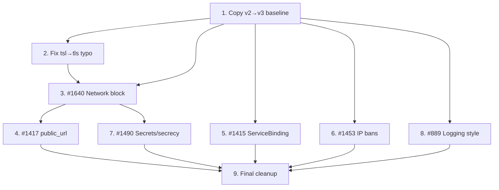

<!-- skill-link: create-issue -->

# EPIC #1978 - Configuration Overhaul (schema v3.0.0)

## Goal

Overhaul the Torrust Tracker configuration to schema version **3.0.0**, incorporating
multiple pending enhancements, security improvements, and structural changes —
many of which are breaking changes that justify the schema version bump.

Deliver a cleaner, more extensible, and more secure configuration model that
supports modern deployment scenarios (reverse proxies, TLS, multi-instance
metrics, logging flexibility, secrets management).

## Why This Is Needed

The current configuration schema (`v2.0.0`) has accumulated several limitations:

1. **No public URL awareness** — the application cannot know its own public-facing URLs
   (#1417), which breaks metrics aggregation, API discoverability, and logging in
   reverse-proxy setups.
2. **Global `on_reverse_proxy`** — the setting applies to all HTTP trackers, preventing
   mixed deployments where some trackers are behind a proxy and others are not (#1640).
3. **Secrets exposure risk** — API tokens and database passwords can leak via tracing
   instrumentation and debug output; no systematic protection (#1490).
4. **Hardcoded IP bans reset interval** — the ban cleanup interval is hardcoded, and the
   cleanup task is spawned once per UDP server instead of once globally (#1453).
5. **Missing protocol context in service identity** — bare `SocketAddr` is used where
   `ServiceBinding` (protocol + address) would provide richer context for logs, health
   checks, and metrics (#1415).
6. **No logging style configuration** — `TraceStyle` is hardcoded to `Default`, not
   configurable (#889). Additionally, the `threshold` field name is misleading — it
   should be renamed to `trace_filter` to match `tracing` crate terminology.

Several of these changes are **breaking** (schema reorganisation, field renames,
removal of global `[core.net]`), making this the right time to bump the schema
version from `2.0.0` to `3.0.0`.

## Scope

### In Scope

- Bump configuration schema version from `2.0.0` to `3.0.0`
- Copy `v2_0_0` module to `v3_0_0` as the starting point for breaking changes
- Copy crate-root `logging.rs` into both versioned modules (making each self-contained)
- All six configuration enhancements listed below
- Final cleanup: remove global re-exports, migrate all consumers to explicit v3 imports
- Migration path / backward compatibility considerations where feasible

### Out of Scope

- Extracting `packages/configuration` into sub-packages (tracked in #1669 EPIC)
- Non-configuration changes to the tracker core or protocol packages
- Changes to the deployer's environment config format (tracked in torrust-tracker-deployer)

## Subissues

Status values: `TODO`, `IN_PROGRESS`, `BLOCKED`, `DONE`.

| Order | Issue                                                                                                          | Local Spec                                                                     | Status | Notes                                                                            |
| ----- | -------------------------------------------------------------------------------------------------------------- | ------------------------------------------------------------------------------ | ------ | -------------------------------------------------------------------------------- |
| 1     | [#1979](../../issues/1979) — Copy `v2_0_0` → `v3_0_0` as baseline                                              | `docs/issues/open/1979-1978-copy-configuration-schema-v2-to-v3-baseline.md`    | TODO   | Foundation: all other subissues depend on this                                   |
| 2     | [#1981](../../issues/1981) — Fix `tsl_config` → `tls_config` typo                                              | `docs/issues/open/1981-1978-fix-tsl-config-tls-config-typo.md`                 | TODO   | Mechanical rename; ~21 files; do early to avoid conflicts with #5                |
| 3     | [#1640](../../issues/1640) — Support per-HTTP-tracker `on_reverse_proxy` setting                               | `docs/issues/open/1640-1978-per-http-tracker-on-reverse-proxy-setting.md`      | TODO   | Heaviest change (~30 files); establishes per-instance `Network` block            |
| 4     | [#1417](../../issues/1417) — Include public service URL in configuration                                       | `docs/issues/open/1417-1978-add-public-service-url-to-configuration.md`        | TODO   | Depends on #3 for `Network` placement decision; adds flat `public_url` field     |
| 5     | [#1415](../../issues/1415) — Use `ServiceBinding` instead of bare `SocketAddr` for service identity            | `docs/issues/open/1415-1978-use-service-binding-instead-of-socket-addr.md`     | TODO   | Independent; no config changes; can be parallel with #6, #7, #8                  |
| 6     | [#1453](../../issues/1453) — IP bans reset interval configurable + fix duplicate cleanup                       | `docs/issues/open/1453-1978-ip-bans-reset-interval-configurable.md`            | TODO   | Independent; new `[udp_tracker_server]` section; can be parallel with #5, #7, #8 |
| 7     | [#1490](../../issues/1490) — Decompose database config and overhaul secrets with `secrecy` crate               | `docs/issues/open/1490-1978-decompose-database-config-and-overhaul-secrets.md` | TODO   | After #3 (both touch `Core`); can be parallel with #5, #6, #8                    |
| 8     | [#889](../../issues/889) — New config option for logging style                                                 | `docs/issues/open/889-1978-new-config-option-for-logging-style.md`             | TODO   | Independent; can be parallel with #5, #6, #7                                     |
| 9     | [#1980](../../issues/1980) — Final cleanup: remove global re-exports, migrate consumers to explicit v3 imports | `docs/issues/open/1980-1978-configuration-overhaul-final-cleanup.md`           | TODO   | Must be last; depends on ALL other subissues                                     |

## Delivery Strategy

### Dependency graph



### Critical path

```text
1 → 2 → 3 → 4 → 9
1 → 2 → 3 → 7 → 9
```

Subissues #5, #6, #8 are independent and can run in parallel with the critical path.

### Conflict hotspots

| File(s)                             | Touched by             | Mitigation                                                       |
| ----------------------------------- | ---------------------- | ---------------------------------------------------------------- |
| `v3_0_0/http_tracker.rs`            | #2, #3, #4             | Implement sequentially: #2 → #3 → #4                             |
| `v3_0_0/core.rs`                    | #3, #7                 | #3 first (removes `core.net`), then #7 (changes `database` type) |
| `src/bootstrap/`                    | #3, #5, #6, #7, #8, #9 | Sequential order; #9 resolves all import paths last              |
| `share/default/config/`             | ALL                    | Each subissue updates its relevant section; #9 does final pass   |
| `test-helpers/src/configuration.rs` | #2, #3, #7, #9         | Sequential; each appends to test config defaults                 |

### Phase 0: Foundation

- **Subissue #1** — Copy `v2_0_0` → `v3_0_0`; copy `logging.rs` into both; expose modules in `lib.rs`
- **Subissue #2** — Fix `tsl_config` → `tls_config` typo (must be done before #3 to avoid conflicts)

### Phase 1: Structural changes (sequential)

- **Subissue #3** (#1640) — Per-instance `Network` block. Heaviest change (~30 files). Establishes the `Network` struct that #4 references.
- **Subissue #7** (#1490) — Database enum decomposition + `secrecy` crate. After #3 (both touch `Core`). ~35 files.
- **Subissue #4** (#1417) — `public_url` flat field. After #3 (depends on `Network` placement decision). ~6 files.

### Phase 2: Independent changes (parallel)

These can run in any order or in parallel branches:

- **Subissue #5** (#1415) — `ServiceBinding` instead of `SocketAddr`. No config changes. ~10 files.
- **Subissue #6** (#1453) — IP bans reset interval + fix duplicate cleanup. Isolated new config section. ~5 files.
- **Subissue #8** (#889) — Logging style config. Isolated to `Logging` struct. ~5 files.

### Phase 3: Integration

- **Subissue #9** — Final cleanup: remove global re-exports, migrate all ~30 consumers to explicit `v3_0_0` imports. Remove crate-root `logging.rs`. Keep `v2_0_0` module deprecated.

For each subissue implementation in this EPIC, the default completion policy is:

1. Run automatic checks (`linter all`, relevant tests, pre-push checks when applicable).
2. Run manual verification scenarios and record evidence.
3. Re-review acceptance criteria after implementation and update verification evidence.

## Progress Tracking

### Workflow Checkpoints

- [ ] Epic spec drafted in `docs/issues/drafts/`
- [ ] Epic spec reviewed and approved by user/maintainer
- [ ] GitHub epic issue created and issue number added to this spec
- [ ] Subissues created and linked in this spec
- [ ] Subissue statuses kept up to date in the `Subissues` table
- [ ] For each implemented subissue: automatic checks completed and recorded
- [ ] For each implemented subissue: manual verification completed and recorded
- [ ] For each implemented subissue: acceptance criteria reviewed post-implementation
- [ ] Epic acceptance criteria reviewed and checked off
- [x] Epic spec drafted in `docs/issues/open/1978-configuration-overhaul-epic.md`
- [x] Epic spec reviewed and approved by user/maintainer
- [x] GitHub epic issue created: #1978
- [ ] Subissues created and linked in this spec
- [ ] Subissue statuses kept up to date in the `Subissues` table
- [ ] For each implemented subissue: automatic checks completed and recorded
- [ ] For each implemented subissue: manual verification completed and recorded
- [ ] For each implemented subissue: acceptance criteria reviewed post-implementation
- [ ] Epic acceptance criteria reviewed and checked off
- [ ] Epic issue closed and spec moved from `docs/issues/open/` to `docs/issues/closed/`

### Progress Log

- 2026-07-13 21:00 UTC - josecelano - Initial EPIC spec drafted
- 2026-07-13 21:00 UTC - josecelano - Added subissue specs for copy-v2-to-v3, #1415, #1453, #1490, #889
- 2026-07-14 00:00 UTC - josecelano - Fixed #889 field name: `log_level` → `threshold` (the field was renamed in commit 287e4842; GitHub issue #889 description was outdated)
- 2026-07-14 00:00 UTC - josecelano - Added subissue #8 (final cleanup: remove global re-exports, migrate consumers to explicit v3 imports). Updated Phase 1 to include copying crate-root `logging.rs` into versioned modules. Updated Phase 4 to deprecate (not remove) v2_0_0.
- 2026-07-14 00:00 UTC - josecelano - Resolved #1417 vs #1640 `public_url` placement: flat field (not inside `Network`). Added protocol validation. Updated both specs.
- 2026-07-14 00:00 UTC - josecelano - Rewrote #1490 spec: decomposed `Database` into enum (`Sqlite3`, `MySQL(ConnectionInfo)`, `PostgreSQL(ConnectionInfo)`); removed backward-compat fallback; added ripple-effect analysis (~25 files). Renamed issue title.
- 2026-07-15 00:00 UTC - josecelano - Dependency analysis complete. Reordered subissues: #1640 before #1417 (Network block first), #1490 after #1640 (both touch Core). Independent subissues (#1415, #1453, #889) can run in parallel. Added dependency graph and conflict hotspot table.
- 2026-07-15 00:00 UTC - josecelano - GitHub issues created: EPIC #1978, #1979 (copy baseline), #1980 (final cleanup), #1981 (tsl typo). Specs moved to `docs/issues/open/` with issue number prefix.

## Acceptance Criteria

- [ ] All required subissues are created and linked.
- [ ] Implementation order is explicit and justified.
- [ ] Dependencies and blockers are documented and current.
- [ ] Epic status reflects actual state of linked subissues.
- [ ] Every completed subissue includes automated verification evidence.
- [ ] Every completed subissue includes manual verification evidence.
- [ ] Every completed subissue includes post-implementation acceptance criteria review.
- [ ] Documentation and governance updates are included when required.

### Acceptance Verification

| AC ID | Status (`TODO`/`DONE`) | Evidence                                  |
| ----- | ---------------------- | ----------------------------------------- |
| AC1   | TODO                   | All subissues created and linked          |
| AC2   | TODO                   | Schema v3.0.0 is active and functional    |
| AC3   | TODO                   | All six enhancements are implemented      |
| AC4   | TODO                   | `linter all` passes                       |
| AC5   | TODO                   | All tests pass (`cargo test --workspace`) |
| AC6   | TODO                   | Default config files updated to v3.0.0    |

## Risks and Trade-offs

1. **Breaking changes for all users**: Schema bump means all existing `tracker.toml` files
   need updating. Mitigation: clear migration guide and changelog.
2. **Parallel implementation collisions**: Multiple subissues modifying the same `v3_0_0`
   namespace could conflict. Mitigation: implement sequentially or coordinate branches
   carefully; subissue #1 (copy baseline) must be merged first.
3. **Scope creep**: More configuration changes may be discovered during implementation.
   Mitigation: document new findings as separate subissues or follow-up EPICs.
4. **Backward compatibility**: Some consumers (deployer, helm charts, docker-compose files)
   may need coordinated updates. Mitigation: coordinate with deployer team.

## References

- Related issues: #1417, #1640, #1490, #1453, #1415, #889
- Related PRs: #1937 (spec for #1640)
- Related ADRs: `docs/adrs/20260617093046_reject_wildcard_external_ip.md`
- Related EPICs: #1669 (package overhaul)
