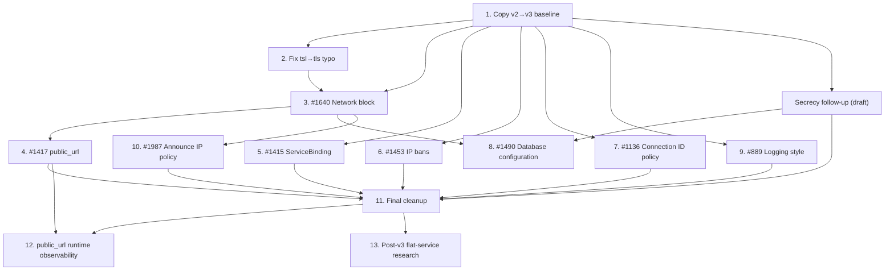

# EPIC #1978 - Configuration Overhaul (schema v3.0.0)

## Goal

Overhaul the Torrust Tracker configuration to schema version **3.0.0**, incorporating
multiple pending enhancements, security improvements, and structural changes —
many of which are breaking changes that justify the schema version bump.

Deliver a cleaner, more extensible, and more secure configuration model that
supports modern deployment scenarios (reverse proxies, TLS, multi-instance
metrics, logging flexibility, secrets management).

## Why This Is Needed

The current configuration schema (`v2.0.0`) has accumulated several limitations:

1. **No public URL awareness** — the application cannot know its own public-facing URLs
   (#1417), which breaks metrics aggregation, API discoverability, and logging in
   reverse-proxy setups.
2. **Global `on_reverse_proxy`** — the setting applies to all HTTP trackers, preventing
   mixed deployments where some trackers are behind a proxy and others are not (#1640).
3. **Secrets exposure risk** — API tokens and database passwords can leak via tracing
   instrumentation and debug output; no systematic protection (tracked by the preceding
   `secrecy` effort).
4. **Hardcoded IP bans reset interval** — the ban cleanup interval is hardcoded, and the
   cleanup task is spawned once per UDP server instead of once globally (#1453).
5. **Missing protocol context in service identity** — bare `SocketAddr` is used where
   `ServiceBinding` (protocol + address) would provide richer context for logs, health
   checks, and metrics (#1415).
6. **No logging style configuration** — `TraceStyle` is hardcoded to `Default`, not
   configurable (#889). Additionally, the `threshold` field name is misleading — it
   should be renamed to `trace_filter` to match `tracing` crate terminology.
7. **No UDP connection ID validation policy** — every UDP listener validates connection
   IDs strictly, preventing isolated compatibility listeners for non-compliant clients
   that reuse expired or arbitrary IDs (#1136).
8. **No opt-in support for the HTTP announce `ip` parameter** — the parameter is parsed
   but ignored, so controlled deployments cannot choose to trust a client-provided peer
   address (#1987).

Several of these changes are **breaking** (schema reorganisation, field renames,
removal of global `[core.net]`), making this the right time to bump the schema
version from `2.0.0` to `3.0.0`.

## Scope

### In Scope

- Bump configuration schema version from `2.0.0` to `3.0.0`
- Copy `v2_0_0` module to `v3_0_0` as the starting point for breaking changes
- Copy crate-root `logging.rs` into both versioned modules (making each self-contained)
- All configuration enhancements listed below, including the secrecy follow-up that must land before publishing the v3 public API
- Final cleanup: remove global re-exports, migrate all consumers to explicit v3 imports
- Migration path / backward compatibility considerations where feasible

### Out of Scope

- Extracting `packages/configuration` into sub-packages (tracked in #1669 EPIC)
- Non-configuration changes to the tracker core or protocol packages
- Changes to the deployer's environment config format (tracked in torrust-tracker-deployer)

## Subissues

Status values: `TODO`, `IN_PROGRESS`, `IN_REVIEW`, `BLOCKED`, `DONE`.

| Order | Issue                                                                                                                                               | Local Spec                                                                              | Status | Notes                                                                                                                                                     |
| ----- | --------------------------------------------------------------------------------------------------------------------------------------------------- | --------------------------------------------------------------------------------------- | ------ | --------------------------------------------------------------------------------------------------------------------------------------------------------- |
| 1     | [#1979](https://github.com/torrust/torrust-tracker/issues/1979) — Copy `v2_0_0` → `v3_0_0` as baseline                                              | `docs/issues/closed/1979-1978-copy-configuration-schema-v2-to-v3-baseline.md`           | DONE   | Merged in PR #1999; v3 baseline and smoke tests are in `develop`                                                                                          |
| 2     | [#1981](https://github.com/torrust/torrust-tracker/issues/1981) — Fix `tsl_config` → `tls_config` typo                                              | `docs/issues/closed/1981-1978-fix-tsl-config-tls-config-typo.md`                        | DONE   | Implemented for v3; v2 compatibility retained until final migration                                                                                       |
| 3     | [#1640](https://github.com/torrust/torrust-tracker/issues/1640) — Support per-HTTP-tracker `on_reverse_proxy` setting                               | `docs/issues/closed/1640-1978-per-http-tracker-on-reverse-proxy-setting.md`             | DONE   | Merged in PR #2014; v3 schema slice complete; runtime consumers deferred to #11                                                                           |
| 4     | [#1417](https://github.com/torrust/torrust-tracker/issues/1417) — Include public service URL in configuration                                       | `docs/issues/closed/1417-1978-add-public-service-url-to-configuration.md`               | DONE   | Merged in PR #2016; typed `Option<HttpUrl>`/`Option<UdpUrl>` newtypes on `HttpTracker`, `UdpTracker`, `HttpApi`; scheme validation at deserialization     |
| 5     | [#1415](https://github.com/torrust/torrust-tracker/issues/1415) — Use `ServiceBinding` instead of bare `SocketAddr` for service identity            | `docs/issues/closed/1415-1978-use-service-binding-instead-of-socket-addr/ISSUE.md`      | DONE   | Added protocol-aware `service_binding` alongside compatible `server_socket_addr` fields in HTTP tracker, REST API, and UDP error logs; verified manually. |
| 6     | [#1453](https://github.com/torrust/torrust-tracker/issues/1453) — IP bans reset interval configurable + fix duplicate cleanup                       | `docs/issues/closed/1453-1978-ip-bans-reset-interval-configurable/ISSUE.md`             | DONE   | V3 setting validated; one cancellation-managed bootstrap cleanup job uses the v3 default constant. Runtime configuration use is deferred to #1980.        |
| 7     | [#1136](https://github.com/torrust/torrust-tracker/issues/1136) — Add configurable UDP connection ID validation policy                              | `docs/issues/closed/1136-1978-configurable-udp-connection-id-validation-policy.md`      | DONE   | PR #2032 merged; all 12 ACs met; manual verification deferred to #1980.                                                                                   |
| 8     | [#1490](https://github.com/torrust/torrust-tracker/issues/1490) — Decompose v3 database configuration                                               | `docs/issues/open/1490-1978-decompose-database-configuration.md`                        | TODO   | After #3 and the secrecy follow-up; isolates the v3 password as `Secret<String>`.                                                                         |
| 9     | [#889](https://github.com/torrust/torrust-tracker/issues/889) — New config option for logging style                                                 | `docs/issues/closed/889-1978-new-config-option-for-logging-style.md`                    | DONE   | V3 schema implemented; includes negative test for removed `threshold` key. Manual verification is deferred to #1980.                                      |
| 10    | [#1987](https://github.com/torrust/torrust-tracker/issues/1987) — Use peer IP from the HTTP announce `ip` parameter when configured                 | `docs/issues/open/1987-add-config-option-to-use-ip-from-announce-query-string/ISSUE.md` | TODO   | After #3 and external prerequisite #1985; per-HTTP-tracker opt-in policy                                                                                  |
| 11    | [#1980](https://github.com/torrust/torrust-tracker/issues/1980) — Final cleanup: remove global re-exports, migrate consumers to explicit v3 imports | `docs/issues/open/1980-1978-configuration-overhaul-final-cleanup.md`                    | TODO   | Must follow all implemented schema subissues and the secrecy release gate.                                                                                |
| 12    | [#2023](https://github.com/torrust/torrust-tracker/issues/2023) — Expose configured public URLs in runtime observability                            | `docs/issues/open/2023-1978-expose-configured-public-urls-in-runtime-observability.md`  | TODO   | Must follow #1417 and #1980; adds `public_url` to health checks, metrics, and logs without replacing ServiceBinding.                                      |
| 13    | [#2067](https://github.com/torrust/torrust-tracker/issues/2067) — Analyze a flat heterogeneous service configuration                                | `docs/issues/open/2067-1978-analyze-flat-service-configuration/ISSUE.md`                | TODO   | Non-blocking analysis only; any recommended implementation follows #1980 and accounts for database and secrecy work.                                      |

### Release-gated follow-up draft

The numbered table lists the 13 GitHub-linked EPIC subissues. The following draft will receive its own issue number only after maintainer approval; it is deliberately not assigned an EPIC order until then:

| Issue                                       | Local Spec                                                        | Status | Notes                                                                                                                                                                                                                                                                |
| ------------------------------------------- | ----------------------------------------------------------------- | ------ | -------------------------------------------------------------------------------------------------------------------------------------------------------------------------------------------------------------------------------------------------------------------- |
| Adopt `secrecy` for sensitive configuration | `docs/issues/drafts/adopt-secrecy-for-sensitive-configuration.md` | DRAFT  | Implements first: protects API tokens in v2 and v3, but leaves legacy database URLs and masking unchanged. #1490 follows and adds the isolated v3 secret password. Do not publish a `torrust-tracker-configuration` release exposing v3 types until both are merged. |

## Delivery Strategy

### Dependency graph



### Critical path

```text
1 → 2 → 3 → 4 → 11
1 → 2 → 3 → 8 → 11
1 → secrecy → 8 → 11
```

Subissues #5, #6, #7, #9 are independent and can run in parallel with the critical path.

### Conflict hotspots

| File(s)                             | Touched by                                | Mitigation                                                         |
| ----------------------------------- | ----------------------------------------- | ------------------------------------------------------------------ |
| `v3_0_0/http_tracker.rs`            | #2, #3, #4, #10                           | Implement sequentially: #2 → #3 → #4 → #10.                        |
| `v3_0_0/core.rs`                    | #3, #8                                    | #3 first (removes `core.net`), then #8 changes `database`.         |
| `v3_0_0/tracker_api.rs`             | secrecy                                   | Implement the API-token refactor before #1490.                     |
| `src/bootstrap/`                    | #3, #5, #6, #7, secrecy, #8, #9, #10, #11 | Implement secrecy before #8; #11 resolves all import paths last.   |
| `share/default/config/`             | All schema subissues                      | Each subissue updates its section; #11 does the final pass.        |
| `test-helpers/src/configuration.rs` | #2, #3, #7, secrecy, #8, #10, #11         | Implement secrecy before #8; each appends to test config defaults. |

### Phase 0: Foundation

- **Subissue #1** — Copy `v2_0_0` → `v3_0_0`; copy `logging.rs` into both; expose modules in `lib.rs`
- **Subissue #2** — Fix `tsl_config` → `tls_config` typo (must be done before #3 to avoid conflicts)

### Phase 1: Structural changes (sequential)

- **Subissue #3** (#1640) — Per-instance `Network` block in schema v3.0.0. Establishes the `Network` struct that #4 references; v3 does not support removed v2 field names.
- **Release-gated follow-up draft** — Adopt `secrecy` for sensitive configuration first. It protects API tokens in v2 and v3 and establishes the `Secret<String>` convention without changing legacy database URLs.
- **Subissue #8** (#1490) — Database enum decomposition. After #3 and the secrecy follow-up; it uses `Secret<String>` for the new isolated v3 database password.
- **Subissue #4** (#1417) — `public_url` flat field. After #3 (depends on `Network` placement decision). ~6 files.
- **Subissue #10** (#1987) — Opt-in use of the HTTP announce `ip` parameter. After #3 and external prerequisite #1985.

### Phase 2: Independent changes (parallel)

These can run in any order or in parallel branches:

- **Subissue #5** (#1415) — `ServiceBinding` instead of `SocketAddr`. No config changes. ~10 files.
- **Subissue #6** (#1453) — IP bans reset interval + fix duplicate cleanup. Adds and validates
  the v3 setting, but retains the current hardcoded 24-hour interval in the single cleanup job
  until #1980 migrates runtime consumers to v3. Operational duration evidence: torrust-demo#28.
- **Subissue #7** (#1136) — Per-listener UDP connection ID validation policy. Implement after #6 to keep related UDP policy work ordered.
- **Subissue #9** (#889) — Logging style config. Isolated to `Logging` struct. ~5 files.

### Phase 3: Integration

- **Subissue #11** — Final cleanup: remove global re-exports, migrate all ~30 consumers to explicit `v3_0_0` imports. Remove crate-root `logging.rs`. Keep `v2_0_0` module deprecated. It follows the secrecy release gate.
- **Subissue #12** (#2023) — After #11, expose optional v3 `public_url` values in health checks,
  metrics, and logs. Preserve the distinction between configured bind address, post-bind
  `ServiceBinding`, and `public_url`; do not implement `internal_service_url`.

### Phase 4: Post-v3 Research

- **Subissue #13** (#2067) — Analyze a possible successor schema that represents heterogeneous
  listener services in one ordered collection. This non-blocking research does not implement a
  schema or runtime change and must not delay #1980. Any implementation recommendation must be
  tracked separately and account for #1490.

For each subissue implementation in this EPIC, the default completion policy is:

1. Run automatic checks (`linter all`, relevant tests, pre-push checks when applicable).
2. Run manual verification scenarios and record evidence.
3. Re-review acceptance criteria after implementation and update verification evidence.
4. If the subissue affects the configuration public API, update the migration guide at `docs/issues/open/1978-configuration-overhaul-epic/configuration-v2-to-v3-migration.md`.

## Progress Tracking

### Workflow Checkpoints

- [x] Epic spec drafted in `docs/issues/open/1978-configuration-overhaul-epic/EPIC.md`
- [x] Epic spec reviewed and approved by user/maintainer
- [x] GitHub epic issue created: #1978
- [x] Subissues created and linked in this spec
- [x] Subissue statuses kept up to date in the `Subissues` table
- [x] For each implemented subissue: automatic checks completed and recorded
- [ ] For each implemented subissue: manual verification completed and recorded
- [x] For each implemented subissue: acceptance criteria reviewed post-implementation
- [ ] Epic acceptance criteria reviewed and checked off
- [ ] Epic issue closed and spec moved from `docs/issues/open/` to `docs/issues/closed/`

### Progress Log

- 2026-07-13 21:00 UTC - josecelano - Initial EPIC spec drafted
- 2026-07-13 21:00 UTC - josecelano - Added subissue specs for copy-v2-to-v3, #1415, #1453, #1490, #889
- 2026-07-14 00:00 UTC - josecelano - Fixed #889 field name: `log_level` → `threshold` (the field was renamed in commit 287e4842; GitHub issue #889 description was outdated)
- 2026-07-14 00:00 UTC - josecelano - Added subissue #8 (final cleanup: remove global re-exports, migrate consumers to explicit v3 imports). Updated Phase 1 to include copying crate-root `logging.rs` into versioned modules. Updated Phase 4 to deprecate (not remove) v2_0_0.
- 2026-07-14 00:00 UTC - josecelano - Resolved #1417 vs #1640 `public_url` placement: flat field (not inside `Network`). Added protocol validation. Updated both specs.
- 2026-07-14 00:00 UTC - josecelano - Rewrote #1490 spec: decomposed `Database` into enum (`Sqlite3`, `MySQL(ConnectionInfo)`, `PostgreSQL(ConnectionInfo)`); removed backward-compat fallback; added ripple-effect analysis (~25 files). Renamed issue title.
- 2026-07-15 00:00 UTC - josecelano - Dependency analysis complete. Reordered subissues: #1640 before #1417 (Network block first), #1490 after #1640 (both touch Core). Independent subissues (#1415, #1453, #889) can run in parallel. Added dependency graph and conflict hotspot table.
- 2026-07-15 00:00 UTC - josecelano - GitHub issues created: EPIC #1978, #1979 (copy baseline), #1980 (final cleanup), #1981 (tsl typo). Specs moved to `docs/issues/open/` with issue number prefix.
- 2026-07-20 12:12 UTC - agent - Added #1136 as subissue 7 of 11 after #1453; documented the secure-default per-listener UDP connection ID validation policy and reconciled the local EPIC with existing subissue #1987.
- 2026-07-20 12:23 UTC - agent - Updated the GitHub EPIC body, linked #1136,
  and verified all 11 native subissues in the documented order.
- 2026-07-20 13:21 UTC - agent - Recorded #1979 as completed by merged PR #1999 and
  started #1981 as the next subissue; identified its schema compatibility boundary for maintainer review.
- 2026-07-20 15:25 UTC - agent - Completed #1981 with v3-corrected TLS names and
  schema-neutral module naming; preserved v2 compatibility and verified the full workspace. #1640 is next.
- 2026-07-21 00:00 UTC - agent - Started #1640 as the next sequential EPIC subissue.
  Maintainer confirmed the per-instance field as `network: Network`; its TOML block is optional
  and defaults to `external_ip = None`, `on_reverse_proxy = false`, and `ipv6_v6only = false`.
- 2026-07-21 00:00 UTC - josecelano - Confirmed schema compatibility boundary for #1640:
  v3 uses only the new per-instance `network` fields with no fallback or precedence for removed
  v2 fields. The application-wide v2-to-v3 consumer and default-config migration remains #1980.
- 2026-07-21 00:00 UTC - agent - Marked #1640 DONE: PR #2014 merged the v3 schema slice;
  deferred runtime-consumer tasks (T2–T3c) are tracked under #1980. Started #1417 as next
  subissue: typed `Option<HttpUrl>`/`Option<UdpUrl>` newtypes on `HttpTracker`, `UdpTracker`,
  and `HttpApi`; `HealthCheckApi` gains only `#[serde(deny_unknown_fields)]` (no `public_url`).
- 2026-07-21 17:00 UTC - agent - #1417 implementation complete; PR #2016 open for review.
  Addressed Copilot review: corrected EPIC progress log, added `#[serde(deny_unknown_fields)]`
  to remaining v3 structs (`Database`, `Logging`, `TlsConfig`, `Configuration`), and softened
  `database.rs` module doc to acknowledge `path: String` as a legacy exception tracked by #1490.
- 2026-07-22 11:00 UTC - agent - Recorded #1417 as DONE following the merge of PR #2016.
  Started independent subissue #1415 as the next implementation task.
- 2026-07-22 13:15 UTC - agent - Added planned subissue #12 for runtime `public_url`
  observability. It follows #1417 and #1980 so health-check, metrics, and logging consumers use
  only the v3 configuration surface.
- 2026-07-22 13:35 UTC - agent - Created approved subissue #2023 and replaced the planned
  #12 entry with its issue number and open specification.
- 2026-07-22 15:55 UTC - agent - Completed #1415: added `service_binding` alongside the
  compatible `server_socket_addr` fields in HTTP tracker, REST API, and UDP error logs. Recorded
  automatic checks and manual runtime evidence; deterministic tracing-output assertions remain
  deferred to #1430.
- 2026-07-23 17:02 UTC - agent - Started #1453 as the next EPIC subissue. Created
  `1453-ip-bans-reset-interval` from current `develop`; implementation is pending maintainer
  review of the subissue specification.
- 2026-07-23 17:02 UTC - josecelano - Approved staged #1453 delivery: add and validate the v3
  interval configuration while moving the duplicate cleanup task into one bootstrap-managed job
  that retains the current hardcoded 24-hour interval. #1980 will wire the v3 setting into that
  job during the final consumer migration. Added torrust-demo#28 as operational evidence for the
  duration policy.
- 2026-07-23 17:02 UTC - agent - #1453 implementation is ready for maintainer review. The v3
  configuration section validates its one-hour minimum and uses its canonical 24-hour default;
  ban cleanup is now one cancellation-managed bootstrap job rather than a task per UDP listener.
  Runtime consumption of the configured value remains assigned to #1980.
- 2026-08-20 16:36 UTC - Copilot/User - Restored #2023 as the twelfth native GitHub sub-issue,
  resolving the discrepancy with this specification. Created approved Task #2067 as the thirteenth
  native sub-issue for non-blocking research into a possible post-v3 flat heterogeneous service
  configuration; any implementation remains separate from this EPIC delivery.
- 2026-08-20 16:44 UTC - Copilot - Renamed #2067's folder-based subissue specification to include
  the parent EPIC number, following the open-issues naming convention.
- 2026-08-21 16:30 UTC - Copilot/User - Split #1490's schema-decomposition and secret-typing work. #1490 now defines the final v3 database configuration shape; a release-gated `secrecy` follow-up remains a draft until approved and issued.
- 2026-08-21 16:45 UTC - josecelano - Ordered the smaller secrecy refactor first. It protects API tokens in v2 and v3 without wrapping legacy database URLs; #1490 follows and uses the established `Secret<String>` convention for the isolated v3 database password.

## Acceptance Criteria

- [x] All required subissues are created and linked.
- [x] Implementation order is explicit and justified.
- [x] Dependencies and blockers are documented and current.
- [x] Epic status reflects actual state of linked subissues.
- [ ] Every completed subissue includes automated verification evidence.
- [ ] Every completed subissue includes manual verification evidence.
- [ ] Every completed subissue includes post-implementation acceptance criteria review.
- [ ] Documentation and governance updates are included when required.

### Acceptance Verification

| AC ID | Status (`TODO`/`DONE`) | Evidence                                                                                                      |
| ----- | ---------------------- | ------------------------------------------------------------------------------------------------------------- |
| AC1   | DONE                   | GitHub EPIC #1978 reports 13 linked subissues in the documented order.                                        |
| AC2   | DONE                   | The dependency graph, critical paths, phases, and conflict hotspot table document ordering and rationale.     |
| AC3   | DONE                   | The EPIC table, dependency graph, and release-gated secrecy draft record current prerequisites and blockers.  |
| AC4   | DONE                   | The `Subissues` table and progress log record the current status for each linked issue.                       |
| AC5   | TODO                   | Confirm every completed subissue's automatic-check evidence before closing the EPIC.                          |
| AC6   | TODO                   | Confirm every completed subissue's manual-verification evidence before closing the EPIC.                      |
| AC7   | TODO                   | Confirm every completed subissue's post-implementation acceptance review before closing the EPIC.             |
| AC8   | TODO                   | Confirm required documentation and governance updates across all completed subissues before closing the EPIC. |

## Risks and Trade-offs

1. **Breaking changes for all users**: Schema bump means all existing `tracker.toml` files
   need updating. Mitigation: clear migration guide and changelog.
2. **Parallel implementation collisions**: Multiple subissues modifying the same `v3_0_0`
   namespace could conflict. Mitigation: implement sequentially or coordinate branches
   carefully; subissue #1 (copy baseline) must be merged first.
3. **Scope creep**: More configuration changes may be discovered during implementation.
   Mitigation: document new findings as separate subissues or follow-up EPICs.
4. **Backward compatibility**: Some consumers (deployer, helm charts, docker-compose files)
   may need coordinated updates. Mitigation: coordinate with deployer team.

## References

- Related issues: #1417, #1640, #1490, #1453, #1415, #1136, #889, #1987
- Related PRs: #1937 (spec for #1640)
- Related ADRs: `docs/adrs/20260617093046_reject_wildcard_external_ip.md`
- Related EPICs: #1669 (package overhaul)
