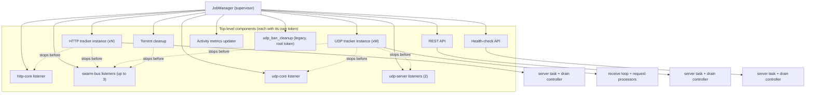
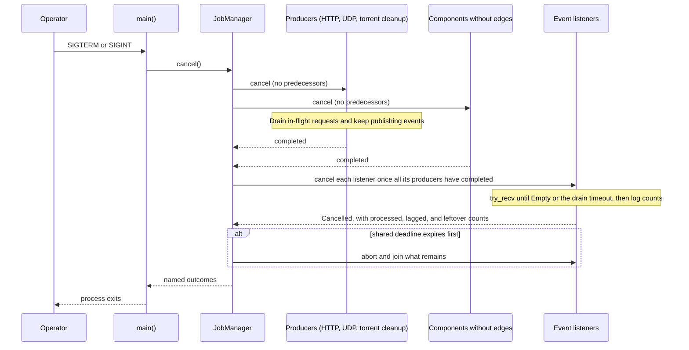
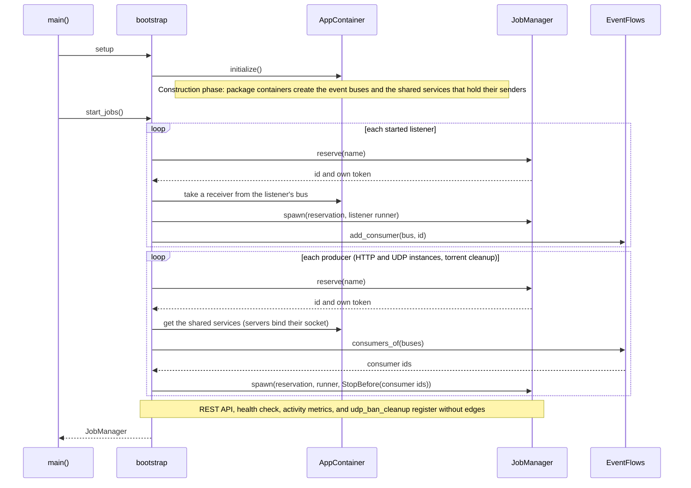
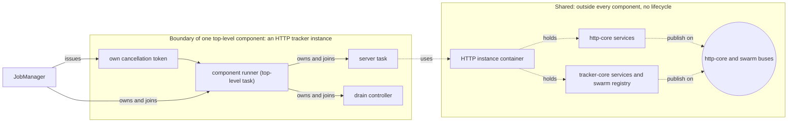

<!-- skill-link: create-issue -->

# EPIC #2410 - Process Queued Events Before Event Listeners Stop

Parent: [EPIC #1488 - Overhaul: Tracker Shutdown](../../open/1488-overhaul-tracker-shutdown/ISSUE.md)

> **EPIC position**: Roadmap sequence 14 (SI-22). A bug found on 2026-10-01
> while refreshing SI-16. It follows SI-17 so the fix lands in the application
> and both migrated test environments at once, and precedes SI-20 because it
> can lose persisted data.
>
> **Sub-EPIC (D17)**: a bug, priority `p1` (D10), delivered by the four
> sub-issues in [Subissues](#subissues). This document is their shared design
> record: decisions, discussion record, glossary, diagrams, chosen design, and
> the detailed implementation steps. Each sub-issue owns its tasks' status,
> commit points, acceptance criteria, and evidence.

## Goal

A graceful shutdown handles queued domain events by an explicit, documented
policy instead of silently dropping them: components that produce events stop
first, then event listeners keep processing their queues until empty or until
a drain timeout expires. When the timeout cuts a drain short, the listener
logs a warning saying events were left unprocessed (with the count when it is
known). Shutdown logs report how many events each listener processed while
draining.

## Glossary

The terms below are used with these exact meanings in this spec. The glossary
lives here provisionally; T2 moves it to `docs/architecture/glossary.md` (D12).

| Term                                   | Meaning                                                                                                                                       | Constraints                                                                                                                                                                                                                                       |
| -------------------------------------- | --------------------------------------------------------------------------------------------------------------------------------------------- | ------------------------------------------------------------------------------------------------------------------------------------------------------------------------------------------------------------------------------------------------- |
| **Event**                              | An objective fact published by a component, such as "announce handled" or "peer download completed".                                          | See the [events-are-objective-facts ADR](../../../adrs/20260727000000_events_are_objective_facts.md).                                                                                                                                         |
| **Event bus**                          | An in-process broadcast channel for one family of events. There are four today (swarm coordination, http-core, udp-core, udp-server).         | Delivers an event only to receivers that existed when it was sent. Buffers up to 65,536 events; a receiver that falls further behind lags and skips the oldest.                                                                                       |
| **Producer**                           | A component that publishes events on a bus, directly or through the services it uses.                                                         | Must stop before every consumer of the buses it publishes on.                                                                                                                                                                                     |
| **Consumer** (event listener)          | A component that receives events from a bus and applies them (statistics, persisted counts, banning).                                         | Must start before, and stop after, every producer of the buses it consumes from.                                                                                                                                                                  |
| **Relay**                              | A component that is both a consumer and a producer.                                                                                           | None known today (T1 confirms). Event flow must have no cycles.                                                                                                                                                                                   |
| **Service**                            | A Rust value whose dependencies are passed through its constructor (repositories, announce service).                                          | Has no lifecycle and never decides when to stop. Not part of the shutdown tree.                                                                                                                                                                   |
| **Component**                          | Something that runs until asked to stop, drains, and reports an outcome (listener, server, periodic job).                                     | Receives exactly one stop request; reports exactly one outcome; joins or aborts every child task before reporting; publishes no events after reporting; never subscribes to OS signals.                                                         |
| **Top-level component**                | A component supervised directly by `JobManager`.                                                                                              | The unit of independent shutdown (boundary rule). Hosted today on exactly one top-level task.                                                                                                                                                     |
| **Sub-component**                      | A component owned by another component.                                                                                                       | Stopped and joined by its parent. Promoted to top level if it depends on anything outside its parent.                                                                                                                                             |
| **Task**                               | A Tokio task: where code executes.                                                                                                            | Can only finish or be aborted. Never a node in the stop-order graph.                                                                                                                                                                              |
| **Job**                                | The name the code uses for a top-level component registered in `JobManager` (`job_manager.spawn`, `JobOutcome`).                               | One name, one top-level task, one outcome (`Completed`, `Cancelled`, `Failed`, `Panicked`, or `Aborted`). Legacy jobs (`register_legacy`, today only `udp_ban_cleanup`) are pre-spawned and get no `JobManager`-issued token. Prefer "component" in new docs. |
| **`JobManager`**                       | The application supervisor.                                                                                                                   | Owns top-level components only, not their children. Applies the shared deadline, then aborts and joins what remains. Under option F it also issues each component's token and enforces the stop order.                                         |
| **Stop request** (cancellation token)  | A `CancellationToken` cancelled to ask a component to stop.                                                                                   | Only a request: it does not prove the component stopped.                                                                                                                                                                                          |
| **Completion** (outcome)               | Proof that a component stopped: its top-level task returned or was aborted, with a `JobStatus`.                                               | Under option F, a producer's completion is what allows its consumers to be cancelled.                                                                                                                                                              |
| **Drain**                              | Work after a stop request: finishing accepted requests or processing queued events. | Listener admission is bounded between events; the shared deadline escalates to abort. Handlers must yield for cancellation to progress. |
| **Drain timeout**                      | A component-specific drain policy, not necessarily a hard handler deadline. | HTTP: 90 s; UDP active requests: 5 s; listeners: constructor-injected admission budget (D9). SI-20 aligns aggregate budgets. |
| **Shared deadline**                    | The single deadline `JobManager` applies to all top-level components together.                                                                | 10 s in `main` today; SI-20 makes it configurable. When it expires, remaining components are aborted.                                                                                                                                             |
| **Abort**                              | A forced stop request to a task (`JoinHandle::abort`), effective when the runtime can next cancel it. | Not synchronous preemption; join to observe completion. Interrupted I/O outcomes may be unknown. |
| **Graceful shutdown**                  | Cooperative completion of all top-level components before the shared deadline. | No forced abort; component completion alone does not prove that every event was persisted. Consult drain and failure logs. |
| **Loss windows (a) and (b)**           | (a) events already queued when a listener stops; (b) events published after the listener stopped.                                             | Defined in Background.                                                                                                                                                                                                                            |
| **Stop-before edge**, **predecessor**  | Option D: "P stops before C"; P is a predecessor of C.                                                                                         | May only point to components already registered, so the graph has no cycles.                                                                                                                                                                     |
| **Composition root** (bootstrap)       | `src/app.rs` and `src/bootstrap/`: where services and components are created and wired.                                                       | The only place that knows both producers and consumers, so the only place that declares the stop order.                                                                                                                                          |
| **Event-flow registry** (`EventFlows`) | Option F's bootstrap registry: which components publish on and consume from each bus.                                                         | Derives option D's edges. Rejects a consumer registered after a producer of its bus.                                                                                                                                                              |

## Background

### What happens

The tracker publishes domain events (announce handled, scrape handled, peer
download completed, ...) on in-process broadcast channels. Event listener
components consume them to update statistics and, for completed downloads,
the database. On shutdown, `JobManager` cancels one root token, and every
component sees it at the same time:

1. The operator sends SIGTERM or SIGINT. `main` calls `JobManager::cancel()`.
2. Servers and event listeners are sibling components on the same root token,
   so all of them are cancelled together.
3. Each listener runs a `tokio::select!` marked `biased` with the cancellation
   branch first. Once the token is cancelled, that branch always wins, so the
   listener returns immediately, even when events are waiting in its channel.
   **Loss window (a):** events already queued are dropped.
4. Servers keep serving in-flight requests while they drain (HTTP up to the
   drain timeout, UDP up to five seconds). Those requests still publish events,
   but no listener is running any more. **Loss window (b):** events produced
   after the listeners stopped are dropped.

The client received a successful response in both windows, but the event's
effect is never recorded.

### Why it is a bug

Nobody decided that shutdown may lose events; it happens by accident and
silently. The EPIC requires a graceful shutdown to be deterministic,
observable, and reliable. Losing data may be acceptable, but only as an
explicit, documented decision with its pros and cons, and with a log that
says when it happened. Today there is neither.

### Impact

Metrics accuracy is not critical for this tracker: operators use metrics to
understand load, and one completed download more or less on a popular torrent
does not change any decision. The impact is therefore low, but real:

- **Persisted data**: when `persistent_torrent_completed_stat` is enabled, the
  tracker-core persistent listener writes completed-download counts to the
  database. A completion in either window is never persisted, so the
  `downloaded` count reported after a restart is too low. The reproduction
  (V1) measured how much: when SIGTERM arrived during a burst of `completed`
  announces, about 92% of the answered completions were never persisted (790
  of 856, and 775 of 845), because the listener persists events more slowly
  than the tracker accepts them and drops its backlog when cancelled.
- **In-memory statistics**: lost at process exit anyway, so the loss has no
  lasting effect in production, but it makes test environments that assert
  statistics non-deterministic.
- **Banning**: the UDP banning listener counts connection-ID errors; a lost
  event at shutdown has no lasting effect because ban state is in memory.
- **Observability**: nothing tells the operator that events were dropped, or
  how many.

### History

The behavior predates the cancellation-token refactor. Before commit
`d2e75e3f` (#1405, 2025-06-17), each listener selected `tokio::signal::ctrl_c()`
with the same `biased` priority and stopped at the same moment as the servers.
Before SI-1 (#2132), SIGTERM bypassed `main` entirely and the process died
from the default signal action. #1405 changed the trigger, not the policy.

The package test-coverage EPIC (#1347) later added seven characterization
tests, one per listener, named `it_should_prioritize_*` (listed in T5; for
example `e289ab60` for tracker-core, and the #2283 coverage review kept the UDP
banning one).
They made the existing behavior explicit, which is what adding unit tests to
untested code should do, but they record what the code did, not a decision
that it was correct. This issue makes that decision.

### Why ownership alone does not prevent it

The supervised cancellation tree models ownership: who runs whom and who
joins whom. Servers and listeners are correctly independent siblings. The
missing piece is a data-flow dependency the tree does not express: servers
**produce** events that listeners **consume**, so a consumer must outlive its
producers. Shared listeners cannot simply become children of one producer:
one http-core listener serves every HTTP tracker instance, and swarm events
come from both HTTP and UDP request handling.

### Facts that constrain the fix

- Six listener modules, seven listener components in `src/app.rs`
  (tracker-core has an in-memory and a persistent listener). All use the same
  cancel-first loop.
- The `Receiver` trait in `packages/events` exposes only an async `recv`; a
  non-blocking drain needs a trait addition (chosen in D13) or `now_or_never`
  on `recv`.
- Each broadcast channel holds at most 65,536 events. This bounds retained
  events, not handler duration or drain duration while producers keep sending.
- Producers are the HTTP and UDP tracker components and the torrent cleanup
  job, which publishes `PeerRemoved` and `TorrentRemoved` swarm events (see
  [D Versus F](#d-versus-f-measured-against-the-current-code)). T1 revalidates
  the inventory, including whether any listener re-publishes events another
  listener consumes.
- `main` gives `JobManager` a 10-second shared deadline, while the HTTP drain
  timeout is 90 seconds. Today a slow HTTP drain can consume the whole deadline,
  leaving no time for listeners (see Open Questions).

### What Happens to the Channel When One Side Stops

Each bus wraps one Tokio broadcast channel. The `EventBus` keeps a
`broadcast::Sender` (inside its `Broadcaster`), every publishing service holds
a clone of it, and each listener holds its own `broadcast::Receiver`. The
channel buffer is shared; each receiver has its own read position.

**Stopping a producer does not close the channel and does not stop the
consumer.** A producer component (for example an HTTP tracker instance)
stopping only means its code sends no more events. The sender clones live in
services and in the `EventBus`, retained by the application container through
`wait_for_all`. Individual clones may drop without closing the channel. The
consumer therefore needs its own stop request instead of relying on `Closed`.
Even if the last sender drops, the receiver can consume retained events before
`Closed`; overflow may already have discarded older events.

**Stopping a consumer loses events in both windows.** Dropping a receiver
discards the events still buffered for it (window a). Events sent afterwards
are not delivered to it (window b). If no receiver remains on the bus at all,
`send` returns an error and the event is not stored; the publishing services
do not treat that as a failure.

**Therefore producers stop first.** Sending into a broadcast channel is
immediate at the inspected call sites: cooperative producer completion leaves
no detached send pending. Successfully published events have either been
consumed, remain buffered, or were lost to lag. Cancelling consumers afterward
closes window (b); D1's drain addresses window (a) within available time.
Neither guarantees lossless persistence under overflow, handler/database
failure, panic, or forced abort. Disabled consumers have no delivery guarantee.
Drain logs distinguish processed events, lag, and queued leftovers; a supervisor
abort names the component but cannot quantify an in-progress event's outcome.

This splits the fix into two questions: Q1 decides how the order (producers
first) is enforced (decided in D7), and Q2 decides how a cancelled consumer
reads what is left in the buffer and how it reports leftovers (decided in
D13).

## Scope

### In Scope

- Inventory event producers, consumers, and listener-to-listener chains.
- An ADR for ordering shutdown by data flow.
- Listeners process queued events after cancellation, bounded by the
  deadline, and log processed and leftover counts.
- `JobManager` (and the bootstrap that registers components) stops producers
  before consumers.
- The HTTP and UDP test environments (after SI-16 and SI-17) follow the same
  order.
- Replace the characterization tests that assert dropped events.

### Out of Scope

- Event-channel capacity and `Lagged` handling under load.
- Configurable deadlines and exit codes (SI-20). This issue uses whatever
  deadline exists and records how the stop order shares it.
- Configuration of the listener drain timeouts: SI-22 injects them through
  constructors with a default; SI-20 evaluates the configuration section
  (D9).
- Persisting in-memory statistics across restarts.
- Readiness changes (SI-21).
- A C4 System Context and Container view of the tracker (a separate
  documentation issue; see D16).

## Subissues

Status values: `TODO`, `IN_PROGRESS`, `BLOCKED`, `DONE`. One sub-issue per
pull request (D17). Merge in order; each leaves the tracker releasable. The
task IDs (T0-T10) refer to the [Implementation Plan](#implementation-plan),
which keeps the detailed steps for all sub-issues.

| Order | Issue | Local Spec | Tasks | Acceptance criteria | Status | Notes |
| --- | --- | --- | --- | --- | --- | --- |
| 1 | #2413 - Document event flows and draft the shutdown-order ADR | [ISSUE.md](../2413-2410-si-22-1-document-event-flows-and-draft-adr/ISSUE.md) | T1, T2 | AC9; ADR draft for AC8 | TODO | Documentation only. |
| 2 | #2414 - Drain listener queues on shutdown | [ISSUE.md](../2414-2410-si-22-2-drain-listener-queues-on-shutdown/ISSUE.md) | T3, T4, T5 | AC1, AC3, AC4, AC6, AC11, AC12 | TODO | Addresses window (a), isolated by the control run; race-run loss attribution remains incomplete. |
| 3 | #2415 - Give each application component its own cancellation token | [ISSUE.md](../2415-2410-si-22-3-per-component-cancellation-tokens/ISSUE.md) | T6 | AC13 (keeps it; no behavior change) | TODO | Refactor that prepares sub-issue 4. |
| 4 | #2416 - Stop event producers before event listeners | [ISSUE.md](../2416-2410-si-22-4-stop-producers-before-listeners/ISSUE.md) | T7, T8, T9, T10 | AC2, AC5, AC7, AC8, AC10, AC13 | TODO | Closes window (b). T9 needs SI-16 and SI-17 merged. |

T0 (the reproduction) is done in this folder: evidence in
[manual-verification-evidence.md](manual-verification-evidence.md) and the
disposable script `reproduce-lost-completions.sh`, which sub-issues 2 and 4
reuse for their rechecks.

### Why These Four Sub-Issues

Each boundary leaves the tracker releasable. Reverting an earlier change after
dependent changes land requires reverting or adapting those dependents too.
The split follows what each change risks:

1. **Documentation and ADR draft first.** The design is reviewed before any
   code depends on it, and the T1 inventory is what sub-issue 4's
   `EventFlows` declarations are checked against.
2. **Listener drain next.** It does not depend on the stop order, is the
  smallest code change, and addresses the backlog loss isolated by the
  `control` runs. The race runs support that diagnosis but do not measure the
  separate contribution of each loss window.
3. **Per-component tokens alone.** The refactor touches every `start_*`
   function in `src/app.rs` but must not change behavior. On its own, the
   existing tests verify it and reviewers see only a mechanical change; mixed
   with the stop order, a mistake would be hard to tell from an intended
   change.
4. **Stop order last.** It needs sub-issue 3 (tokens that can be cancelled
   separately) and, for T9, SI-16 and SI-17. The ADR draft moves into
   `docs/adrs/` here because only then is the design final (D15).

Alternatives considered:

- **Fewer sub-issues** (for example, 3 and 4 together): one large pull
  request that mixes a behavior-preserving refactor with a behavior change.
- **A separate sub-issue for T9** (test environments): T9 is the only task
  blocked by SI-16 and SI-17. Splitting it out would let sub-issue 4 merge
  without waiting for them. Not done because SI-16 and SI-17 come before
  SI-22 in the EPIC #1488 sequence, so no wait is expected; revisit if they
  slip.
- **A separate red-test sub-issue** (T3 or T7): rejected, because a failing
  test cannot be merged on its own; each red test belongs with its fix.
- **A separate documentation sub-issue for T10**: rejected, because the ADR
  move must accompany the last design change (D15).

## Decisions

- **D1 - Drain with a timeout, and warn on loss (maintainer, 2026-10-01).**
  On cancellation, a listener keeps processing its queue until it is empty or
  its drain admission timeout expires. Persistent database handlers may be
  slow; T4 measures them. A large backlog (the channels hold up to 65,536
  events each) could take long, so the timeout stops admission between events;
  the shared deadline remains the final abort mechanism. When the timeout
  expires with events left, the listener logs a
  warning that names the listener and, when known, the number of unprocessed
  events.

  | Option                               | Pros                                         | Cons                                                         |
  | ------------------------------------ | -------------------------------------------- | ------------------------------------------------------------ |
  | Stop immediately (today)             | Fastest shutdown; simplest code              | Silent, unbounded loss; not a conscious decision             |
  | Drain fully, no timeout              | No intentional backlog discard | Still subject to lag/failure; unbounded shutdown can hit the orchestrator's SIGKILL |
  | **Drain with timeout, warn on loss** | No loss in the normal case; bounded; visible | Slightly longer shutdown; loss still possible, but reported  |

  Metrics accuracy is not critical (see Impact), which is why bounded loss is
  acceptable; it must never again be silent.

- **D2 - Fix it inside EPIC #1488 (maintainer, 2026-10-01).** The original
  shutdown analysis did not identify this problem, and it predates the
  cancellation-token refactor. It is fixed here anyway because it serves every
  EPIC goal: deterministic (a defined order), observable (drain counts and
  loss warnings), standardized (one listener policy), reliable (no silent
  loss), and robust (bounded by the deadline).
- **D3 - Producers and consumers never reference each other (maintainer,
  2026-10-01).** Decoupling them is the reason the event bus exists. The stop
  order is known and declared only at the composition root. Option C is
  rejected on this ground, and because it cannot compile for swarm events
  (dependency cycle).
- **D4 - State relationships, not categories (maintainer, 2026-10-01).** Sorting
  components into producer and consumer groups (option A) is too coarse. The
  stop order must state explicitly which component stops before which, through
  a simple `JobManager` change that is symmetric with startup and easy to
  change later. Option G (implicit reverse registration order) is rejected for
  the same reason. Q1 decides between D and F.
- **D5 - Glossary first in this spec, then a permanent home (maintainer,
  2026-10-01).** This topic is complex enough that exact terms, with their
  constraints, must be written down. D12 sets the permanent home.
- **D6 - Record every decision with its reasoning (maintainer, 2026-10-01).**
  The [Design Discussion Record](#design-discussion-record-2026-10-01) keeps
  the reasoning, alternatives, pros and cons, so later readers know why each
  choice was made.

- **D7 - Q1: option F, with the registry in bootstrap (maintainer,
  2026-10-01).** Bootstrap declares, for each component, which event buses it
  publishes on or consumes from. A small `EventFlows` registry in
  `src/bootstrap/` turns those declarations into stop-before edges, and
  `JobManager` enforces the edges without knowing about events. Why:
  - it states the real facts ("publishes on bus B", "consumes from bus B")
    instead of their cross product;
  - listeners that start only under configuration are handled naturally:
    only the ones that started are registered;
  - adding a listener is one line; no producer registration changes;
  - the registry can enforce the consumers-first startup rule, which edges
    alone cannot;
  - `JobManager` stays a generic supervisor; event knowledge stays at the
    composition root, where the buses are wired;
  - D's edges stay available for dependencies that are not about events;
  - it needs the same `JobManager` change as D, and can later feed from an
    event-flow owner (E) without changing the mechanism.

  Alternatives rejected for Q1: option D used directly, because with
  conditional listeners bootstrap would rebuild the registry ad hoc, every
  producer would be edited when a consumer is added, and the knowledge would
  be scattered (see
  [D Versus F](#d-versus-f-measured-against-the-current-code)); a per-topic
  index inside `JobManager` (opaque topic keys), which would avoid passing
  `&mut EventFlows` through about ten `start_*` functions but would teach the
  supervisor publish/subscribe. If that plumbing proves painful, prefer a
  small bootstrap context struct holding both over moving topics into
  `JobManager`. Options A, C, and G are rejected by D3 and D4, B is not
  reachable, and E remains the long-term direction.
- **D8 - Component boundary rule (maintainer, 2026-10-01).** Confirmed as
  written in [Components, Services, and Tasks](#components-services-and-tasks):
  a top-level component is the unit of independent shutdown; the stop-order
  graph has top-level components as nodes, never tasks or services; a
  sub-component with a dependency outside its parent is promoted to top
  level; a component hosting several consumers is stopped after the union of
  their predecessors.
- **D9 - Q3: each listener's drain timeout is its own value, injected through
  its constructor (maintainer, 2026-10-01).** It is not derived at run time
  from the time left in the shared deadline. A value passed in explicitly is
  simpler, deterministic to test, and keeps listeners independent of the
  supervisor's state; the shared deadline still bounds everything through its
  abort. SI-22 uses a default (T4 chooses it from a measurement: the time the
  slowest listener, the persistent one with database writes, needs to drain a
  full buffer of 65,536 events). It will later become a configuration value in
  the section each listener belongs to; evaluating that placement belongs to
  SI-20, which owns shutdown budgets and their validation against the process
  deadline. Findings for that evaluation:
  - the swarm and tracker-core listeners fit in `[core]`;
  - the udp-core and udp-server listeners fit in `[udp_tracker_server]`;
  - the http-core listener has no global section: HTTP settings exist only per
    `[[http_trackers]]` entry, and that listener is shared by all of them, so
    it would need a new global section (for example an `[http_tracker_server]`
    mirroring the UDP one);
  - alternatives: one value in SI-20's `[shutdown]` section, or a new section
    for event listeners.
- **D10 - Q4: priority high, `p1` (maintainer, 2026-10-01).** The maintainer
  wants this fixed before releasing version 4. Shutdown is the most complex
  part of the tracker, so making it clear brings a large maintainability gain;
  it also improves reliability (no unmanaged tasks) and observability, both
  high-value properties for the project.
- **D11 - Q5: the new ADR fully supersedes the cancellation-tree ADR
  (maintainer and Copilot, 2026-10-01).** The change is heavy: it redefines
  how tokens are issued and adds concepts, boundaries, rules, and constraints
  (components, the boundary rule, stop-before edges, the drain policy, the
  data-flow rules). Next to that, the old ADR reads as a naive first version.
  A partial supersession would force readers to merge two documents in their
  heads; one ADR keeps a single source of truth. The new ADR must restate
  everything from the old one that remains valid, so nothing is lost:
  executables as the only OS-signal boundary (point 1); components join or
  deliberately abort their children before reporting (point 4, now
  load-bearing for event correctness); server libraries never subscribe to OS
  signals (point 5); `Started` as a one-time startup notification (point 6);
  the deployment and exit-result policy; and the rejected alternatives. The
  old ADR gets `- Status: Superseded by [...]` and stays as history.
- **D12 - Q6: the glossary lives in `docs/architecture/glossary.md`, and
  `docs/application-jobs.md` moves to `docs/architecture/` (maintainer and
  Copilot, 2026-10-01).** The maintainer proposed both moves. Copilot agrees:
  `docs/application-jobs.md` is a runtime-architecture guide (the
  architecture README already lists it as related), and a separate glossary
  file fits better than a section inside it, because several terms (event,
  event bus, producer, consumer, service) are broader than jobs. Two follow-ups:
  `docs/application-jobs.md` already has a "Terms" section whose definitions
  differ from this spec's (for example "Service"), so the definitions are
  merged into the glossary with one definition per term; and links to the
  moved file must be updated (live documents, and historical records too,
  because `linter lychee` checks every local link). The move and the glossary
  happen in T2, before the ADR links to them.
- **D13 - Q2: add `try_recv` and `len` to the `Receiver` trait, with a shared
  drain helper (maintainer, 2026-10-01).** The trait in
  `packages/events/src/receiver.rs` gains a non-blocking `try_recv`, which
  returns an event or a new `TryRecvError` (`Empty`, `Lagged(n)`, or
  `Closed`), and `len`, the number of events this receiver has not read yet.
  Both map directly onto Tokio's `broadcast::Receiver::try_recv` and
  `broadcast::Receiver::len`, verified in tokio 1.53.1, the version in
  `Cargo.lock`. A shared drain helper in `packages/events` runs the loop for
  every listener: after cancellation it takes events with `try_recv` until
  `Empty` or the drain timeout, hands each one to the listener's handler, and
  returns the counts of events processed, lost to lag, and left over (`len`
  when the timeout expires). All seven listeners therefore share one policy
  and one log format. Why: it is the most robust option: explicit,
  deterministic, testable with the existing `ScriptedReceiver`s, and it gives
  an unread-position count for D1's reporting. Tokio 1.53.1 `len()` includes
  overwritten unread messages until `Lagged` advances the receiver, so it is
  not always the number still recoverable. Report this distinction, avoid
  double-counting lag, and test timeout before the first lag observation.
  In-progress events and failed side effects are not included. Its cost (changing the trait, its
  seven implementations, and the `mockall` mock) is acceptable: SI-22 is a
  heavy refactor anyway, and the coming major release (4.0.0) allows breaking
  changes.

  | Option                                  | How                                                                     | Pros                                                                 | Cons                                                                              | Outcome  |
  | --------------------------------------- | ----------------------------------------------------------------------- | -------------------------------------------------------------------- | --------------------------------------------------------------------------------- | -------- |
  | **A. `try_recv` and `len` in the trait** | Loop on `try_recv` until `Empty` or the timeout | Explicit; deterministic; unread count with documented lag semantics | Trait change touches seven implementations and the mock | Chosen |
  | B. `recv().now_or_never()` loop          | Poll `recv` once per event; not ready means empty                       | No trait change                                                      | Relies on the unstated assumption that `recv` is ready when an event is buffered; no leftover count | Rejected |
  | C. Short idle timeout                    | Keep awaiting `recv`; stop after a quiet period                         | Simple                                                               | Time-based and nondeterministic; may stop while events still arrive              | Rejected |

- **D14 - This spec is a best-effort pre-design; redesign during
  implementation is expected, and every change is agreed first (maintainer,
  2026-10-01).** The task is complex, and implementing it will reveal things
  this analysis did not consider. Rethinking or redesigning part of the
  solution during implementation is normal and welcome, not a failure of the
  plan. Because shutdown is critical for the tracker to work properly, no
  design change is applied without the maintainer's agreement. The protocol is
  in [Design Changes During Implementation](#design-changes-during-implementation).
- **D15 - Q7: the new ADR stays a draft in this issue folder until the design
  is validated (maintainer, 2026-10-01).** T2 writes it as `adr-draft.md` next
  to this spec. Every agreed design change (D14) updates the draft in the same
  change. The last pull request that changes the design moves it into
  `docs/adrs/` (with a `create-adr` filename generated at that moment), adds
  `- Status: Superseded by [...]` to the cancellation-tree ADR (D11), and
  updates `docs/adrs/index.md`. Why: reviewers can read the intended design
  from the start, and only a design validated by the implementation becomes
  an accepted ADR, so a change found during implementation never forces a
  second supersession. Rejected: merging the ADR in the first pull request
  and superseding it again if the design changes; merging it with the
  stop-order pull request, which still leaves later findings (T9, T10)
  without a draft to update. The repository had no documented precedent for
  drafting an ADR inside an issue folder; the maintainer approved this process
  explicitly. If it proves useful, T10 proposes documenting it in the
  `create-adr` skill.
- **D16 - Diagrams in Mermaid, inspired by C4 but not in C4 notation
  (maintainer and Copilot, 2026-10-01).** The maintainer asked whether a C4
  model would help represent jobs, the services they use, and their concrete
  dependencies. Diagrams help: the topology (four buses, three kinds of
  producer, seven listeners, publishing through shared services, and the
  derived stop order) is hard to keep in mind, and no existing document shows
  the event data flow. Strict C4 is not used because: it describes static
  structure at increasing zoom and has no notation for ownership, data flow
  through buses, or stop order; the whole tracker is a single C4 container,
  so everything relevant sits at one level; C4's "component" (code behind an
  interface) clashes with this spec's glossary, where a component is a
  lifecycle unit; and the repository uses Mermaid in eight documents and C4
  nowhere, while Mermaid's C4 syntax is experimental. From C4 the spec keeps
  one idea: one diagram per question and zoom level. The five diagrams are in
  [Diagrams](#diagrams-d16): event data flow, supervision tree with
  stop-before edges, shutdown sequence, startup sequence (the instantiation
  tree in time order), and the boundary of one component. The last two were
  added at the maintainer's request to show the job boundary: what a
  component owns (its token, runner, and tasks) and what it only uses (shared
  services, containers, and buses). Services are drawn as shared, not inside
  jobs, because containers share them between components. The diagrams live in this
  spec until the implementation is finished, then move to stable documents in
  `docs/architecture/` (T10). A C4 System Context and Container view of the
  tracker is out of scope; it would be a separate documentation issue.
- **D17 - SI-22 becomes a sub-EPIC of #1488 with four sub-issues
  (maintainer, 2026-10-02).** One sub-issue per planned pull request: (1)
  T1-T2 inventory, glossary, jobs-doc move, and ADR draft; (2) T3-T5 listener
  drain (window a); (3) T6 per-component tokens, with no behavior change; (4)
  T7-T10 stop order, test environments, documentation, and the ADR move
  (window b). This document becomes the sub-EPIC's design record (decisions,
  discussion record, glossary, diagrams, chosen design); each sub-issue gets a
  small spec with its own acceptance criteria. The maintainer reviews the four
  sub-issue drafts.
- **D18 - SI-22 keeps the bounded drain; batched persistence is a separate
  issue (maintainer, 2026-10-02; resolves Q8).** SI-22 drains until the
  timeout and warns with the number of events left (D1); T4 measures a
  `release` build to choose the timeout. Batching the persistent listener's
  database writes is an independent performance issue, implemented after the
  shutdown refactor (#1488) finishes. Pros: SI-22 stays focused on making loss
  explicit; the batching design is not rushed. Cons: until batching lands, a
  large backlog can still be cut short at shutdown, but the loss is logged.
  Issue #2418: `docs/issues/open/2418-batch-persisted-download-writes/ISSUE.md`.
- **D19 - The scrape gap is a separate bug (maintainer, 2026-10-02; resolves
  Q9).** The per-torrent count is loaded lazily on announce since #1543, but
  the scrape path was never given the same lookup. A separate bug issue covers
  it, handed off to another agent: manual reproduction first, then a failing
  integration test, then the fix. It does not depend on SI-22, so it can be
  fixed in parallel; this branch is rebased once it lands. The fix must
  respect the #1510 constraint (no full load at startup on large databases).
  The maintainer prefers inserting the torrent in memory after the database
  read, as announce does (performance over memory), but the implementer
  decides after re-reading the code and estimating memory. Abuse concerns
  (database reads or memory growth from scrapes of random info hashes) go to
  a separate spam and abuse EPIC, #2411
  (`docs/issues/open/2411-spam-and-abuse-resistance/EPIC.md`), which also
  tracks whether HTTP scrape enforces the 74 info-hash limit, #2417
  (`docs/issues/closed/2417-2411-verify-http-scrape-info-hash-limit/ISSUE.md`). The
  bug is tracked in #2406.

## Open Questions for Review

- **Q1 - How do event producers stop before event listeners?** See the
  [Q1 analysis](#q1-analysis---stopping-producers-before-consumers) below.
  Decided: option F, with the registry in bootstrap (D7).
- **Q2 - Drain mechanism.** Decided (D13): add `try_recv` and `len` to the
  `Receiver` trait, with a shared drain helper in `packages/events`.
- **Q3 - Deadline split.** Decided (D9): each listener's own value, injected
  through its constructor; configuration placement is evaluated in SI-20.
- **Q4 - Priority.** Decided (D10): high, `p1`.
- **Q5 - How to change the cancellation-tree ADR.** Decided (D11): full
  supersession, restating every point that remains valid. The alternative
  was a partial supersession of points 2 and 3 under a new "Partially
  superseded by" status.
- **Q6 - Permanent home of the glossary.** Decided (D12):
  `docs/architecture/glossary.md`, with `docs/application-jobs.md` moved to
  `docs/architecture/`. The other candidates were the shutdown feature
  document, a repository-wide `docs/glossary.md`, and a section inside
  `docs/application-jobs.md`.
- **Q7 - When to merge the new ADR.** Decided (D15): it stays a draft in this
  issue folder, updated with every agreed change, and moves into `docs/adrs/`
  in the last pull request that changes the design. The alternatives were
  merging it in the first pull request (T2) and superseding it again if the
  design changes, or merging it with the stop-order pull request (T7-T8).
- **Q8 - The drain budget against the measured persistence rate.** Found by
  the reproduction (V1), so it is a design change under D14. The persistent
  listener stored roughly 134 to 370 completions per second (`dev` build,
  `info` logging). At that rate a full buffer (65,536 events) needs about 3 to
  8 minutes, far beyond the shared deadline (10 s today, 25 s planned by
  SI-20), so D1's drain timeout would cut a large backlog short. Options: (a)
  keep D1 as is: drain until the timeout and warn with the leftover count; a
  large backlog is still lost, but reported; (b) also make persistence faster
  (for example, aggregate completions per torrent and write them in batches
  or one transaction), which shrinks the backlog in normal operation too; (c)
  first measure a `release` build in T4 and decide then. Recommendation: (a)
  for SI-22, with (c) as part of T4, and (b) as a separate issue if the
  measurement confirms the gap. Decided (D18): (a) plus (c) in SI-22; (b) as
  an independent issue after #1488 finishes.
- **Q9 - Persisted per-torrent counts are only visible after a new announce.**
  Found by the reproduction (V1): after a restart, a scrape reports
  `downloaded=0` for a torrent with a persisted count until the torrent is
  announced again; then it reports the persisted value. This is outside
  SI-22's shutdown scope. History found on 2026-10-02: #1264 (2025-03)
  reported that persisted torrent data was not loaded at startup; PR #1509
  (#1502, 2025-05) loaded every torrent at startup, which failed on the demo
  tracker (about 1.9 billion torrents, a 17 GB database), so #1510 disabled it
  and `bd6e06ac` (#1541) removed it; #1543 (`762bf690`) then made the global
  counter independent of loaded torrents and loads a torrent's count only when
  an announce adds it. The scrape path (`get_swarm_metadata_or_default`) never
  reads the database, so a scrape of a torrent not yet announced since the
  restart reports zero. No issue records a decision about the scrape case, so
  the maintainer is asked whether it is an accepted trade-off or a bug.
  Decided (D19): a bug, tracked in #2406.

### Q1 Analysis - Stopping Producers Before Consumers

D1 (listener drain) closes loss window (a): events already queued. It does
not close window (b): events published by a server that is still draining
after the listeners have stopped. Closing (b) requires that every component
that publishes events stops before the listeners that consume them. Today
`JobManager` cancels one root token, so they all stop together.

#### Where the Producer-Consumer Relationship Lives Today

The tracker has two different dependency graphs:

1. **Services** are Rust values: repositories, announce and scrape services,
   handlers. They depend on each other through constructors, so the containers
   build them once, at startup, in dependency order. A service dependency says
   nothing about where the service runs.
2. **Jobs** are the parts of the application that run in parallel: the
   components `JobManager` supervises. Bootstrap hands each job the services it
   needs.

An event channel connects *jobs* through *services*. There are four event
buses today, and each is created by the container of the package that
publishes on it:

| Event bus          | Created in                              | Senders go to                                                     | Receivers taken in                                                                      |
| ------------------ | --------------------------------------- | ----------------------------------------------------------------- | --------------------------------------------------------------------------------------- |
| Swarm coordination | `swarm-coordination-registry` container | Swarm services used by HTTP and UDP request handling (T1: others) | `src/bootstrap/jobs/torrent_repository.rs`, `src/bootstrap/jobs/tracker_core.rs` (two) |
| http-core          | `http-core` container                   | HTTP announce and scrape services                                 | `src/bootstrap/jobs/http_tracker_core.rs`                                               |
| udp-core           | `udp-core` container                    | `UdpTrackerCoreServices::stats_event_sender`, used by UDP request handling   | `src/bootstrap/jobs/udp_tracker_core.rs`                                                |
| udp-server         | `udp-server` container                  | `UdpTrackerServerServices::stats_event_sender`, used by UDP request handling | `src/bootstrap/jobs/udp_tracker_server.rs` (statistics and banning)                     |

So creating a bus fixes its producers (through the services that receive its
sender), and bootstrap attaches the consumers afterwards by taking receivers.
A job produces on a bus when any service it uses holds that bus's sender,
directly or through other services: an HTTP tracker job publishes http-core
events itself, and swarm events through the tracker-core services it calls.
This dependency between jobs is implicit: no container and no `JobManager`
structure records it.

The order is already hardcoded for startup. `start_jobs_with_manager` in
`src/app.rs` starts every event listener before the servers, so no event is
published before its enabled consumers subscribe. This says nothing about
disabled consumers or buffer overflow. Shutdown discards that knowledge:
`JobManager` cancels everything at once. The missing behavior is the reverse
of a startup order the code already has, but only as the order of lines.

Stopping in reverse start order is a proven supervisor rule. Erlang/OTP
supervisors start their children in the declared order and terminate them in
reverse order; systemd applies `After=`/`Before=` ordering to start and,
reversed, to stop.

The relationship is a directed acyclic graph (DAG), not a tree:

- **Fan-out**: one producer feeds several consumers. An HTTP tracker instance
  publishes on the http-core and swarm buses, so it feeds the http-core
  listener, the swarm listener, and both tracker-core listeners.
- **Fan-in**: one consumer has several producers. The swarm listener receives
  events from every HTTP and every UDP tracker instance.

The start order must be consumers first: a broadcast channel delivers an event
only to receivers that existed when it was sent, so a producer started before
its consumer can publish events nobody receives. Shutdown is the reverse:
producers first, then consumers. The reverse order comes from the direction of
the dependency, not from parent-child ownership: one edge, "this producer
needs that consumer running", orders both start (consumer first) and stop
(consumer last). Jobs with no edge between them, such as two consumers of the
same producer, can stop concurrently.

#### Knowledge and Mechanism

Every option answers two separate questions:

- **Knowledge**: who knows which jobs must stop before which? Bootstrap (the
  composition root) is the only place that already knows both producers and
  consumers, because it creates both and wires them through the buses.
  Producers and consumers must not know each other: decoupling them is the
  reason the event bus exists.
- **Mechanism**: who enforces the order? `JobManager` supervises the jobs, so
  it is the natural place.

Options A and D are mechanisms that take their knowledge from bootstrap.
Option E is a knowledge source that still needs a mechanism. Option F combines
D's mechanism with a lightweight knowledge source per bus. Option G derives
the order from registration order alone. Option B merges both into channel
semantics. Option C moves the knowledge into the producers, which couples
them to their consumers.

#### Components, Services, and Tasks

The options above order "jobs", which silently assumes one stoppable unit per
spawned task. That holds today (every listener and every server is its own
top-level job), and the cancellation-tree ADR builds the same assumption into
its wording ("top-level component tasks"), but nothing states it as a rule.
Three different things are involved:

| Concept       | What it is                                                                                         | Lifecycle?                     | In the shutdown tree?                                  |
| ------------- | -------------------------------------------------------------------------------------------------- | ------------------------------ | ------------------------------------------------------ |
| **Service**   | A Rust value with constructor dependencies (repositories, announce service)                       | No                             | No                                                     |
| **Component** | Something that runs until asked to stop, drains, and reports an outcome (listener, server, periodic job) | Yes                       | Yes: the nodes                                         |
| **Task**      | A Tokio task: where code executes                                                                  | Can only finish or be aborted  | No: an implementation detail inside a component        |

A cancellation token targets components, not tasks. A token never stops a
task; it asks code to stop. Tasks only finish or get aborted. The
cancellation-tree ADR already separates the two: "token cancellation only
requests stop; it does not prove task completion". The token is the stop
*request* to a component; awaiting its task handles is how the component
*proves* it has finished. What the earlier analysis mixed up is the
granularity: it treated a component as exactly one top-level task.

**Boundary rule.** A top-level component is the unit of independent shutdown.
Everything inside it stops in response to its one stop request, and any
ordering inside it is only between its own children. Anything that must stop
at a different time than its siblings, because of a dependency outside the
component, must be its own top-level component.

Consequences of the rule:

- The stop-order graph has top-level components as nodes, never tasks or
  services. A component may run on one task or several: HTTP uses a server
  task and a drain controller, UDP a receive loop and request processors.
- Sub-components with their own lifecycle are children in the ownership tree;
  their parent stops and joins them in its own order. Plain services stay out
  of the tree, and raw task handles stay inside components as their proof of
  completion.
- A sub-component with a dependency outside its parent is promoted to a
  top-level component.
- A component may host several consumers fed by different producers. It is
  then stopped after *all* of their producers have finished (the union of
  their predecessors). That is always safe; it only makes the earliest of
  those consumers wait longer than strictly needed. Split the component only
  when its parts must stop at different times.
- The rule costs nothing today: Tokio tasks are cheap, and one listener per
  component also isolates failures (a panicking listener does not take the
  others down) and gives each listener a named outcome.

#### Option A - Ordered stages in `JobManager`, one declaration for start and stop (not preferred, D4)

**How it works.** Bootstrap registers each job with a stage value, in start
order: stage 0 holds the consumers (event listeners) and stage 1 the producers
(HTTP and UDP trackers, and any periodic job that publishes events). Jobs start
in ascending stage order, which is what `start_jobs_with_manager` already does
implicitly. On shutdown, `JobManager` stops them in descending order: it
cancels the highest stage and waits for it, then the next, down to stage 0.
Each stage has its own token, and all waits share the existing deadline.
`JobManager` can reject a registration whose stage is lower than one already
registered, so start order and stop order come from the same declaration and
cannot drift apart. The test environments do the same with one token per
stage. A relay gets a stage between its consumers and its producers (see
[relays](#components-that-produce-and-consume-relays)), so a third stage is a
registration change, not a redesign.

**Pros:**

- Small change, located in `JobManager` and the registration calls in
  `src/app.rs`. Listeners and servers keep reacting to a token as they do now.
- One declaration drives start and stop: the implicit "listeners first" line
  order becomes explicit, and shutdown can never drift from startup.
- A proven rule (OTP supervisors, systemd ordering).
- The knowledge stays at the composition root; producers and consumers stay
  unaware of each other.
- The order is visible in one place: reading bootstrap tells you which stage
  each job is in.
- Easy to test deterministically with fake components: a job must not be
  cancelled while a later-started stage is still running.
- Fits the cancellation-tree ADR: ownership does not change; the stages only
  add an order between siblings.
- Easy to observe: logs can name the stage being stopped and how long it took.

**Cons:**

- `JobManager` learns a new concept (the stage of a job).
- Coarse: the order is global, not per channel. Every producer stops before
  any consumer, even pairs that share no channel. That is harmless for
  correctness, but an unrelated slow drain delays every listener and uses the
  shared deadline (D9).
- Stages are assigned by hand. A producer in the consumer stage silently
  reopens window (b). The start-order check catches a start/stop mismatch, not
  a wrong stage; the T1 inventory and review of the registration calls do.
- Every job needs a stage, including jobs with no event role (REST API,
  health-check API). That choice interacts with SI-21, which wants the health
  check to answer "not ready" while servers drain.
- Producers draining slowly (the HTTP drain timeout is 90 seconds, the shared
  deadline 10) can use up the deadline and leave listeners no time (SI-20
  aligns the budgets).

#### Option B - Listeners stop when their channel closes

**How it works.** Listeners ignore cancellation and keep receiving until the
channel reports `Closed`. A Tokio broadcast channel reports `Closed` only after
every sender is dropped and the receiver has received every remaining event.
Shutdown would drop all senders once the producers have stopped.

**Pros:**

- The classic channel idiom: a consumer runs until no producer remains.
- One mechanism closes both windows: remaining events are delivered before
  `Closed`, so no separate drain step (D1) is needed for the order.
- No new concept in `JobManager`; the order follows from the data.

**Cons:**

- Not reachable today. The event bus senders are cloned into containers
  (`AppContainer` and the per-service containers) that servers and the REST
  API use through `Arc`. The application retains its container until after
  `wait_for_all`, so closing the channel cannot drive listener shutdown today.
- Making it reachable means restructuring container ownership so every sender
  clone is dropped at the right moment. One leaked clone keeps a listener
  running until `JobManager` aborts it at the deadline, which turns into a
  hang that is hard to diagnose.
- The order is implicit (it depends on when the last sender drops), so it is
  harder to see in code and in logs than an explicit stage.
- A timeout is still needed for a large backlog (D1).

#### Option C - Listeners become children of their producers (rejected)

**How it works.** Each producer owns its listeners as child tasks and stops
them after its own drain, following the cancellation-tree rule that a parent
joins its children.

**Pros:**

- The data flow is expressed by ownership, inside the existing ADR, with no
  new `JobManager` concept.

**Cons:**

- It couples producers to consumers, which defeats the purpose of the event
  bus. A producer would have to know its listeners' concrete types and how to
  build them (repositories, metrics policy, database), and every new consumer
  would change producer code.
- It cannot be built for swarm events: `tracker-core` depends on
  `swarm-coordination-registry` because its listeners consume swarm events. If
  the registry owned those listeners, it would depend on `tracker-core`, a
  dependency cycle Cargo rejects.
- Listeners are shared between producers. One http-core listener serves every
  HTTP tracker instance, and the swarm and tracker-core listeners consume
  events from both HTTP and UDP request handling. A shared listener cannot have
  a single owner.
- Working around that needs either one listener per producer (duplicate
  listeners writing to the same repositories, and changed metrics-policy
  wiring) or a reference count where the last producer stops the listener,
  which is option B in another form.

#### Option D - Explicit stop-before edges between components

**How it works.** Registering a top-level component returns a typed handle.
A component can be registered with the handles of components it must stop
before. Handles exist only for components already registered, so a component
can reference only earlier registrations. Each component gets its own
cancellation token from `JobManager` instead of sharing the root token. If
component P must stop before component C, P is a predecessor of C. On
shutdown, `JobManager` immediately cancels every component with no
predecessors, which is today's behavior for every component. Each time a
component finishes, `JobManager` cancels any component whose predecessors have
now all finished. This fits the existing loop in `wait_for_all`, which already
collects components in completion order. Everything stays under the shared
deadline, and the abort fallback is unchanged. The edges are declared at
bootstrap, next to the wiring: if components declared their own dependencies,
D would couple them like option C.

```rust
let http_core_listener = job_manager.spawn("http_core_event_listener", listener);

job_manager.spawn_with(
    "http_instance_0",
    runner,
    StopBefore(&[http_core_listener /* , the swarm and tracker-core listeners */]),
);
```

An earlier draft of this option assumed a general dependency graph with cycle
detection and an ordering algorithm, and judged it too complex. Allowing edges
only to components already registered removes both.

**Pros:**

- Explicit and symmetric: one edge orders both start (the referenced component
  is registered, and started, first) and stop (it stops after).
- Correct start order and no cycles by construction, because edges only point
  to earlier registrations. No cycle detection or ordering algorithm.
- Precise: a component waits only for its own predecessors, so a slow HTTP
  drain does not delay the UDP banning listener.
- Generic: works for any dependency between components, not only events, and
  keeps `JobManager` free of event-bus concepts.
- Components registered without edges behave exactly as today.
- Handles relays and chains of any depth without a new concept.
- Deterministically testable with fake components, and observable: logs can
  name the components a component waited for.

**Cons:**

- Declarations scale with producers times consumers: every producer lists
  every consumer of every bus it publishes on (four edges per HTTP instance,
  six per UDP instance).
- Adding a consumer means editing the registration of every producer of its
  bus: the coupling option C was rejected for, moved into bootstrap. A
  forgotten edge silently reopens window (b).
- Per-component tokens change `JobManager`'s API slightly; today
  `new_cancellation_token()` returns a clone of the shared root token.
- Which buses a component publishes on is transitive and still known only by
  hand (as in A and E).

#### Option E - An event-flow owner per channel

**How it works.** Introduce a plain type, not a job, that owns one event
channel and the relationship it creates. Call it an *event flow*. Bootstrap
creates one per event bus before building the services. The flow creates the
bus, hands out senders when producer services are built and receivers when
listeners are attached, and records which jobs produce on it and which consume
from it. At shutdown it provides the order for its channel: its producers stop
before its consumers. A mechanism still enforces that order: `JobManager` can
turn the flows into stages (option A) or edges (option D).

**Pros:**

- Answers "who owns the channel?" explicitly: one owner per bus holds the bus
  and its producer-consumer relationship in one place.
- Matches the ownership model of the cancellation-tree ADR better than any
  other option: the relationship has an owner instead of being implied by the
  order of lines in bootstrap.
- Precise: the order is per channel, so a slow HTTP drain does not delay the
  UDP banning listener.
- Producers and consumers stay decoupled: they only ever see a sender or a
  receiver.
- The whole channel lifecycle lives in one place: creation, subscription,
  ordering, and possibly closing the channel later, which would make option
  B's semantics reachable.
- Relays are natural: a relay consumes from one flow and produces on another.

**Cons:**

- The largest refactor of the realistic options. The four buses are created
  inside package containers today (`swarm-coordination-registry`, `http-core`,
  `udp-core`, `udp-server`). Moving their creation to a root-level owner
  changes those containers' construction and the standalone test environments,
  in packages being prepared for extraction (#1669).
- It cannot infer which job produces on a flow, because jobs reach senders
  through services, sometimes transitively. Bootstrap still declares "this job
  produces on this flow", so the manual-declaration risk of A and D remains,
  only moved next to the channel.
- A new abstraction that orders nothing on its own: it still needs a
  mechanism (A or D).
- More than the current topology needs while every chain has two levels.

#### Option F - Per-bus declarations on top of D's edges (chosen, D7)

**How it works.** Keep D's mechanism in `JobManager`, unchanged and generic:
stop-before edges between component handles. Add a small registry in
bootstrap, call it `EventFlows`, keyed by event bus. Each consuming component
is registered in it as a consumer of its buses. When bootstrap registers a
producing component, it states which buses the component publishes on, and
the registry turns that into D's edges: the producer stops before every
consumer of those buses.

```rust
let mut flows = EventFlows::default();
flows.add_consumer(Bus::Swarm, job_manager.spawn("swarm_coordination_registry_event_listener", swarm_listener));
flows.add_consumer(Bus::HttpCore, job_manager.spawn("http_core_event_listener", http_core_listener));

job_manager.spawn_with(
    "http_instance_0",
    runner,
    StopBefore(flows.consumers_of(&[Bus::HttpCore, Bus::Swarm])),
);
```

It is a lightweight form of option E: the relationship gets one owner per bus,
but bus creation stays in the package containers.

**Pros:**

- Declares the real facts ("component X publishes on bus B", "component Y
  consumes from bus B") instead of their cross product. Declarations scale with
  producers plus consumers.
- Adding a listener touches only its own registration; every producer of that
  bus picks it up. Producers and consumers stay decoupled, even in bootstrap.
- Keeps all of D's properties: explicit, one declaration for start and stop,
  no cycles, precise per bus, components without edges unchanged.
- `JobManager` stays generic; event knowledge lives at the composition root,
  where the buses are wired.
- Small and local, and it can grow into option E if bus ownership is
  restructured later (#1669).
- Plain D edges remain available for dependencies that are not about events.

**Cons:**

- One more small type in bootstrap (the registry and a bus identifier).
- Which buses a producer publishes on is still declared by hand, and it is
  transitive: an HTTP instance publishes swarm events through the tracker-core
  services it calls. A missing bus silently reopens window (b). The T1
  inventory must establish the list; listener drain logs help notice gaps.
- A consumer registered after a producer of its bus is not covered. The
  registry should reject it, which also enforces the consumers-first startup
  rule.

**Consequences of the component boundary rule for option F:**

1. **Nodes are top-level components.** Handles, edges, and registry entries
   refer to components, never to tasks or services.
2. **`JobManager` issues each component's token at registration.** Today
   bootstrap calls `new_cancellation_token()` (a clone of the root token,
   sometimes turned into a child token) before building the component. Server
   components also bind their listener before they are spawned. The API
   therefore needs two steps: reserve a component (name, handle, and its own
   token), build the runner with that token, then spawn it into the
   reservation. A component must use only the token it was given.
3. **Completion must mean "publishes no more events".** A predecessor counts
   as finished when its top-level task returns, which is safe only because
   every component joins or aborts its children before returning (rule 4 of
   the cancellation-tree ADR). That rule becomes load-bearing for event
   correctness. HTTP satisfies it (its runner joins the server task, which
   waits for every connection), and UDP has satisfied it since #2370 made
   request processors owned and joined. T1 checks every other producer,
   including any component whose services publish, for example the REST API
   if it can mutate swarms.
4. **A component can be a consumer of several buses, a producer of several, or
   both.** The registry entry becomes "publishes on [...]" and "consumes from
   [...]", per component. A component with several consumers is stopped after
   the union of their producers. Relays fit without new concepts.
5. **Self-edges are excluded.** If a component both publishes on and consumes
   from the same bus, ordering between those parts is internal to the
   component; external consumers of that bus still wait for the whole
   component.
6. **Legacy registrations take part only without edges.** The one production
   legacy job, `udp_ban_cleanup`, receives a pre-spawned handle and no
   `JobManager`-issued token. Until it migrates, it can be neither a
   predecessor nor a successor; T1 confirms it publishes and consumes no
   events.
7. **The test environments order their components by hand.** They do not use
   `JobManager`, so each environment gives its server and listener separate
   tokens and stops the server first, then the listener. This replaces SI-16's
   single token once SI-22 lands.
8. **Logs report the order.** `JobManager` logs which components a component
   waited for and when it was cancelled, so a missing edge is visible.

#### Option G - Strict reverse registration order (rejected)

**How it works.** No new parameter. `JobManager` stops components one at a
time in reverse registration order, the default of Erlang/OTP supervisors.
Because bootstrap already registers consumers before producers, producers
would stop first.

**Pros:**

- No declarations at all.
- Symmetric with startup by construction.
- A proven default.

**Cons:**

- Fully sequential: every component waits for every component registered
  after it, so shutdown takes the sum of all drains instead of the longest
  one, and one slow drain delays everything registered before it.
- The dependencies stay implicit in the order of lines. Reordering bootstrap
  for an unrelated reason silently changes the stop order.
- Cannot express that two components are independent.

Rejected by D4: it keeps the relationship implicit, which is what the
maintainer wants to avoid.

#### Components That Produce and Consume (Relays)

A future component may consume events and publish new ones, for example a
listener that derives events for another listener. Call it a *relay*. It
creates chains of three or more steps (`server -> relay -> listener`). For no
event to be lost, every step must stop after everything that feeds it and
before everything it feeds: a relay must finish its drain, including
publishing what the drain produces, before its own consumers stop.

- **A. Ordered stages**: a two-group design breaks, because a relay fits in
  neither group. With its producers, it stops while they still publish during
  their drain. With its consumers, they stop while it still publishes during
  its own drain. Ordered stages handle it: the relay gets its own stage between
  them. The risk is a relay placed in the wrong stage, caught only by the
  inventory and review.
- **B. Channel close**: handles relays naturally. A relay runs until its input
  channel closes, then drops its own sender, which closes its output channel,
  and so on down the chain, as in classic pipelines (Unix pipes, Go channels).
  Any depth works without configuration. But every relay must hold the only
  sender for its output: one leftover clone blocks the whole chain behind it
  until the deadline. A cycle never closes, so shutdown hangs until the
  deadline.
- **C. Producer ownership**: works for chains only when every listener has a
  single producer (a tree). Shared listeners still break it, and relays make
  the ownership tree deeper and more rigid.
- **D. Stop-before edges**: handles relays without a new concept: a relay is
  a job with edges on both sides (its producers stop before it; it stops
  before its consumers). Any depth, fan-in, and fan-out work, and cycles are
  impossible because edges only point to earlier registrations.
- **E. Event-flow owner**: natural, because a relay consumes from one flow and
  produces on another, so flows chain. Enforcing the order across a chain
  still needs a mechanism that handles depth: stages computed from the flows
  (A) or edges (D).
- **F. Per-bus declarations**: a relay is registered as a consumer of its
  input bus and declares its output bus as a producer; the registry derives
  both edges. The registration order (output consumers, then the relay, then
  input producers) is the startup order the rule already requires.

Relays also add deadline pressure: each level of a chain drains within the one
shared deadline, so the last levels of a long chain get the least time (SI-20
aligns the budgets).

A cycle in the event flow (A feeds B, B feeds A) cannot shut down without loss
under any option. The ADR should forbid it.

#### Summary

| Option                       | Closes window (b)                            | Relays                          | Order knowledge lives in   | Change size                        | Order visible        | Main risk                                   |
| ---------------------------- | -------------------------------------------- | ------------------------------- | -------------------------- | ---------------------------------- | -------------------- | ------------------------------------------- |
| A. Ordered stages            | Yes, with D1 for (a)                         | Yes, one stage per level        | Bootstrap, stage per job   | Small                              | Yes, explicit        | Wrong stage; coarse global order            |
| B. Channel close             | Yes, and (a) too                             | Yes, automatically; no cycles   | Implicit in sender lifetimes | Large (container ownership)      | No, implicit         | A leaked sender clone hangs shutdown        |
| C. Producer ownership        | Rejected: couples producers to consumers     | Only for single-producer chains | Producers                  | Not buildable (dependency cycle)   | Yes                  | Defeats the event bus                       |
| D. Stop-before edges         | Yes, with D1 for (a)                         | Yes, edges on both sides        | Bootstrap, edges between components | Small to medium (per-component tokens) | Yes, per component | Producers-times-consumers edges; a forgotten edge |
| E. Event-flow owner          | Yes, with A or D as mechanism and D1 for (a) | Yes, flows chain                | One owner per channel      | Large (bus creation leaves four package containers) | Yes, per channel | Job-to-flow declarations are still manual |
| F. Per-bus declarations on D | Yes, with D1 for (a)                         | Yes, edges derived per bus      | Bootstrap registry, one entry per bus | Small to medium         | Yes, per bus         | A producer's bus list is manual and transitive |
| G. Reverse registration      | Yes, with D1 for (a)                         | Yes, if registered in order     | Implicit in line order     | Small                              | No, implicit         | Sequential, slow shutdown; silent reordering   |

**Decision (D7).** Option F with D1: D's
explicit stop-before edges as the generic mechanism in `JobManager`, fed by a
per-bus registry in bootstrap. It makes the producer-consumer relationship
explicit, orders start and stop with one declaration, scales with producers
plus consumers, and lets listeners be added without touching producers. Plain
D edges remain available for dependencies that are not about events. Option E
stays the likely long-term direction if bus ownership is restructured (#1669);
the registry would move into it without changing the mechanism. Option A is
simpler but coarse, and it sorts jobs into categories instead of stating their
relationships. Option B is not reachable without restructuring container
ownership, option C is rejected (D3), and option G is rejected (D4).

#### D Versus F, Measured Against the Current Code

Producer-consumer map found in the code on 2026-10-01 (T1 revalidates it):

| Producer component (call site in `src/app.rs`)     | Publishes on                     | Consumers it must stop before                                                                          |
| -------------------------------------------------- | -------------------------------- | ------------------------------------------------------------------------------------------------------ |
| HTTP tracker instance (`start_http_instance`, loop) | http-core, swarm                 | http-core listener; swarm listener; tracker-core in-memory and persistent listeners                    |
| UDP tracker instance (`start_udp_instance`, loop)   | udp-core, udp-server, swarm      | udp-core listener; udp-server statistics and banning listeners; the three swarm-bus listeners          |
| Torrent cleanup (`start_torrent_cleanup`)           | swarm                            | the three swarm-bus listeners                                                                          |

- Torrent cleanup is a producer: `remove_inactive` sends `PeerRemoved` for
  each removed peer, and `remove_peerless_torrents` sends `TorrentRemoved`.
- The activity-metrics job, the REST API, the health-check API, and
  `udp_ban_cleanup` publish nothing found so far.
- All three swarm-bus listeners start only under configuration: the
  swarm listener and the tracker-core in-memory listener when
  `tracker_usage_statistics` is on, the persistent listener when
  `persistent_torrent_completed_stat` is on. Only the two UDP-server listeners
  depend on UDP tracker startup; http-core and udp-core listeners start
  unconditionally, even with no configured instances.

What this means for each option:

- **Code size is similar.** Producers are registered at three call sites, two
  of them inside loops, so D needs about 13 consumer references across three
  call sites, not one list per running instance. F needs one line per
  consumer (seven) and about six bus names across the same three call sites.
- **D must rebuild F's registry by hand.** Because listeners start
  conditionally, D's call sites cannot name fixed handles; they need "the
  swarm-bus listeners that actually started". Bootstrap would collect them in
  per-bus lists and pass those lists from the listener start functions to the
  producer start functions. That is F's registry, written ad hoc and without
  its rules.
- **Plumbing.** With D, those lists are threaded through the `start_*`
  function signatures. With F, one `&mut EventFlows` travels with
  `&mut JobManager`.
- **Adding a consumer.** With F it is one line. With D, the new listener's
  handle must also be added to the list of every producer of its bus (three
  call sites for a new swarm listener). Forgetting one silently reopens window
  (b).
- **Where the knowledge sits.** With F, "torrent cleanup publishes on the
  swarm bus" is written once, next to the cleanup registration. With D, the
  same fact is spread over the handle lists.
- **Generality.** D's edges can express any ordering between components, not
  only events. F keeps that, because it produces D's edges, and the edge API
  stays available for non-event dependencies.
- **What F costs.** One small extra type and a `Bus` identifier; a slightly
  more abstract registration line; and a rule to keep consistent (a consumer
  must be registered before any producer of its bus), which F checks and D
  cannot.

Both options need the same `JobManager` change (per-component tokens and
stop-before edges), so F is D plus a thin layer in bootstrap, not an
alternative to it. The real choice is whether bootstrap states edges directly
(D) or states bus membership and derives the edges (F).

## Design Discussion Record (2026-10-01)

The design was worked out in one review session between the maintainer and
GitHub Copilot. This record keeps the sequence of questions, findings, and
outcomes, including ideas that were later replaced, so the reasoning is not
lost. Times are UTC.

1. **14:35 - Origin.** While refreshing SI-16, Copilot proposed stopping the
   HTTP test environment's server before its statistics listener, so events
   from requests completing during the drain would be counted.
2. **15:13 - The bug.** Reading the listeners showed the `biased`,
   cancellation-first loop: a cancelled listener returns at once, even with
   events queued. Ordering alone therefore does not prevent loss. Outcome:
   SI-16 keeps one token, like the application, so its tests exercise the
   production path; the loss becomes this issue.
3. **Ownership question.** The maintainer asked whether cancelling the server
   and the listener independently is a problem for ownership. Finding: the
   ownership tree is correct (they are independent siblings); what is missing
   is a data-flow dependency the tree does not express. See
   [Why ownership alone does not prevent it](#why-ownership-alone-does-not-prevent-it).
4. **History question.** The maintainer asked whether the problem existed
   before the cancellation token. Finding: yes; #1405 (`d2e75e3f`) changed the
   trigger from Ctrl-C to the token, not the policy, and before SI-1 SIGTERM
   bypassed `main`. Outcome: D2.
5. **15:27 - Policy.** The maintainer explained that the characterization
   tests came from the #1347 coverage work, which makes behavior explicit
   without deciding it. Metrics accuracy is not critical, but data loss must
   be an explicit, documented decision; processing a queue is fast, but a huge
   backlog needs a timeout and a warning. Outcome: D1. The real-artifact
   reproduction (T0) was deferred until the design questions settle, because
   they may change the design; the seam evidence (V0) is recorded. The
   `fix-bug` skill expects the attempt before review, so this is a recorded
   deviation.
6. **15:37 - First Q1 analysis.** Options A (two groups), B (channel close),
   C (producers own listeners), and D (dependency graph) were analysed, each
   with its own pros and cons; A was recommended.
7. **15:42 - Relays.** The maintainer asked about future components that both
   produce and consume. Finding: two groups break; ordered stages, channel
   close, and a dependency graph handle relays; producer ownership only for
   trees. A became ordered stages; event-flow cycles are forbidden under any
   option.
8. **Coupling.** The maintainer pointed out that option C couples producers
   to consumers, which defeats the event bus. Finding: confirmed, and C cannot
   compile for swarm events because of a dependency cycle. Outcome: D3.
9. **16:11 - Who owns the channel?** The maintainer observed that whoever
   creates a channel knows the producers, that consumers are added later, that
   services (constructor dependencies) differ from jobs (parallel execution),
   and that the startup order is already hardcoded, so shutdown could be too.
   He proposed a type, not a task, that owns the producer-consumer
   relationship. Findings: the four buses are created by the producers'
   containers and receivers are taken in bootstrap; the startup order starts
   listeners first; OTP and systemd stop in reverse start order. Outcomes:
   the knowledge-versus-mechanism split, option E (the maintainer's idea), and
   A refined so one declaration drives start and stop.
10. **16:31 - Explicit relationships.** The maintainer found stages a poor
    solution because they sort components into two categories, and asked for
    a simple `JobManager` parameter saying which component stops before which,
    symmetric with startup and easy to change later. He asked whether the
    dependency is a tree, and whether reverse order applies to siblings.
    Findings: it is a DAG (fan-out and fan-in); consumers must start first
    because a broadcast channel only delivers to existing receivers; the
    reverse order follows the direction of the dependency, not parent-child
    ownership; siblings without an edge stop concurrently. Option D was
    rewritten as stop-before edges limited to components already registered,
    which removes cycle detection; the earlier draft had overstated its cost.
    Copilot then argued that edges between components declare a derived
    relationship: the real facts are "publishes on bus B" and "consumes from
    bus B". Edges need producers-times-consumers declarations, and adding a
    consumer means editing every producer, which is option C's coupling moved
    into bootstrap. Option F (per-bus declarations deriving D's edges) was
    proposed, with the ranking F, then D, then A. Option G was rejected.
    Outcome: D4.
11. **Structure of the analysis.** Asked whether to add options or update
    existing ones, Copilot recommended updating D in place (same idea,
    corrected cost, with a note on the earlier mistake) and adding F as a new
    option (D's mechanism with a lightweight E), keeping the option letters
    stable for this discussion. A cleaner two-axis layout (mechanism versus
    knowledge source) is left for the ADR.
12. **16:43 - Tasks, services, and components.** The maintainer asked what
    happens when one job hosts several consumers fed by different producers,
    whether the cancellation token was meant to stop tasks rather than
    listeners, and whether the tree should know Tokio handles or services.
    Findings: a token targets a component and only requests a stop; awaiting
    task handles proves completion; the analysis had assumed one component per
    task. Outcome: the three terms, the boundary rule, union-of-predecessors
    for components hosting several consumers, and eight consequences for
    option F. The riskiest consequence is the registration API change, which
    touches every `start_*` function in `src/app.rs`; the plan isolates it as
    a behavior-preserving refactor (T6).
13. **16:47 - ADRs and glossary.** The maintainer expected ADR changes and
    asked for a glossary. Findings: accepted ADRs change by supersession, and
    option F changes points 2 and 3 of the cancellation-tree ADR. Outcomes:
    Q5, Q6, D5, AC8, and AC9.
14. **16:50 - Record everything.** The maintainer asked for every decision,
    its reasoning, and its pros and cons to be recorded. Outcome: D6 and this
    record.
15. **16:54 - Which side stops first?** The maintainer asked whether stopping
    the producer drops the channel and stops the consumer, and whether
    stopping the consumer first loses events. Findings: stopping a producer
    neither closes the channel (senders live in the `EventBus` and services
    until exit) nor stops the consumer; stopping a consumer drops its buffered
    events and misses later ones. Outcome: producers stop first, then the
    consumer drains the buffer; recorded in
    [What Happens to the Channel When One Side Stops](#what-happens-to-the-channel-when-one-side-stops).
    The maintainer noted this is the same problem as Q1.
16. **16:58 - D or F?** The maintainer asked which of D and F Copilot
    prefers, with pros and cons grounded in the code. Findings: torrent
    cleanup is a swarm-bus producer; three swarm-bus listeners start only
    under configuration; code size is similar for both; with conditional
    listeners, D has to rebuild F's registry ad hoc. Recorded in
    [D Versus F, Measured Against the Current Code](#d-versus-f-measured-against-the-current-code).
    Copilot's preference: F.
17. **18:19 - Decision.** Copilot described its preferred design (a
    reservation-based `JobManager` API, an `EventFlows` registry in
    bootstrap, and the delivery order), including the considered variation of
    a per-topic index inside `JobManager`. The maintainer chose it and asked
    for the reasoning to be documented and for an implementation plan based
    on a fresh reading of the code. Outcomes: D7, D8, the
    [Chosen Design](#chosen-design-d7-d8), and the detailed
    [Implementation Steps](#implementation-steps).
18. **18:47 - Q3 to Q6.** The maintainer answered the simpler questions:
    drain timeouts are injected through constructors and later become
    configuration in the section each listener belongs to (D9); the priority
    is high because this must be fixed before version 4 and makes the most
    complex part of the tracker clearer (D10); the cancellation-tree ADR is
    fully superseded, since the new one defines concepts, boundaries, rules,
    and constraints and the old one now looks naive (D11, Copilot agrees);
    the glossary goes to `docs/architecture/glossary.md` and the jobs doc
    moves to `docs/architecture/` (D12, proposed by the maintainer; Copilot
    agrees and kept the glossary as its own file because several terms are
    broader than jobs). Copilot's findings: the http-core listener has no
    global configuration section, and the jobs doc's existing "Terms" differ
    from this spec's glossary.
19. **18:59 - Q2.** Copilot verified in tokio 1.53.1 that
    `broadcast::Receiver` provides `try_recv` (with `Empty`, `Lagged`, and
    `Closed`) and `len`, then compared adding them to the `Receiver` trait,
    polling `recv` with `now_or_never`, and an idle timeout. The maintainer
    chose the trait addition as the most robust option; its cost is acceptable
    because SI-22 is a heavy refactor and the coming 4.0.0 release allows
    breaking changes. Outcome: D13. Every open question is now decided.
20. **19:03 - Best-effort pre-design.** The maintainer stated that this spec
    is a best-effort pre-design of a complex change: new things will come up
    during implementation, rethinking or redesigning is welcome, and every
    change must be agreed first because shutdown is critical for the tracker.
    Outcomes: D14, the design-change protocol, three design-review
    checkpoints, and Q7, because an accepted ADR cannot be edited if the
    design changes after it is merged.
21. **19:11 - Q7.** The maintainer chose to keep the ADR as a draft in this
    issue folder until the design is validated, approving a process the
    repository had not used before. Outcome: D15. Every open question is
    decided again.
22. **19:54 - Diagrams.** The maintainer asked whether a C4 model would help
    represent jobs, the services they use, and their concrete dependencies.
    Copilot recommended diagrams but not strict C4 (static structure only; no
    notation for ownership, data flow, or stop order; a clash with the
    glossary's "component"; no C4 in the repository) and pointed out that
    services are shared, not inside jobs. The maintainer agreed and asked to
    keep the diagrams in this spec until the implementation is finished.
    Outcome: D16 and the three validated Mermaid diagrams.
23. **20:00 - Job boundary.** The maintainer asked for a diagram of the job
    boundary, like the existing instantiation tree in
    `docs/application-jobs.md`. Copilot noted that the existing diagram mixes
    creation, service sharing, and cancellation and is outdated (Ctrl-C only,
    one shared token), and proposed two focused diagrams instead: a startup
    sequence (the instantiation tree in time order, mirroring the shutdown
    sequence) and a zoom into one component's boundary. The maintainer
    agreed. Outcome: diagrams 4 and 5; D16 extended.
24. **2026-10-01 20:48-20:59 - Reproduction (T0).** At the maintainer's
    request, Copilot reproduced the bug on the real tracker binary with a
    disposable script. Result: Reproduced. In control runs, SIGTERM 1 s after
    the last response lost 33 of 500 completions, and SIGTERM 10 s after it
    lost none, which isolates the cause: the persistent listener's backlog,
    dropped at cancellation (window a). In race runs, SIGTERM during the burst
    lost about 92% of the answered completions; the process still exited 0
    and logged a successful shutdown. Window (b) was not isolated. Two new
    findings became Q8 (drain budget against the persistence rate) and Q9
    (persisted counts visible only after a new announce). Evidence: V1.
25. **2026-10-02 07:12 - Maintained regression test.** The maintainer noted
    that the disposable script is a good candidate for an automatic test,
    preferably in package scope. Copilot found that `tracker-core`'s `TestEnv`
    already wires the persistent listener and SQLite, but discards the
    listeners' handles and token, so tests cannot stop them. Outcome: three
    options recorded in the Regression Test Strategy, with option 1 (package
    scope, deterministic red with a pre-cancelled token) recommended, and
    AC11.
26. **2026-10-02 08:00 - Sub-issues and Q9 history.** The maintainer agreed
    to four sub-issues (D17) and will review their drafts. For Q9, the
    maintainer recalled fixing a related bug found on the demo tracker and
    asked for a search first. Copilot traced #1264, #1502, PR #1509, #1510,
    #1541, and #1543: loading every torrent at startup was removed for
    performance, and the global counter was fixed separately, but no issue
    covers a scrape of a torrent that has not been announced since the
    restart.
27. **2026-10-02 11:45 - Can producers stop without the channel dropping
    events?** The maintainer asked to verify, against the code, that stopping
    producers first loses no events: neither events sent with no listener,
    nor events a listener has received but not handled, and that no channel
    is dropped too early. Findings (`develop` at `f6346f32`):
    - **The bus is retained through listener shutdown.** Each `EventBus` holds a
      `Broadcaster` (a `broadcast::Sender`) inside its package container;
      services hold clones. `main` keeps the application container in
      `_app_container` until after `jobs.wait_for_all(...)` returns. That
      retains sufficient sender ownership, not every clone, and does not mean
      the container lives until process exit.
    - **Enabled consumers subscribe before producers start.** `start_jobs_with_manager`
      starts configured listeners before producers, and each receiver is created
      (`EventBus::receiver()`, which calls `subscribe()`) synchronously in
      bootstrap before the listener task is spawned. Events before the first
      listener poll are buffered subject to capacity and lag. Disabled listeners
      do not subscribe, so not every send necessarily has a consumer.
    - **Cooperative producer completion leaves no detached send.** Events are
      sent with `.send(...).await` in the request path (swarm coordinator,
      http-core and udp-core services, udp-server processor, swarm registry),
      and `Broadcaster::send` calls the synchronous `broadcast::Sender::send`.
      No detached publication was found at those sites. Successful sends may
      already have been consumed or lost to lag; abort/panic need not finish
      publication or other request work. T1 revalidates this inventory.
    - **Token cancellation does not interrupt a handler.** In every listener loop the
      handler runs in the body of the `recv` branch of the `select!`, not as
      a raced future. Cancellation is seen at the next loop iteration. The
      handler can still fail or panic, and a shared-deadline abort can interrupt
      it. A drain timeout checked between events does not remove those exceptions.
    - **Reporting has limits:** the drain reports observed `Lagged(n)` and
      queued leftovers. Existing handler errors and named supervisor outcomes
      remain relevant; no claim is made that every loss has an exact count.
      A received event is absent from `len()`, and an interrupted database
      operation may have an unknown outcome. Regular-operation lag handling is
      out of scope. D9 aims to leave drain time, but a slow producer can consume
      the entire shared budget until SI-20 aligns the budgets.
    Conclusion: stopping producers first, then draining, is possible with the
    current channel ownership, without closing the channel as a shutdown
    signal. These qualified findings correct the original unconditional
    lifetime and handler-completion claims; they do not guarantee zero loss.

## Chosen Design (D7, D8)

### `JobManager`

- `reserve(name)` returns a reservation: a component id and the component's
  own `CancellationToken`, not derived from a shared root token. A consumer
  registered before its producers must not hold a child of a token its
  producers' cancellation would also cancel. Bootstrap builds the runner with
  the reservation's token; server components bind their socket at this point,
  as they do today.
- `spawn(reservation, runner, StopBefore(ids))` registers the runner and its
  stop-before edges. The ids can only come from earlier reservations, so
  every edge points backwards and the graph cannot have a cycle. A
  reservation dropped without being spawned (for example after a bind
  failure) is released, so no component waits for it.
- `cancel()` starts the ordered shutdown: it cancels every component that has
  no unfinished predecessor and the legacy root token. Before edges are added
  in sub-issue 4, this means every registered component.
- `wait_for_all(deadline)` keeps its contract: one shared deadline, then abort
  and join what remains, with named outcomes. After shutdown has been requested,
  each completion cancels the components whose predecessors have now all
  finished. Completion before shutdown never cancels a consumer by itself;
  `cancel()` accounts for predecessors that have already finished. Logs say
  which components a component waits for, and when it is cancelled.
- `register_legacy` keeps today's behavior (root token, no edges) until
  `udp_ban_cleanup` migrates.

Registration must not lose an already-issued stop request: cover cancellation
before reserve, between reserve and spawn, and repeated cancellation. Reject
foreign/released dependency IDs and dependency additions after ordered shutdown
starts; do not introduce a live producer behind an already-cancelled consumer.
The precise API errors are reviewed in T6/T8, without widening the chosen design.
Failed or panicked predecessors release dependents after their owned work is
stopped, but their failure outcome remains visible. At the shared deadline,
abort/join all remaining components, including consumers not yet cancelled.

### `EventFlows` (bootstrap)

```rust
pub enum Bus { Swarm, HttpCore, UdpCore, UdpServer }

impl EventFlows {
    /// Fails if `bus` already has a producer: consumers must start first.
    pub fn add_consumer(&mut self, bus: Bus, consumer: ComponentId) -> Result<(), Error>;
    /// Marks `buses` as having a producer and returns their consumers.
    pub fn consumers_of(&mut self, buses: &[Bus]) -> Vec<ComponentId>;
}
```

| Component (start function in `src/app.rs`)                          | Declaration                                           |
| ------------------------------------------------------------------- | ----------------------------------------------------- |
| Swarm listener, tracker-core in-memory and persistent listeners      | `add_consumer(Bus::Swarm, ...)`, only when started    |
| http-core listener                                                   | `add_consumer(Bus::HttpCore, ...)`                    |
| udp-core listener                                                    | `add_consumer(Bus::UdpCore, ...)`, starts unconditionally |
| udp-server statistics and banning listeners                          | `add_consumer(Bus::UdpServer, ...)`, when UDP starts  |
| HTTP tracker instance (`start_http_instance`)                        | `StopBefore(consumers_of(&[HttpCore, Swarm]))`        |
| UDP tracker instance (`start_udp_instance`)                          | `StopBefore(consumers_of(&[UdpCore, UdpServer, Swarm]))` |
| Torrent cleanup (`start_torrent_cleanup`)                            | `StopBefore(consumers_of(&[Swarm]))`                  |
| REST API, health-check API, activity metrics, `udp_ban_cleanup`      | No edges                                              |

`start_jobs_with_manager` already registers every listener before any
producer, so the consumers-first rule holds without reordering bootstrap.

### Listener drain (D1)

On cancellation, each of the seven listeners stops waiting for new events
and processes the events already buffered, bounded by its drain timeout. It
logs how many it processed and, when the timeout expires with events left,
warns with the leftover count. `Lagged(n)` during the drain counts as lost
events. Every listener drains through the shared helper built on the
`Receiver` trait's `try_recv` and `len` (D13); the timeout is injected through
the listener's constructor (D9).

Invariants and exceptions (Design Discussion Record entry 27):

- The application retains the event buses through listener shutdown. Individual
  sender clones may be dropped safely; retaining every clone is not required.
  Even closing a broadcast channel by dropping its last sender does not discard
  events still available to a live receiver; it reports `Closed` after those
  events are consumed. Dropping the receiver abandons its unread events.
- The drain timeout is checked only between events: an event taken from the
  buffer is awaited without racing it against the drain timeout. This is an
  admission budget, not a hard bound on an individual handler. The shared
  shutdown deadline can still abort that handler, leaving its outcome unknown.
  Queue length alone cannot count an event already received, and a named abort
  log must not be presented as an exact lost-event count.
- A listener's receiver is created before any producer of its bus starts.

`len()` is the unread-position count, including unobserved lag, not a guaranteed
recoverable queue count (D13). Log fields and tests must retain that distinction.

### Test environments

The HTTP and UDP test environments give their servers and listeners separate
tokens: `stop()` cancels the server, joins it (and its drain controller), then
cancels and joins the listeners.

## Diagrams (D16)

Drawn from the code on 2026-10-01; T1 revalidates them, and every agreed
design change (D14) updates them. They move to `docs/architecture/` in T10.

### 1. Event data flow

Which components publish on which bus, through which shared services, and
which listeners consume each bus. The stop-before edges in diagram 2 follow
from it: every producer of a bus stops before every consumer of that bus.

```mermaid
flowchart LR
    subgraph Producers["Producer components"]
        HTTP["HTTP tracker instance (xN)"]
        UDP["UDP tracker instance (xM)"]
        CLEAN["Torrent cleanup"]
    end
    subgraph Services["Shared services (hold bus senders)"]
        HCS["http-core announce and scrape services"]
        TCS["tracker-core services and swarm registry"]
        UCS["UdpTrackerCoreServices"]
        USS["UdpTrackerServerServices"]
    end
    subgraph Buses["Event buses"]
        BH(("http-core"))
        BS(("swarm"))
        BUC(("udp-core"))
        BUS(("udp-server"))
    end
    subgraph Listeners["Consumer components (listeners)"]
        LH["http-core listener"]
        LS["swarm listener (if tracker_usage_statistics)"]
        LTI["tracker-core in-memory listener (if tracker_usage_statistics)"]
        LTP["tracker-core persistent listener (if persistent_torrent_completed_stat)"]
        LUC["udp-core listener"]
        udpServerStats["udp-server statistics listener"]
        udpServerBanning["udp-server banning listener"]
    end
    HTTP --> HCS --> BH
    HTTP --> TCS
    UDP --> UCS --> BUC
    UDP --> USS --> BUS
    UDP --> TCS
    CLEAN --> TCS --> BS
    BH --> LH
    BS --> LS & LTI & LTP
    BUC --> LUC
    BUS --> udpServerStats & udpServerBanning
```



The two UDP-server listeners start only when UDP trackers start. The udp-core
listener starts unconditionally, like the http-core listener.

### 2. Supervision tree and stop-before edges (after SI-22)

Solid arrows are ownership: `JobManager` owns the top-level components, and
each component owns and joins its child tasks. Dashed arrows are the
stop-before edges that `EventFlows` derives. Components without edges stop
as soon as shutdown starts.



### 3. Shutdown sequence (after SI-22)

A listener is cancelled as soon as every producer of its buses has completed;
for example, the UDP listeners can stop while an HTTP drain is still running.



### 4. Startup sequence (after SI-22)

The instantiation tree in time order, and the mirror of diagram 3. The
construction phase builds services through constructors, in dependency order,
with no lifecycle. The execution phase registers components: every listener
first, so no event is published before its consumer exists, then the
producers. Shutdown stops them in reverse.



### 5. Boundary of one component

Diagram 2 shows every component; this one zooms into one, an HTTP tracker
instance, to show where a component ends (D8). Everything inside the box
stops on the component's one token and is joined before the component reports
its outcome. Everything outside is shared: the component only uses it, and
never stops it.



## Architectural Decisions

- Related ADRs:
  [Adopt a supervised cancellation tree for shutdown](../../../adrs/20260902074438_adopt_supervised_cancellation_tree_for_shutdown.md)
  and [Events are objective facts](../../../adrs/20260727000000_events_are_objective_facts.md).
- Existing ADR affected: option F changes points 2 and 3 of the
  cancellation-tree ADR's Agreement. It is fully superseded (D11), never
  edited.
- ADRs to create: a root ADR (repository-wide, multi-package), drafted in this
  issue folder until the design is validated (D15), for ordering
  shutdown by data flow and the listener drain policy (D1, with its pros and
  cons). It records these rules: the order is known only at the composition
  root, and producers and consumers never reference each other; one
  declaration orders both start and stop; a component may reference only
  components already registered, so the graph has no cycles; no cycles in
  event flow; the application retains buses through listener shutdown;
  each enabled listener subscribes before any producer of its bus starts;
  a drain checks its timeout only between events, without interrupting a
  handler, but supervisor abort, panic, and processing failure remain exceptions
  (record entry 27); and when to move to an event-flow
  owner (E). It also defines
  service, component, and task, and states the component boundary rule,
  linking the glossary in `docs/architecture/glossary.md` (D12). It clarifies
  that one top-level task per component is how components are hosted today,
  not what a component is.

## Design and Ownership Review

- **Owners**: `JobManager` owns the stop order. Each listener owns its own
  drain. Producers own their own request drain (unchanged).
- **Normal path**: cancel producers, join them; cancel consumers; each
  consumer processes queued events until the queue is empty, logs how many it
  processed, and returns `Cancelled`; join consumers.
- **Timeout path**: when a consumer's drain timeout (D1) expires with events
  left, it logs a warning with the listener name and the leftover count when
  known, then returns `Cancelled`.
- **Failure path**: if the shared deadline expires, `JobManager` aborts and
  joins what remains (unchanged); the drain timeout is chosen so this is not
  the normal way a drain ends (D9).
- **Drop path**: unchanged; an aborted listener loses its remaining events,
  and the `JobManager` abort log names it.
- **Deadlines**: the drain timeout fits inside the existing shared deadline
  (D9).
- **Checkpoint**: design reviews after the first listener drain (T4), the
  registration refactor (T6), and the stop order (T8); see
  [Design Changes During Implementation](#design-changes-during-implementation).

## Bug-Fix Process

Follows [fix-bug](../../../../.github/skills/dev/debugging/fix-bug/SKILL.md):

1. **Analysis**: done in Background. Hypothesis: the `biased` cancel-first
   loop drops queued events, and concurrent cancellation drops events produced
   during the server drain.
2. **Reproduction**: Reproduced on the real tracker binary (V1): answered
   `completed` announces are missing from the database after SIGTERM. Seam
   evidence (V0) shows the same at the listener.
3. **Regression-test boundary**: unit tests at each listener's dispatch loop,
   plus a `JobManager` unit test for stop order.
4. **Red**: new tests fail against the current cancel-first loop and
   cancellation of every job at once.
5. **Fix**: listener drain, then stop-before edges.
6. **Green and recheck**: rerun the tests and the T0 scenario.

## Regression Test Strategy

- **Listener drain (window a)**: unit tests at each dispatch function, using
  the existing `ScriptedReceiver` pattern: cancellation pending plus ready
  events must process every ready event, then return `Cancelled`. Start with
  the persistent listener (the only one with lasting data). These replace the
  seven cancel-priority characterization tests listed in T5.
- **Drain timeout (D1)**: with paused Tokio time and a receiver that keeps
  yielding events, the listener stops when its drain timeout expires and logs
  the leftover warning, instead of draining forever.
- **Stop order (window b)**: `JobManager` unit test with fake components: a
  consumer is not cancelled until every producer has completed, within one
  deadline.
- **Application level**: an integration test (announce `completed`, shut down,
  check the persisted count) guards the wiring but cannot be proven red
  reliably, because the race window is small. It is regression coverage, not
  the red proof.
- **Maintained tests replacing the disposable script (maintainer request,
  2026-10-02; package scope preferred).** The reproduction script
  (`reproduce-lost-completions.sh`) is a good template for an automatic
  regression test. Options:
  1. **Package scope: `packages/tracker-core/tests/` (recommended).** Reuse
     the existing `TestEnv`, which already wires the swarm registry, the
     tracker-core container, an SQLite database, and the persistent listener,
     and already has `announce_peer_completed` and
     `wait_for_global_downloads_persisted`. The test sends N peers through the
     real announce handler (`started`, then `completed`), stops the
     listeners, and asserts that the persisted per-torrent and global counts
     both equal N. It covers window (a) end to end inside the package: real
     event bus, real listener, real database, and no binary, network, or OS
     signal. Deterministic red: subscribe the persistent listener's receiver,
     publish the N completions, then run the listener with an
     already-cancelled token; the current cancel-first loop persists nothing,
     and the fixed listener must persist all N. Prerequisite: `TestEnv` must
     own its listeners. Today it discards their handles and keeps the token
     local, so no test can stop or join them; the existing tests sleep 100 ms
     after starting the listeners and poll the database, and their comments
     mention flaky failures under load. Keeping the token and handles and
     adding a `stop()` that cancels and joins them would also let those
     tests stop sleeping and polling.
  2. **Root scope, in-process application (`tests/`).** Start the
     application in-process with an HTTP tracker and persistent statistics,
     announce over HTTP, run the `JobManager` shutdown (`cancel()` and
     `wait_for_all`), then check the database. It covers the whole wiring,
     including the stop order (window b) after T8, without OS signals. Broader
     and slower than option 1.
  3. **Root scope, executable boundary (`tests/lifecycle/`).** The script's
     `control` run as a maintained test, using the `NativeTracker` fixture and
     SIGTERM to the binary's own PID. Closest to the symptom operators see,
     but its red depends on timing (a backlog must exist when SIGTERM
     arrives), so it is regression coverage, not the red proof.

  Recommendation: option 1 in T3-T4 as the maintained replacement for the
  script's window-(a) scenario; option 2 in T8 for the wiring and window (b);
  option 3 only if the maintainer wants the executable-boundary symptom
  covered permanently. With options 1 and 2 in place, the script is only
  needed for the M3 recheck.

## Implementation Plan

Status values: `TODO`, `IN_PROGRESS`, `BLOCKED`, `DONE`.

| ID  | Status | Task                              | Notes / Expected Output                                                                                                         |
| --- | ------ | --------------------------------- | ------------------------------------------------------------------------------------------------------------------------------- |
| T0  | DONE   | Real-artifact reproduction        | Reproduced (V1): control runs isolate window (a); race runs lost about 92% of answered completions. Disposable script `reproduce-lost-completions.sh`. |
| T1  | TODO   | Producer/consumer inventory       | Every producer, consumer, and listener chain recorded in the shutdown task inventory.                                           |
| T2  | TODO   | Glossary, jobs doc, ADR draft     | `docs/architecture/glossary.md` created and `docs/application-jobs.md` moved (D12); ADR draft `adr-draft.md` in this folder (D15) covering D1, D7-D9, and D13, written to fully supersede the cancellation-tree ADR (D11). Maintainer approval before code. |
| T3  | TODO   | Red regression test (listener)    | Persistent listener test fails against the cancel-first loop; red output recorded.                                              |
| T4  | TODO   | Listener drain (first listener)   | Persistent listener drains until empty or timeout, logs counts and leftover warning; tests green. Design-review checkpoint.     |
| T5  | TODO   | Listener drain (remaining)        | Same policy for the other six listener components; characterization tests replaced.                                             |
| T6  | TODO   | Per-component tokens (refactor)   | Reservation-based registration; every component uses only its own token. No edges yet: `cancel()` still cancels everything at once. Existing tests green. |
| T7  | TODO   | Red regression test (stop order)  | `JobManager` stop-order test fails while edges are stored but not enforced; red output recorded.                                |
| T8  | TODO   | Stop order                        | `JobManager` enforces edges; `EventFlows` registry; bootstrap declarations per the Chosen Design; tests green.                  |
| T9  | TODO   | Test environments                 | HTTP and UDP environments stop servers before listeners (needs SI-16 and SI-17 merged).                                          |
| T10 | TODO   | Docs, verification, recheck       | Jobs doc and glossary updated to the final implementation; ADR draft moved into `docs/adrs/` and the old ADR superseded (D15); diagrams moved to `docs/architecture/` (D16); task inventory and feature docs; automatic checks; T0 recheck; AC review; completion review. |

### Implementation Steps

Code re-checked on 2026-10-01 at 18:19 UTC (`develop` at `f6346f32`).
Revalidate file paths and counts before starting each task.

#### Design Changes During Implementation

This plan is a best-effort pre-design (D14). When implementation shows that
an assumption is wrong, a constraint was missed, or a better design exists:

1. Stop the affected task before building on the changed assumption.
2. Record the finding in the progress log and as a new entry in the
   [Design Discussion Record](#design-discussion-record-2026-10-01), with the
   evidence (code, test output, or measurement).
3. Propose the change with its reasoning, alternatives, pros, and cons (D6).
4. Apply it only after the maintainer agrees.
5. Update every affected part of this spec (decisions, Chosen Design,
   glossary, diagrams, plan, acceptance criteria) and the ADR draft (D15) in
   the same change, so the spec always describes the agreed design.

Design-review checkpoints, where the maintainer reviews the design against
what the code has shown so far: after the first listener drain (T4), after
the registration refactor (T6), and after the stop order (T8).

**Prerequisites.** Every open question is decided (D7, D9-D13, and D15).
SI-16 and SI-17 are merged before T9.

**Pull-request boundaries** (confirmed by D17, one sub-issue each): (1) T0-T2:
evidence, inventory, glossary, the jobs-doc move, and the ADR draft; (2)
T3-T5: listener drain, which closes window (a) on its own; (3) T6: the
behavior-preserving registration refactor; (4) T7-T10: stop order, test
environments, and documentation, which close window (b), and the move of the
ADR into `docs/adrs/` (D15). Each pull request leaves the tracker releasable
with rollback subject to the dependencies between the changes.

1. **T0 - Reproduction.** Run the tracker binary with SQLite,
   `persistent_torrent_completed_stat = true`, and an HTTP tracker. Announce
   `event=completed` with `tracker_client http announce`, send SIGTERM to the
  binary's own PID right away, and compare the raw SQLite per-torrent and
  global counts after exit. Scrape after restart is supplemental until #2406
  fixes that separate read-path bug. Repeat; classify the outcome (Reproduced,
   Trigger only, or Infeasible) in `manual-verification-evidence.md` V1.
2. **T1 - Inventory.** Revalidate the producer-consumer map in
   [D Versus F](#d-versus-f-measured-against-the-current-code): check the REST
   API endpoints and the activity-metrics job for event publishing, and the
   listeners for re-publishing (relays). Record the result in
   `docs/features/shutdown-process/task-inventory.md`.
3. **T2 - Glossary, jobs doc, and ADR** (separate commits, in this order):
   - move `docs/application-jobs.md` to `docs/architecture/application-jobs.md`
     and update every link to it (live: `docs/index.md`,
     `docs/architecture/README.md`,
     `docs/architecture/tracker-instance-architecture.md`; historical records
     too, because `linter lychee` checks all local links);
   - create `docs/architecture/glossary.md` from this spec's glossary, merge
     the "Terms" section of the jobs doc into it (one definition per term;
     "Service" differs today), and link it from the architecture README and
     `docs/index.md`;
   - write the ADR draft as `adr-draft.md` in this issue folder (D15), with
     the `create-adr` skill's structure, covering D1, D7, D8, D9, D13, and the
     rules listed in Architectural Decisions, and linking the glossary. It is
     written to fully supersede the cancellation-tree ADR (D11) and restates
     every point of it that remains valid. The supersession itself (status
     line and index) happens when the draft moves into `docs/adrs/` (T10).
4. **T3 - Red listener test.** In
   `packages/tracker-core/src/statistics/event/listener.rs`, replace
   `it_should_prioritize_a_pre_cancelled_token_over_a_ready_persistent_event`
   with a test where a pre-cancelled token and a ready completed-download
   event lead to a persisted count of one. Run it against the current loop and
   record the red output. Then add the package-scope integration test
   (Regression Test Strategy, option 1; AC11) in
   `packages/tracker-core/tests/`: first make `TestEnv`
   (`packages/tracker-core/tests/common/test_env.rs`) keep its listeners'
   token and handles and add a `stop()` that cancels and joins them, then
   publish N completions and run the persistent listener with an
   already-cancelled token. Record its red output too.
5. **T4 - First listener drain.** In `packages/events`, add `try_recv`, `len`,
   and the `TryRecvError` type to the `Receiver` trait
   (`packages/events/src/receiver.rs`) and implement them for
   `broadcast::Receiver` (`packages/events/src/broadcaster.rs`), the `mockall`
   mock, and the six test `ScriptedReceiver`s (D13). Add the shared drain
   helper there, with unit tests: drains until `Empty`; stops at the timeout
   and reports the leftover count from `len`; counts `Lagged(n)` as lost.
   Then change `dispatch_persistent_completed_statistics_events` to use it on
   cancellation, with the drain timeout injected through the listener's
   constructor (D9). Choose its default from a measurement of draining a full
   buffer (65,536 events) in this listener, the slowest one because of its
   database writes, and record it. The listener processes buffered events
   without waiting, stops when the buffer is empty or the drain timeout
   expires, logs the processed count, and warns with the leftover count. Add
   the paused-time timeout test. Stop for the design-review checkpoint.
6. **T5 - Remaining listener drains.** Apply the same policy through the
   shared drain helper from T4, and replace each cancel-priority
   characterization test:
   - `packages/tracker-core/src/statistics/event/listener.rs`
     (`dispatch_in_memory_events`):
     `it_should_prioritize_a_pre_cancelled_token_over_a_ready_in_memory_event`;
   - `packages/swarm-coordination-registry/src/statistics/event/listener.rs`:
     `it_should_prioritize_pre_cancelled_token_over_a_ready_event`;
   - `packages/http-core/src/statistics/event/listener.rs`,
     `packages/udp-core/src/statistics/event/listener.rs`,
     `packages/udp-server/src/statistics/event/listener.rs`, and
     `packages/udp-server/src/banning/event/listener.rs`:
     `it_should_prioritize_cancellation_over_a_ready_event`.
7. **T6 - Per-component tokens.** In `src/bootstrap/jobs/manager.rs`, add
   `reserve`, make `spawn` take the reservation, release dropped
   reservations, and keep `register_legacy` on the root token; `cancel()`
   cancels every component token and the root token, so behavior is
   unchanged. In `src/app.rs`, convert the 13 `spawn` sites and replace the 14
   `new_cancellation_token()` calls with reservation tokens, dropping the four
   `.child_token()` calls on server sites; `udp_ban_cleanup` keeps the root
   token. Update the tests that build a `JobManager` directly (in
   `manager.rs`, four in `src/app.rs`, and one in `src/console/profiling.rs`);
   `tests/common/workspace.rs` only calls `cancel` and `wait_for_all`. Run the
   full test suite and `cargo test --test lifecycle-signals`.
8. **T7 - Red stop-order test.** In the `manager.rs` tests, reserve a consumer
  C, then two producers with `StopBefore([C])` that finish only when the test
  releases them. Assert C remains uncancelled until both complete, then is
  cancelled, all within one deadline. With edges stored but not enforced,
  the test is red; record it. Also prove controlled late publication with the
  real event bus as specified in sub-issue 4, without attributing the entire
  race-run deficit to that window.
9. **T8 - Stop order.** Enforce the edges in `cancel()` and `wait_for_all`,
   with the waiting and cancellation logs. Add `EventFlows` and `Bus` in
   `src/bootstrap/`, with unit tests: a late consumer is rejected,
   `consumers_of` unions several buses, and only started listeners are
   included. Wire `src/app.rs` as in the Chosen Design table, passing
   `&mut EventFlows` (or a small bootstrap context) through the `start_*`
   functions. Add an application-level test showing producers complete before
   their consumers are cancelled, and the in-process application test
   (Regression Test Strategy, option 2): announce `completed` over HTTP, run
   the `JobManager` shutdown, and check that every answered completion is
   persisted.
10. **T9 - Test environments.** In
    `packages/axum-http-server/src/testing/environment.rs` and
    `packages/udp-server/src/testing/environment.rs`, give servers and
    listeners separate tokens and stop the server first. Add the test SI-16
    left out: a statistics event from a request completed just before
    `stop()` is counted after `stop()` returns.
11. **T10 - Documentation and verification.** Update
    `docs/architecture/application-jobs.md` (it describes the current
    implementation) and the glossary to the final implementation, and update
    the shutdown feature document and task inventory. Move the ADR draft into
    `docs/adrs/` with a `create-adr` filename, add
    `- Status: Superseded by [...]` to the cancellation-tree ADR, and update
    `docs/adrs/index.md` (D15); if the draft-ADR process proved useful,
    propose documenting it in the `create-adr` skill, in a separate commit
    and only with the maintainer's approval. Move the five diagrams (D16)
    to stable documents: the event data flow to
    `docs/architecture/events.md`; the supervision tree, both sequences, and
    the component boundary to `docs/architecture/application-jobs.md`,
    replacing its current bootstrap diagram; update or remove the
    shutdown diagrams they replace in
    `docs/features/shutdown-process/task-inventory.md` and
    `docs/features/shutdown-process/shutdown-architecture-examples.md`. Run M2
    and the M3 recheck,
    `linter all`, and the pre-push checks, then review the acceptance criteria
    and record the completion review.

## Commit Points

| Task | Coherent change set                                  | Commit policy                                        |
| ---- | ---------------------------------------------------- | ---------------------------------------------------- |
| T0   | Reproduction evidence                                | Commit before the fix.                               |
| T1   | Inventory documentation                              | Commit after `linter all`.                           |
| T2   | ADR                                                  | Commit after maintainer approval.                    |
| T3-T4 | Red test, then the first listener drain             | Commit after design review and maintainer review.    |
| T5   | Remaining listeners                                  | One commit per listener package.                     |
| T6   | Per-component tokens refactor (no behavior change)   | Commit after all existing tests pass.                |
| T7-T8 | Red stop-order test, then the stop order            | Commit after focused validation and review.          |
| T9   | Test environments                                    | Commit after package tests pass.                     |
| T10  | Docs, evidence, AC review                            | Commit after all checks pass.                        |

Use the `write-unit-test` skill and the prose-first Arrange-Act-Assert design
review for every test increment. Sign every commit with GPG.

## Shared Delivery Gates

Each child owns its implementation status and evidence; this shared policy
avoids duplicating the full workflow in four drafts:

- Follow `create-issue`, `write-unit-test`, and, for bugs, `fix-bug`. Inventory
  module-owned decisions separately from collaborator semantics. Persistent
  database assertions are collaboration tests, even when located in a `tests`
  module; drain admission and ordering decisions use isolated tests.
- Build one test increment at a time. After it passes, review prose-first
  Arrange-Act-Assert design with the maintainer before the next increment.
- A commit that changes a trait or public API includes all required implementation,
  mock, and caller migrations, or retains a temporary compiling adapter.
- Every child runs `linter all`, focused tests where applicable, and required
  pre-push checks. Record manual commands, baseline, toolchain/runtime, actual
  outcomes, logs, and bug red/green/recheck evidence in its own
  `manual-verification-evidence.md`; links to this EPIC's baseline are allowed.
- After implementation, re-review that child's acceptance criteria with evidence,
  obtain an independent Task Reviewer report in `agent-review-reports.md`, and
  record a retrospective or explain why one was unnecessary. Spec approval
  never substitutes for implementation acceptance.

## Progress Tracking

### Workflow Checkpoints

- [x] Folder-style spec drafted (moved to `docs/issues/open/2410-1488-si-22-process-queued-events-before-listeners-stop/EPIC.md`)
- [x] Reproduction attempted and classified in `manual-verification-evidence.md` (V1: Reproduced)
- [x] Spec reviewed and approved by user/maintainer
- [x] GitHub issue created and issue number added to this spec (#2410; sub-issues #2413 to #2416)
- [ ] Spec-only PR merged into `develop` before implementation
- [ ] Every design change found during implementation was agreed with the maintainer and recorded (D14)
- [ ] Implementation completed
- [ ] Automatic verification completed (`linter all`, relevant tests, and pre-push checks)
- [ ] Manual verification and final recheck recorded in `manual-verification-evidence.md`
- [ ] Acceptance criteria reviewed after implementation and updated with evidence
- [ ] Evidence-based implementation completion review recorded
- [ ] Reviewer validated acceptance criteria and updated checkboxes
- [ ] Independent reviewer reports recorded in issue-local `agent-review-reports.md`
- [ ] Committer verified spec progress is up to date before commit
- [ ] Issue closed and spec moved from `docs/issues/open/` to `docs/issues/closed/`

### Progress Log

- 2026-10-01 15:13 UTC - GitHub Copilot - Drafted after the maintainer confirmed the bug while reviewing SI-16. Seam-level evidence recorded; real-artifact reproduction pending (T0).
- 2026-10-01 15:27 UTC - GitHub Copilot - Maintainer review: metrics accuracy is not critical, but data loss must be an explicit, documented decision. Recorded D1 (drain with timeout, warn on loss) with pros and cons; noted the characterization tests came from the #1347 coverage work.
- 2026-10-01 15:42 UTC - GitHub Copilot - Maintainer review of Q1: added the per-option analysis, then the impact of future components that both produce and consume events (relays). Option A becomes ordered stages (two used today); the ADR is to forbid event-flow cycles.
- 2026-10-01 16:11 UTC - GitHub Copilot - Maintainer review of Q1: added where the producer-consumer relationship lives today (services vs jobs, bus ownership, hardcoded startup order), the knowledge-vs-mechanism split, start/stop symmetry for option A, the coupling and dependency-cycle rejection of option C, and the maintainer's event-flow owner idea as option E.
- 2026-10-01 16:31 UTC - GitHub Copilot - Maintainer review of Q1: the maintainer found stages too coarse and proposed explicit per-job ordering. Rewrote option D as stop-before edges limited to already-registered jobs (no cycle detection needed), added option F (per-bus declarations feeding D's edges) as the recommendation, and documented that the relationship is a DAG and that consumers must start first.
- 2026-10-01 16:43 UTC - GitHub Copilot - Maintainer review of Q1: the maintainer asked whether a job may host several consumers and whether the tree should know tasks or services. Added the service/component/task distinction, the component boundary rule, and its consequences for option F; options D and F now order top-level components.
- 2026-10-01 16:47 UTC - GitHub Copilot - Maintainer request: added a provisional glossary with each term's constraints, recorded that option F changes the cancellation-tree ADR (to be superseded, Q5), and added Q6 for the glossary's permanent home, with tasks and ACs.
- 2026-10-01 16:50 UTC - GitHub Copilot - Maintainer request: recorded every decision and its reasoning. Added D2-D6, rejected option G, the Design Discussion Record, a separate behavior-preserving refactor task for per-component tokens (T6, tasks renumbered), and two risks.
- 2026-10-01 18:19 UTC - GitHub Copilot - Maintainer decision: Q1 is option F with the registry in bootstrap (D7), and the component boundary rule is confirmed (D8). Added the Chosen Design and detailed Implementation Steps after re-checking the code (13 `spawn` sites and 14 token sites in `src/app.rs`, seven `Receiver` implementations, seven cancel-priority tests, three other `JobManager` users).
- 2026-10-01 18:47 UTC - GitHub Copilot - Maintainer decisions on Q3-Q6 recorded as D9-D12; priority raised to `p1`. T2 now creates the glossary and moves the jobs doc before writing the ADR; AC8 and AC9 updated; listener drain-timeout configuration moved out of scope to SI-20.
- 2026-10-01 18:59 UTC - GitHub Copilot - Maintainer decision on Q2 recorded as D13 (trait `try_recv` and `len`, shared drain helper), after verifying the tokio API. All open questions are decided; T4 and T5 updated.
- 2026-10-01 19:03 UTC - GitHub Copilot - Maintainer guidance recorded as D14 (best-effort pre-design; agreed redesign during implementation). Added the design-change protocol, design-review checkpoints after T4, T6, and T8, a matching workflow checkpoint and risk, and Q7 (when to merge the ADR).
- 2026-10-01 19:11 UTC - GitHub Copilot - Maintainer decision on Q7 recorded as D15: the ADR is drafted as `adr-draft.md` in this folder and moves into `docs/adrs/` in the last design-changing pull request. T2, T10, AC8, the pull-request boundaries, and the prerequisites updated.
- 2026-10-01 19:54 UTC - GitHub Copilot - Recorded D16 and added three validated Mermaid diagrams (event data flow, supervision tree with stop-before edges, shutdown sequence). T10 moves them to `docs/architecture/`; AC10 added; C4 context/container views out of scope.
- 2026-10-01 20:00 UTC - GitHub Copilot - Added validated diagrams 4 (startup sequence) and 5 (boundary of one component) at the maintainer's request; D16, T10, and AC10 updated.
- 2026-10-02 06:37 UTC - GitHub Copilot - T0 done: bug Reproduced on the real binary (evidence V1, runs on 2026-10-01 20:48-20:59 UTC). Added the disposable script, Q8 (drain budget against the measured persistence rate), and Q9 (persisted counts visible only after a new announce); Impact, Bug-Fix Process, M1, and the workflow checkpoint updated.
- 2026-10-02 07:12 UTC - GitHub Copilot - Maintainer request: recorded the options to turn the disposable script into maintained tests (package scope in `tracker-core` recommended, with a deterministic red), and added AC11.
- 2026-10-02 08:00 UTC - GitHub Copilot - Recorded D17 (four sub-issues under an SI-22 sub-EPIC) and the Q9 history search (#1264, #1502, #1509, #1510, #1541, #1543).
- 2026-10-02 08:07 UTC - GitHub Copilot - Recorded D18 (Q8: bounded drain in SI-22, batched persistence as an issue after #1488) and D19 (Q9: separate scrape bug, handed off).
- 2026-10-02 10:49 UTC - GitHub Copilot - Drafted the follow-ups: scrape bug pre-draft and hand-off (`.tmp/`), HTTP scrape limit verification, batched persistence writes, and the spam and abuse EPIC.
- 2026-10-02 11:03 UTC - GitHub Copilot - Applied D17: renamed this spec to `EPIC.md` (EPIC frontmatter), added the Subissues table, and drafted the four sub-issue specs.
- 2026-10-02 11:45 UTC - GitHub Copilot - Linked the scrape bug #2406 (D19, Q9). Verified against the code that producers can stop first without losing events (record entry 27) and added the drain invariants to the Chosen Design.
- 2026-10-02 13:30 UTC - GitHub Copilot - Maintainer review: propagated the record entry 27 invariants to AC12 and AC13, the ADR rules, the Subissues table, and the acceptance criteria of all four sub-issues.
- 2026-10-02 15:40 UTC - GitHub Copilot - Diff review corrected absolute channel/handler guarantees, soft drain versus shared abort, unread length including lag, conditional listener inventory, and rollback/commit boundaries. Added lifecycle edge-case tests and shared child review gates. Hardened and smoke-tested the disposable script; original reproduction numbers remain historical. The HTTP follow-up now has real 75/1000-hash evidence; its policy choice remains separate.

## Acceptance Criteria

- [ ] AC1: A listener cancelled with a finite backlog that fits its budgets,
  without lag or handler failure, processes every queued event and returns
  `Cancelled` (all seven components). Timeout and failure paths are separate.
- [ ] AC2: No listener component is cancelled before every event-producing
      component has completed or the shared deadline has expired.
- [ ] AC3: Each listener logs how many events it processed after
      cancellation. When its drain timeout expires with events left, it logs
      a warning naming the listener and the leftover count when known.
- [ ] AC4: The ADR records measured drain admission budgets and shared-deadline
  escalation. A handler may cross its admission timeout; a slow producer
  can exhaust the shared budget. Both paths have deterministic tests and
  bounded test waits, not an unconditional guarantee of drain time.
- [ ] AC5: The HTTP and UDP test environments stop producers before listeners.
- [ ] AC6: The seven cancel-priority characterization tests listed in T5
      (`it_should_prioritize_*`) are replaced by tests asserting the new policy.
- [ ] AC7: T0 is rerun like-for-like. The control workload drains fully within
  the measured budgets. Race results record persisted counts, lag, queued
  leftovers, failures, and aborts without claiming exact per-event loss
  attribution; an unexplained deficit blocks acceptance.
- [ ] AC8: The ADR draft is moved from this folder into `docs/adrs/` (D15),
      restates every still-valid point of the cancellation-tree ADR, and that
      ADR carries `Status: Superseded by` the new ADR (D11).
- [ ] AC9: The glossary lives in `docs/architecture/glossary.md`, the jobs doc
      in `docs/architecture/application-jobs.md`, all links to the moved file
      are updated, and the ADR and this spec link to the glossary (D12).
- [ ] AC10: The five diagrams describe the final implementation and live in
      stable documents under `docs/architecture/`; the existing shutdown
      diagrams they replace are updated or removed (D16).
- [ ] AC11: A maintained package-level integration test in
      `packages/tracker-core/tests/` sends N completions through the real
      event bus, persistent listener, and SQLite database, stops the
      listeners, and asserts that all N are persisted. It is proven red
      against the cancel-first loop and green after the fix (Regression Test
      Strategy, option 1).
- [ ] AC12: A listener's drain checks its timeout only between events; a
      slow handler crossing that timeout completes before the next receive.
      A separate test covers shared-deadline abort with a handler still in
      progress, reported as an unknown outcome rather than an exact loss count.
- [ ] AC13: Event buses remain owned through listener shutdown, and every
      enabled listener's receiver is created before any producer of its bus starts.
      The startup order is enforced by `EventFlows` (a consumer registered
      after a producer is rejected). In addition to registry unit tests, a
      bootstrap collaboration test proves actual subscription before the first
      publication, since registration alone is not subscription (entry 27).
- [ ] `linter all` exits with code `0`
- [ ] Relevant tests pass
- [ ] Manual verification and recheck are documented in `manual-verification-evidence.md`
- [ ] Acceptance criteria are re-reviewed after implementation and reflect actual behavior
- [ ] Documentation is updated (task inventory, feature docs, ADR)

## Verification Plan

### Automatic Checks

- `linter all`
- `cargo test --workspace` (listener and `JobManager` unit tests)
- `cargo test --test lifecycle-signals`
- Pre-push checks before opening the implementation PR

### Disposable Verification Scripts

- **Path**: `reproduce-lost-completions.sh` in this folder (Bash; simple
  orchestration, so no Rust or Python justification is needed).
- **What it verifies**: starts the real tracker binary with persistent
  completed statistics on a fresh SQLite database, sends `started` then
  `completed` announces for N peers, sends SIGTERM to the binary's own PID
  either during the burst (`race`) or after it (`control`), and compares the
  answered completions with the persisted counts.
- **Why temporary automation**: the scenario needs the real binary, OS
  signals, concurrent HTTP load, and direct database inspection. The
  maintained red proofs live at unit seams (the race is timing-dependent); the
  script reproduces the operator-visible symptom and is rerun for M3.
- **Owner and removal**: kept until M3 (the like-for-like recheck after the
  fix) is recorded, then removed in T10 unless the maintainer decides to keep
  it as a documented tool. Its scenarios are promoted to maintained tests as
  described in the Regression Test Strategy (options 1 and 2).

### Manual Verification Scenarios

Status values: `TODO`, `IN_PROGRESS`, `DONE`, `FAILED`, `BLOCKED`.

| ID  | Scenario                       | Human-oriented command/steps                                                                                                    | Expected Result                                                       | Status | Evidence                                     |
| --- | ------------------------------ | ------------------------------------------------------------------------------------------------------------------------------- | --------------------------------------------------------------------- | ------ | -------------------------------------------- |
| M0  | Seam evidence                  | `cargo test -p torrust-tracker-core --lib prioritize_a_pre_cancelled_token`                                                     | Tests pass, showing a ready event is not handled once cancelled.     | DONE   | `manual-verification-evidence.md` section V0 |
| M1  | Reproduce lost completion      | `reproduce-lost-completions.sh control` (also with `CONTROL_WAIT=10`) and `race`; restart on the race database and scrape; query SQLite. | Before fix: persisted counts lower than answered completions.         | DONE   | `manual-verification-evidence.md` section V1 |
| M2  | Shutdown drain logs            | Run the tracker, generate announces, SIGTERM; inspect listener logs.                                                            | Each listener logs its drain count; producers stop before listeners. | TODO   | `manual-verification-evidence.md` section V2 |
| M3  | Recheck lost completion        | Rerun the M1 `control` and `race` runs with the same parameters after the fix.                                                  | No control deficit; race counts and all observed loss/failure signals recorded under AC7, including unknown in-progress outcomes. | TODO   | `manual-verification-evidence.md` section V3 |

### Acceptance Verification

| AC ID | Status (`TODO`/`DONE`) | Evidence |
| ----- | ---------------------- | -------- |
| AC1   | TODO                   |          |
| AC2   | TODO                   |          |
| AC3   | TODO                   |          |
| AC4   | TODO                   |          |
| AC5   | TODO                   |          |
| AC6   | TODO                   |          |
| AC7   | TODO                   |          |
| AC8   | TODO                   |          |
| AC9   | TODO                   |          |
| AC10  | TODO                   |          |
| AC11  | TODO                   |          |
| AC12  | TODO                   |          |
| AC13  | TODO                   |          |

## Dependencies

- SI-16 and SI-17: the test environments use the token lifecycle.
- Interacts with SI-20: the ADR's deadline rule must stay valid when SI-20
  makes budgets configurable.

## Risks and Trade-offs

- **Longer shutdown**: consumers wait for producers and drain their queues.
  Bounded by the drain timeout and the shared deadline; the logs show where
  time went.
- **Real-artifact red is unreliable**: the race window is small, so the
  maintained red proof is at the unit seams (see Regression Test Strategy).
- **Shared-deadline starvation**: a slow HTTP drain can leave no time for
  listeners until SI-20 aligns budgets (D9).
- **Registration API change touches every component**: per-component tokens
  change every `start_*` function in `src/app.rs`, including server
  components that bind before they are spawned. T6 makes this change alone,
  with no behavior change, so a mistake shows up in existing tests before
  any ordering is added.
- **A missing declaration silently reopens window (b)**: the buses a producer
  publishes on are declared by hand and partly transitive. Mitigated by the T1
  inventory, review of the declarations, and the stop-order logs.
- **The pre-design may be wrong in places**: this spec is a best-effort
  design made before any code was written (D14). Mitigated by the design-change
  protocol, the three design-review checkpoints, and keeping the ADR a draft
  until the design is validated (D15).

## Rollback

Revert the stop-order and drain commits; listeners return to cancel-first and the
characterization tests come back from history. No data format changes.

## Implementation Completion Review

- Retrospective: `Not yet assessed`
- Create `implementation-retrospective.md` from
  `docs/templates/IMPLEMENTATION-RETROSPECTIVE.md` if the work produces
  reusable lessons; otherwise record why not in the progress log.

## References

- Parent EPIC: #1488
- Related issues: #1405 (listener cancellation tokens), #2132 (SI-1), #2283
  (listener test review)
- Related ADR: `docs/adrs/20260902074438_adopt_supervised_cancellation_tree_for_shutdown.md`
