---
semantic-links:
  related-artifacts:
    - docs/packages.md
    - packages/AGENTS.md
    - docs/issues/open/1669-overhaul-packages/EPIC.md
    - docs/issues/open/1669-overhaul-packages/workspace-coupling-report-2026-06-10.md
---

# Torrust Tracker — Workspace Package Dependencies

```mermaid
flowchart TB
    subgraph app["Application"]
        direction TB
        tracker["torrust-tracker<br/>(root crate)"]
    end

    subgraph servers["Servers"]
        direction TB
        axum-http["axum-http-server"]
        axum-rest["axum-rest-api-server"]
        axum-health["axum-health-check-api-server"]
        udp-srv["udp-server"]
        axum-base["axum-server"]
    end

    subgraph core["Core"]
        direction TB
        tracker-core["tracker-core"]
        http-core["http-tracker-core"]
        udp-core["udp-tracker-core"]
        rest-core["rest-api-core"]
    end

    subgraph protocol["Protocols"]
        direction TB
        http-proto["http-protocol"]
        udp-proto["udp-protocol"]
    end

    subgraph domain["Domain / Shared"]
        direction TB
        swarm["swarm-coordination-registry"]
        config["configuration"]
        primitives["primitives"]
        events["events"]
        server-lib["server-lib"]
    end

    subgraph client-tools["Client Tools"]
        direction TB
        client-lib["tracker-client-lib"]
        tracker-client["tracker-client<br/>(console)"]
        rest-client["rest-api-client"]
    end

    subgraph testing["Testing / Benchmarking"]
        direction TB
        test-helpers["test-helpers"]
        torrent-bench["torrent-repository-benchmarking"]
        persist-bench["persistence-benchmark"]
        e2e-tools["e2e-tools"]
    end

    subgraph external["External torrust-* crates"]
        direction TB
        clock["torrust-clock"]
        info-hash["torrust-info-hash"]
        located-err["torrust-located-error"]
        metrics["torrust-metrics"]
        net-prim["torrust-net-primitives"]
        peer-id["torrust-peer-id"]
        bencode["torrust-bencode"]
    end

    %% App depends on servers, core, and config
    tracker --> tracker-core
    tracker --> http-core
    tracker --> udp-core
    tracker --> axum-http
    tracker --> axum-rest
    tracker --> axum-health
    tracker --> axum-base
    tracker --> rest-client
    tracker --> rest-core
    tracker --> server-lib
    tracker --> config
    tracker --> swarm
    tracker --> udp-srv
    tracker --> clock

    %% Server dependencies
    axum-http --> axum-base
    axum-http --> server-lib
    axum-http --> config
    axum-http --> tracker-core
    axum-http --> http-core
    axum-http --> http-proto
    axum-http --> swarm
    axum-http --> primitives
    axum-http --> udp-proto
    axum-http --> clock
    axum-http --> info-hash
    axum-http --> net-prim

    axum-rest --> axum-base
    axum-rest --> server-lib
    axum-rest --> config
    axum-rest --> tracker-core
    axum-rest --> http-core
    axum-rest --> rest-client
    axum-rest --> rest-core
    axum-rest --> swarm
    axum-rest --> udp-srv
    axum-rest --> udp-core
    axum-rest --> primitives
    axum-rest --> clock
    axum-rest --> info-hash
    axum-rest --> metrics
    axum-rest --> net-prim

    axum-health --> axum-base
    axum-health --> server-lib
    axum-health --> config
    axum-health --> net-prim

    axum-base --> server-lib
    axum-base --> config
    axum-base --> located-err

    udp-srv --> server-lib
    udp-srv --> config
    udp-srv --> tracker-core
    udp-srv --> udp-core
    udp-srv --> udp-proto
    udp-srv --> swarm
    udp-srv --> primitives
    udp-srv --> events
    udp-srv --> client-lib
    udp-srv --> clock
    udp-srv --> info-hash
    udp-srv --> metrics
    udp-srv --> net-prim

    %% Core layer dependencies
    tracker-core --> config
    tracker-core --> swarm
    tracker-core --> primitives
    tracker-core --> events
    tracker-core --> clock
    tracker-core --> info-hash
    tracker-core --> located-err
    tracker-core --> metrics

    http-core --> tracker-core
    http-core --> http-proto
    http-core --> config
    http-core --> swarm
    http-core --> primitives
    http-core --> events
    http-core --> clock
    http-core --> info-hash
    http-core --> metrics
    http-core --> net-prim

    udp-core --> tracker-core
    udp-core --> udp-proto
    udp-core --> config
    udp-core --> swarm
    udp-core --> primitives
    udp-core --> events
    udp-core --> clock
    udp-core --> info-hash
    udp-core --> metrics
    udp-core --> net-prim

    rest-core --> config
    rest-core --> tracker-core
    rest-core --> http-core
    rest-core --> swarm
    rest-core --> primitives
    rest-core --> udp-srv
    rest-core --> udp-core
    rest-core --> metrics

    %% Protocol layer
    http-proto --> bencode
    http-proto --> clock
    http-proto --> info-hash
    http-proto --> located-err
    http-proto --> peer-id

    udp-proto --> peer-id

    %% Domain layer
    swarm --> config
    swarm --> primitives
    swarm --> events
    swarm --> clock
    swarm --> info-hash
    swarm --> metrics

    config --> primitives
    config --> located-err

    primitives --> clock
    primitives --> info-hash
    primitives --> net-prim
    primitives --> peer-id

    %% Client tools
    client-lib --> primitives
    client-lib --> udp-proto
    client-lib --> info-hash
    client-lib --> located-err
    client-lib --> net-prim

    tracker-client --> client-lib
    tracker-client --> udp-proto
    tracker-client --> info-hash

    rest-client --> no-ws-deps["(no workspace deps)"]
    style no-ws-deps fill:#f9f,stroke:#333,stroke-width:1px

    server-lib --> net-prim

    %% Testing / Benchmarking
    test-helpers --> config

    torrent-bench --> primitives
    torrent-bench --> clock
    torrent-bench --> info-hash

    persist-bench --> config
    persist-bench --> tracker-core
    persist-bench --> info-hash

    e2e-tools --> tracker

    %% External crates styling
    classDef ext fill:#e1f5fe,stroke:#0288d1,stroke-dasharray: 5 5
    class clock,info-hash,located-err,metrics,net-prim,peer-id,bencode ext

    %% Layer styling
    classDef app fill:#fff3e0,stroke:#ff9800
    class tracker app

    classDef srv fill:#e8f5e9,stroke:#4caf50
    class axum-http,axum-rest,axum-health,udp-srv,axum-base srv

    classDef core fill:#fce4ec,stroke:#e91e63
    class tracker-core,http-core,udp-core,rest-core core

    classDef proto fill:#f3e5f5,stroke:#9c27b0
    class http-proto,udp-proto proto

    classDef dom fill:#fff8e1,stroke:#ffc107
    class swarm,config,primitives,events,server-lib dom

    classDef client fill:#e0f2f1,stroke:#009688
    class client-lib,tracker-client,rest-client client

    classDef test fill:#fafafa,stroke:#9e9e9e
    class test-helpers,torrent-bench,persist-bench,e2e-tools test
```

