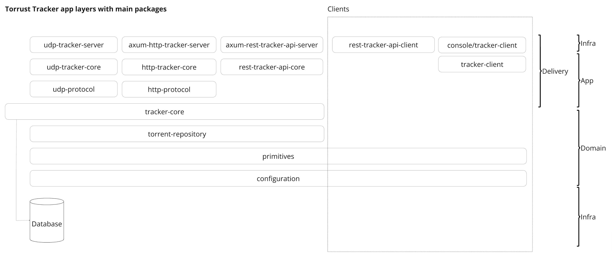

---
semantic-links:
  skill-links:
    - write-markdown-docs
  related-artifacts:
    - deny.toml
    - docs/index.md
    - docs/adrs/20260429000000_keep_database_as_aggregate_supertrait.md
    - packages/
---

# Torrust Tracker Package Architecture

- [Package Conventions](#package-conventions)
- [Package Catalog](#package-catalog)
- [Architectural Philosophy](#architectural-philosophy)
- [Design Decisions](#design-decisions)
- [Protocol Implementation Details](#protocol-implementation-details)

```output
packages/
├── axum-health-check-api-server
├── axum-http-server
├── axum-rest-api-server
├── axum-server
├── configuration
├── e2e-tools
├── events
├── http-protocol
├── http-core
├── persistence-benchmark
├── primitives
├── rest-api-client
├── rest-api-core
├── swarm-coordination-registry
├── test-helpers
├── torrent-repository-benchmarking
├── tracker-client
├── tracker-core
├── udp-protocol
├── udp-core
└── udp-server
```

```output
console/
└── tracker-client      # Client for interacting with trackers
```

```output
contrib/
└── dev-tools           # Developer tooling (git hooks, container scripts, etc.)
```

## Package Conventions

| Prefix       | Responsibility                         | Dependencies             |
| ------------ | -------------------------------------- | ------------------------ |
| `axum-*`     | HTTP server components using Axum      | Axum framework           |
| `*-server`   | Server implementations                 | Corresponding \*-core    |
| `*-core`     | Domain logic & business rules          | Protocol implementations |
| `*-protocol` | BitTorrent protocol implementations    | BitTorrent protocol      |
| `udp-*`      | UDP Protocol-specific implementations  | Tracker core             |
| `http-*`     | HTTP Protocol-specific implementations | Tracker core             |

Key Architectural Principles:

1. **Separation of Concerns**: Servers contain only network I/O logic.
2. **Protocol Compliance**: `*-protocol` packages strictly implement BEP specifications.
3. **Extensibility**: Core logic is framework-agnostic for easy protocol additions.

## Layer Boundary Enforcement

Dependencies between layers are enforced programmatically via
[`cargo deny check bans`](https://embarkstudios.github.io/cargo-deny/) — configured in
[`deny.toml`](../deny.toml) at the workspace root.

### Motivation

The layered architecture (servers → core → protocol → domain) prevents
coupling between concerns. Without automated enforcement, a misplaced
dependency (e.g., a core crate importing a server crate) compiles and
passes CI silently. `cargo deny` prohibits these edges at the lockfile
level, catching violations in pre-commit hooks and CI before merge.

### Forbidden edges

| Edge                       | Description                                                    | Current violations            |
| -------------------------- | -------------------------------------------------------------- | ----------------------------- |
| `core -> server`           | Core must not depend on delivery-layer packages                | `rest-api-core -> udp-server` |
| `tracker-core -> core`     | Tracker core must not depend on its protocol-specific wrappers | None                          |
| `tracker-core -> protocol` | Tracker core must not depend on protocol parsing crates        | None                          |
| `tracker-core -> server`   | Tracker core must not depend on server crates                  | None                          |
| `protocol -> core`         | Protocol crates must not depend on core logic                  | None                          |
| `protocol -> tracker-core` | Protocol crates must not depend on tracker core                | None                          |
| `protocol -> server`       | Protocol crates must not depend on server crates               | None                          |
| `domain -> server`         | Domain/shared packages must not depend on server crates        | None                          |

### How it works

`cargo deny` uses a **bans with wrappers** mechanism. For each server-layer
or protocol crate that should be restricted, `deny.toml` lists:

- The **banned crate** (the server/protocol package).
- A **wrappers list** — the set of packages that are legitimately allowed
  to depend on that crate directly. Any direct dependency outside this
  list, and any transitive dependency from a non-server package, is rejected.

For example, `torrust-tracker-udp-server` can only be depended on by:

- `torrust-tracker` (root binary)
- `torrust-tracker-axum-rest-api-server`
- `torrust-tracker-axum-health-check-api-server`
- `torrust-tracker-rest-api-core` (known violation — see below)

A core package like `torrust-tracker-http-core` adding `udp-server` as a
dependency would be immediately rejected by `cargo deny check bans`.

### Known exceptions

- `torrust-tracker-rest-api-core` depends on `torrust-tracker-udp-server`
  — a known violation tracked separately. Until it is fixed, the wrapper
  list for `udp-server` includes `rest-api-core`.

### Maintenance

When adding a new dependency to a workspace package, run:

```sh
cargo deny check bans
```

If it fails, either:

1. The new dependency is on a restricted crate — check whether your
   package belongs in that crate's wrappers list.
2. The dependency is legitimate — add your package to the appropriate
   wrapper entry in `deny.toml`.

Adding a package to a wrapper list should be a deliberate architectural
decision, reviewed with the same care as any layer-crossing dependency.
See `deny.toml` for the complete configuration.

## Design Decisions

- Persistence trait boundaries and the aggregate supertrait choice:
  [docs/adrs/20260429000000_keep_database_as_aggregate_supertrait.md](adrs/20260429000000_keep_database_as_aggregate_supertrait.md)

## Package Catalog

| Package                           | Description                          | Key Responsibilities                       |
| --------------------------------- | ------------------------------------ | ------------------------------------------ |
| **axum-\***                       |                                      |                                            |
| `axum-server`                     | Base Axum HTTP server infrastructure | HTTP server lifecycle management           |
| `axum-http-server`                | BitTorrent HTTP tracker (BEP 3/23)   | Handle announce/scrape requests            |
| `axum-rest-api-server`            | Management REST API                  | Tracker configuration & monitoring         |
| `axum-health-check-api-server`    | Health monitoring endpoint           | System health reporting                    |
| **Core Components**               |                                      |                                            |
| `http-core`                       | HTTP-specific implementation         | Request validation, Response formatting    |
| `udp-core`                        | UDP-specific implementation          | Connectionless request handling            |
| `tracker-core`                    | Central tracker logic                | Peer management                            |
| **Protocols**                     |                                      |                                            |
| `http-protocol`                   | HTTP tracker protocol (BEP 3/23)     | Announce/scrape request parsing            |
| `udp-protocol`                    | UDP tracker protocol (BEP 15)        | UDP message framing/parsing                |
| **Domain**                        |                                      |                                            |
| `swarm-coordination-registry`     | Peer swarm registry                  | Torrent/peer coordination                  |
| `configuration`                   | Runtime configuration                | Config file parsing, Environment variables |
| `primitives`                      | Domain-specific types                | PeerId, Peer, SwarmMetadata                |
| `events`                          | Async event bus                      | Inter-package communication                |
| **Utilities**                     |                                      |                                            |
| `test-helpers`                    | Testing utilities                    | Mock servers, Test data generation         |
| **Client Tools**                  |                                      |                                            |
| `tracker-client` (`packages/`)    | Tracker client library               | Generic tracker client library             |
| `rest-api-client`                 | API client library                   | REST API integration                       |
| **Benchmarking**                  |                                      |                                            |
| `torrent-repository-benchmarking` | Torrent storage benchmarks           | Criterion benchmarks                       |
| `persistence-benchmark`           | Persistence layer benchmarks         | SQLite/MySQL/PostgreSQL benchmarks         |

### Extracted Packages

Packages that have been extracted to their own standalone repositories.

| Package          | Standalone Repository                                                               | Crate Name               | Description                                                      |
| ---------------- | ----------------------------------------------------------------------------------- | ------------------------ | ---------------------------------------------------------------- |
| `clock`          | [torrust/torrust-clock](https://github.com/torrust/torrust-clock)                   | `torrust-clock`          | Deterministic clock abstraction                                  |
| `located-error`  | [torrust/torrust-located-error](https://github.com/torrust/torrust-located-error)   | `torrust-located-error`  | Diagnostic errors with source locations                          |
| `metrics`        | [torrust/torrust-metrics](https://github.com/torrust/torrust-metrics)               | `torrust-metrics`        | Prometheus-compatible metrics: counters, gauges, labels, samples |
| `net-primitives` | [torrust/torrust-net-primitives](https://github.com/torrust/torrust-net-primitives) | `torrust-net-primitives` | Generic networking primitive types (ServiceBinding, Protocol)    |
| `server-lib`     | [torrust/torrust-server-lib](https://github.com/torrust/torrust-server-lib)         | `torrust-server-lib`     | Shared server library utilities                                  |

## Protocol Implementation Details

### HTTP Tracker (BEP 3/23)

- `http-protocol` implements:
  - URL parameter parsing
  - Response bencoding
  - Error code mapping
  - Compact peer formatting

### UDP Tracker (BEP 15)

- `udp-protocol` handles:
  - Connection ID management
  - Message framing (32-bit big-endian)
  - Transaction ID tracking
  - Error response codes

## Architectural Philosophy

1. **Testability**: Core packages have minimal dependencies for easy unit testing
2. **Observability**: Health checks and metrics built into server packages
3. **Modularity**: Protocol implementations decoupled from transport layers
4. **Extensibility**: New protocols can be added without modifying core logic



> Diagram shows clean separation between network I/O (servers), protocol handling, and core tracker logic
