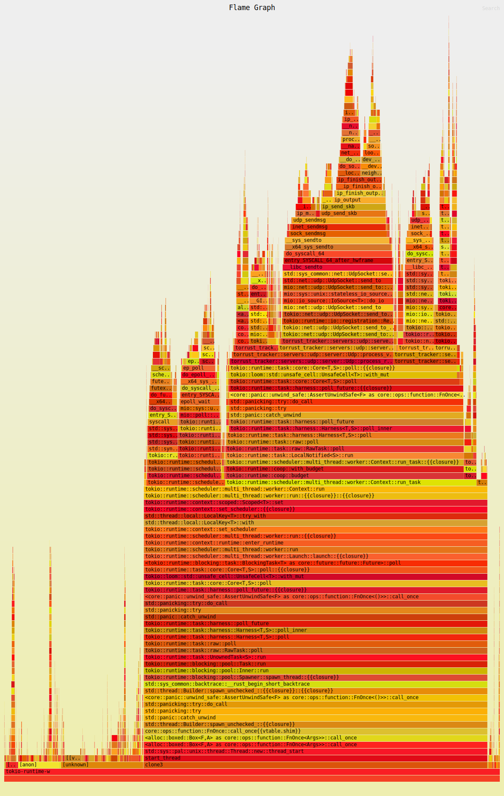
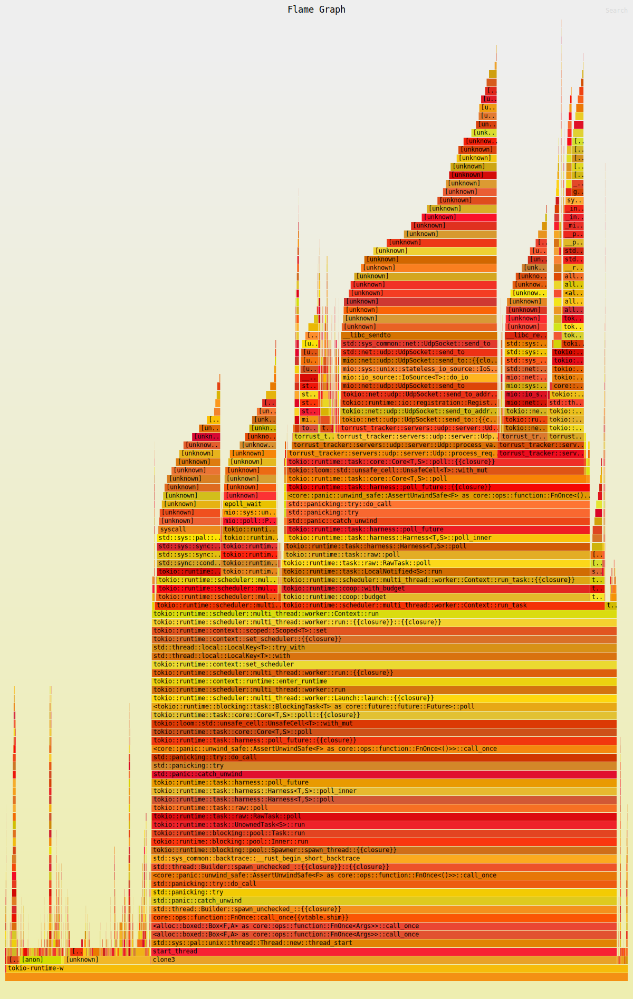
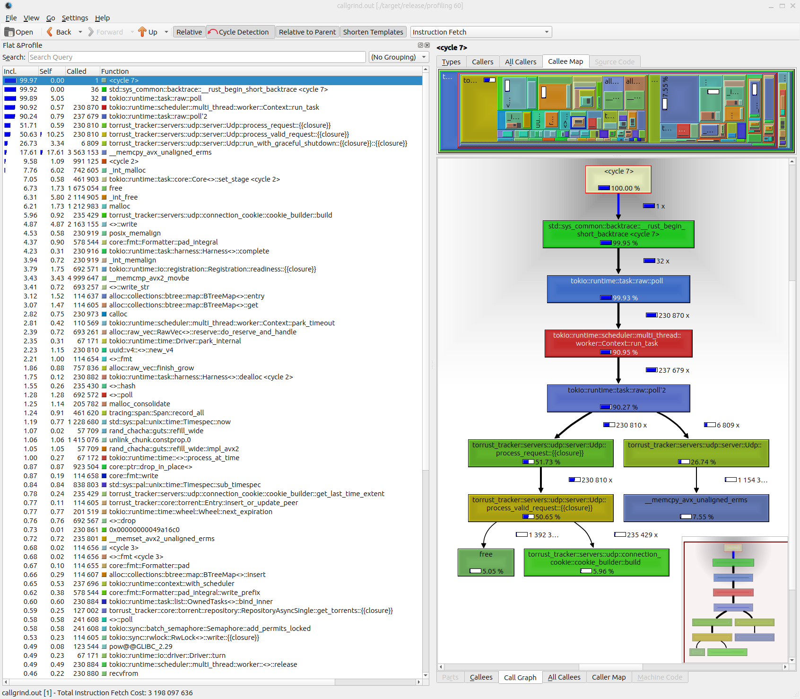

# Profiling

## Using flamegraph

### Requirements

You need to install some dependencies. For Ubuntu you can run:

```console
sudo apt-get install clang lld
```

You also need to uncomment these lines in the cargo [config.toml](./../.cargo/config.toml) file.

```toml
[target.x86_64-unknown-linux-gnu]
linker = "/usr/bin/clang"
rustflags = ["-Clink-arg=-fuse-ld=lld", "-Clink-arg=-Wl,--no-rosegment"]
```

Follow the [flamegraph](https://github.com/flamegraph-rs/flamegraph) instructions for installation.

Apart from running the tracker you will need to run some request if you want to profile services while they are processing requests.

You can use the aquatic [UDP load test](https://github.com/greatest-ape/aquatic/tree/master/crates/udp_load_test) script.

### Generate flamegraph

To generate the graph you will need to:

1. Build the tracker for profiling.
2. Run the aquatic UDP load test.
3. Run the tracker with flamegraph and profiling configuration.

```console
cargo build --profile=release-debug --bin=profiling
./target/release/aquatic_udp_load_test -c "load-test-config.toml"
sudo TORRUST_TRACKER_PATH_CONFIG="./share/default/config/tracker.udp.benchmarking.toml" /home/USER/.cargo/bin/flamegraph -- ./target/release-debug/profiling 60
```

__NOTICE__: You need to install the `aquatic_udp_load_test` program.

The output should be like the following:

```output
Loading configuration file: `./share/default/config/tracker.udp.benchmarking.toml` ...
Torrust successfully shutdown.
[ perf record: Woken up 23377 times to write data ]
Warning:
Processed 533730 events and lost 3 chunks!

Check IO/CPU overload!

[ perf record: Captured and wrote 5899.806 MB perf.data (373239 samples) ]
writing flamegraph to "flamegraph.svg"
```



__NOTICE__: You need to provide the absolute path for the installed `flamegraph` app if you use sudo. Replace `/home/USER/.cargo/bin/flamegraph` with the location of your installed `flamegraph` app. You can run it without sudo but you can get a warning message like the following:

```output
WARNING: Kernel address maps (/proc/{kallsyms,modules}) are restricted,
check /proc/sys/kernel/kptr_restrict and /proc/sys/kernel/perf_event_paranoid.

Samples in kernel functions may not be resolved if a suitable vmlinux
file is not found in the buildid cache or in the vmlinux path.

Samples in kernel modules won't be resolved at all.

If some relocation was applied (e.g. kexec) symbols may be misresolved
even with a suitable vmlinux or kallsyms file.

Couldn't record kernel reference relocation symbol
Symbol resolution may be skewed if relocation was used (e.g. kexec).
Check /proc/kallsyms permission or run as root.
Loading configuration file: `./share/default/config/tracker.udp.benchmarking.toml` ...
```

And some bars in the graph  will have the `unknown` label.



## Using valgrind and kcachegrind

You need to:

1. Build an run the tracker for profiling.
2. Make requests to the tracker while it's running.

Build and the binary for profiling:

```console
RUSTFLAGS='-g' cargo build --release --bin profiling \
   && export TORRUST_TRACKER_PATH_CONFIG="./share/default/config/tracker.udp.benchmarking.toml" \
   && valgrind \
     --tool=callgrind \
     --callgrind-out-file=callgrind.out \
     --collect-jumps=yes \
     --simulate-cache=yes \
     ./target/release/profiling 60
```

> NOTICE: You should make requests to the services you want to profile. For example, using the [UDP load test](./benchmarking.md#run-udp-load-test).

After running the tracker with `<valgrind` it generates a file `callgrind.out`
that you can open with `kcachegrind`.

```console
kcachegrind callgrind.out
```



## Links

Profiling tools:

- [valgrind](https://valgrind.org/).
- [kcachegrind](https://kcachegrind.github.io/).
- [flamegraph](https://github.com/flamegraph-rs/flamegraph).

Talks about profiling:

- [Profiling Rust Programs with valgrind, heaptrack, and hyperfine](https://www.youtube.com/watch?v=X6Xz4CRd6kw&t=191s).
- [RustConf 2023 - Profiling async applications in Rust by Vitaly Bragilevsky](https://www.youtube.com/watch?v=8FAdY_0DpkM).
- [Profiling Code in Rust - by Vitaly Bragilevsky - Rust Linz, December 2022](https://www.youtube.com/watch?v=JRMOIE_wAFk&t=8s).
- [Xdebug 3 Profiling: 2. KCachegrind tour](https://www.youtube.com/watch?v=h-0HpCblt3A).

## Acknowledgments

Many thanks to [Vitaly Bragilevsky](https://github.com/bravit) and others for sharing the talks about profiling.
